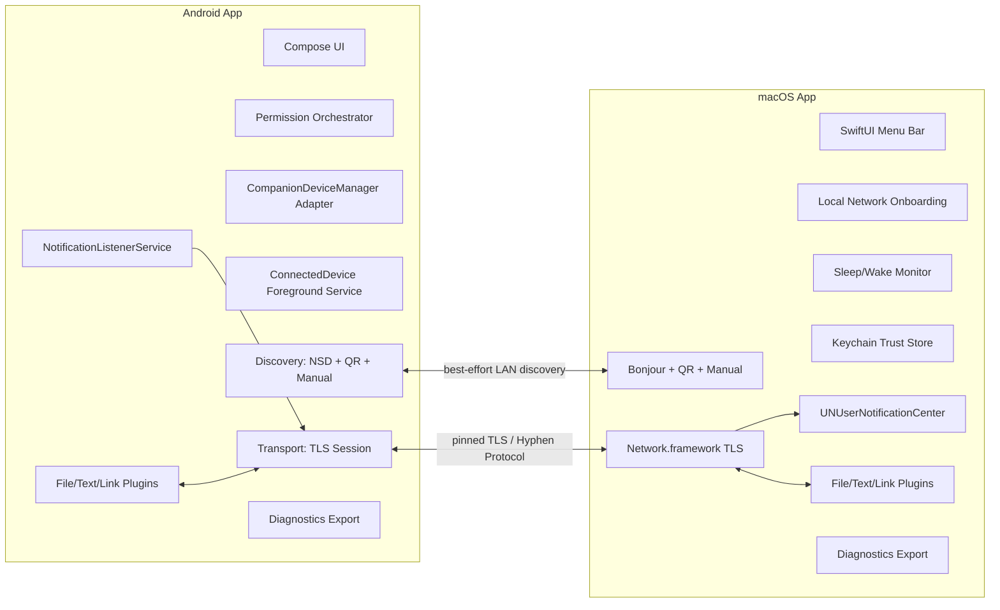
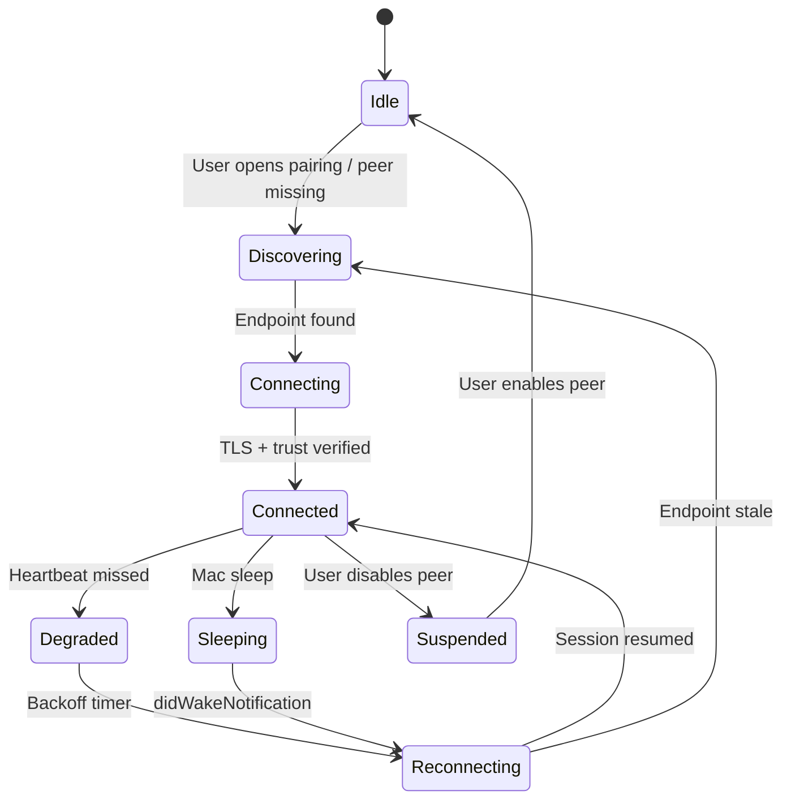
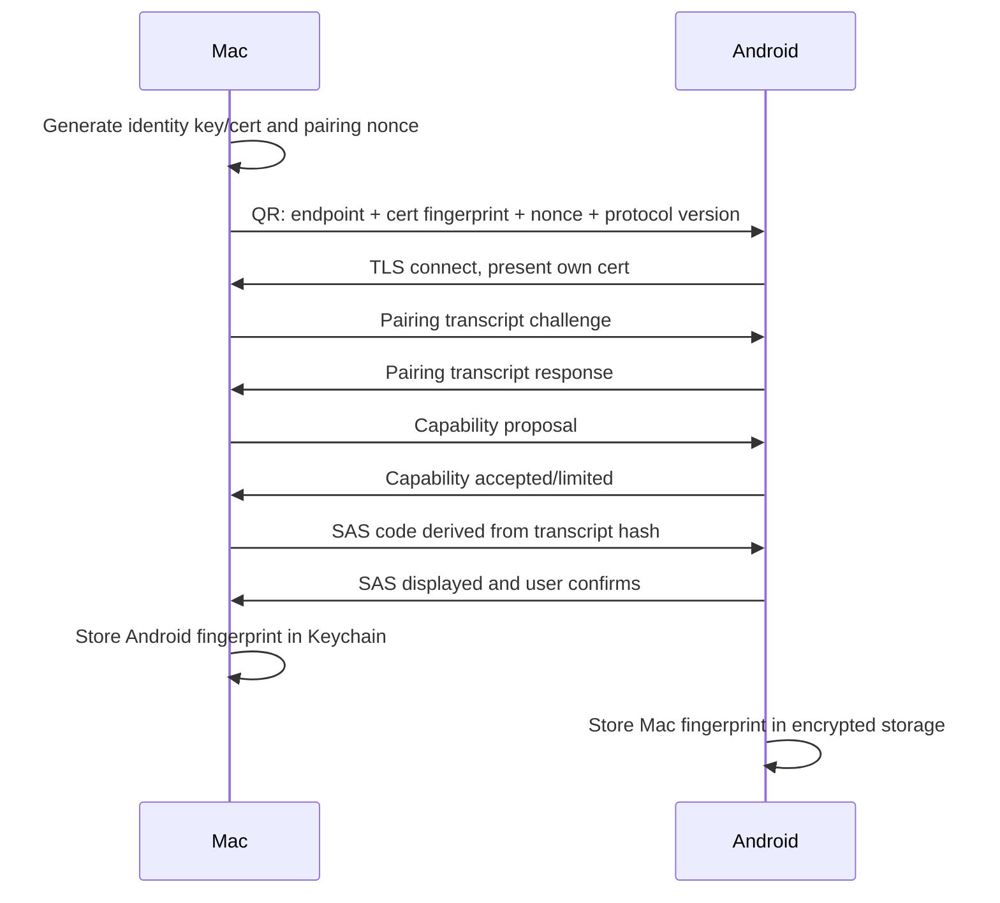

# Project Hyphen: macOS ↔ Android Local-First Companion Layer Plan v0.3

**Version**: v0.3  
**Date**: 2026-06-10  
**Scope**: the third project, macOS ↔ Android wired/wireless interoperability  
**Positioning**: an open-source, local-first, auditable Android companion layer for macOS, not a single-purpose “Android AirDrop for Mac” utility.

---

## 0. v0.3 Summary

v0.3 upgrades the plan from a high-quality product strategy into an executable engineering plan. v0.2 already corrected the major issues around Quick Share ↔ AirDrop, NearDrop, scrcpy source integrity, stable notification identity, Android foreground-service types, CompanionDeviceManager, mDNS/MulticastLock, macOS sleep/App Nap, and the telemetry-versus-metrics contradiction. v0.3 incorporates the follow-up deep feasibility audit and promotes the following items to P0 architecture constraints:

1. **Android 16/17 local-network permissions**. Hyphen can no longer assume LAN, mDNS, `.local`, or `NsdManager` will remain low-friction implicit capabilities. Android 16 can be used to test restricted LAN behavior, while Android 17 enforces local-network protection for apps targeting SDK 37+ with `ACCESS_LOCAL_NETWORK` as an explicit runtime permission. Discovery and transport onboarding must be permission-aware, fallback-rich, and testable under future behavior.
2. **Companion Device API layering**. CompanionDeviceManager remains the right primitive family, but Android 16/API 36 shifts presence observation toward `ObservingDevicePresenceRequest` and `DevicePresenceEvent`. Hyphen should implement a `CompanionPresenceAdapter` abstraction rather than hard-coding older callbacks.
3. **Two distribution tracks**. GitHub/F-Droid should optimize for transparency, completeness, and auditability. Google Play should optimize for policy minimization, permission rationale, foreground-service declarations, and accurate Data safety disclosure. The tracks may expose different feature sets while remaining protocol-compatible.
4. **Release engineering moves forward**. Apple Developer ID/notarization, Google Play foreground-service declarations, Data safety, test accounts, closed testing, and F-Droid metadata are not final-week packaging tasks. They begin in Phase 0.
5. **A realistic nine-month v1 path**. The credible v1 window moves toward March 2027, assuming a mid-June 2026 start. The first 60 days should burn down platform risk, not accumulate UI breadth.

---

## 1. Final Decision

**Conditional Go.** Proceed only if the team accepts these boundaries:

- The moat is not file transfer; it is **persistent paired cross-device continuity**.
- v1 promises pairing, reliable reconnect, notification mirroring and controlled actions, bidirectional text/link/file flow, privacy defaults, diagnostics export, and an auditable protocol.
- v1 does not promise universal Quick Reply, SMS/Call Log, cloud relay, folder sync, screen control, AirDrop protocol reimplementation, or automatic background clipboard listening.
- Local-network permissions, Companion API evolution, foreground-service policy, macOS local-network privacy, and sleep/wake recovery are P0 engineering work.
- If Google Play resists richer features, the project should not stall; open-source and Play tracks should be released separately.

---

## 2. Product Positioning

### 2.1 One sentence

**Project Hyphen is an open-source, local-first, auditable Android companion layer for macOS that keeps a trusted Mac and Android phone continuously connected for notifications, actions, text, links, files, state, and recovery.**

### 2.2 Positioning to stop using

Avoid these labels:

- Android AirDrop for Mac
- Quick Share replacement
- Android Universal Control
- Open-source AirDroid
- KDE Connect clone for Mac

These labels force the product into feature-by-feature comparisons against Quick Share, AirDrop, LocalSend, NearDrop, KDE Connect, and AirDroid. Hyphen’s advantage is not any single transfer feature.

### 2.3 Positioning to use

Recommended public language:

- **Paired Android continuity for macOS**
- **Local-first Android companion for Mac**
- **Private, auditable, no-cloud device bridge**
- **Notification continuity + local transfer + reliable reconnect**

### 2.4 Core value propositions

| Value | User language | Engineering meaning |
|---|---|---|
| Persistent pairing | “My Mac knows my phone; I don’t have to rediscover it every time.” | Trust store, certificate pinning, remembered endpoints, CDM association |
| Notification continuity | “I can see, clear, and sometimes reply to phone notifications from my Mac.” | `NotificationListenerService`, macOS `UNUserNotificationCenter`, action bridge |
| Local-first | “No account, no cloud.” | LAN TLS, QR/manual fallback, zero telemetry by default |
| Recoverable | “After sleep or Wi‑Fi changes, it comes back.” | Reconnect state machine, wake observer, backoff, session resume |
| Auditable | “I can inspect what it sends and why it asks for permissions.” | Protocol docs, permission docs, diagnostics bundle, open-source CI |

---

## 3. Market and Competitor Landscape v0.3

### 3.1 Impact of Quick Share ↔ AirDrop

Quick Share has begun supporting AirDrop workflows for compatible Android devices, letting Android send files to iPhone, iPad, and macOS recipients when the Apple device is set to “Everyone for 10 Minutes.” This materially weakens “Android to Mac file sending” as a standalone selling point.

It does not replace Hyphen’s thesis:

- It is not a persistent paired companion.
- It does not mirror Android notifications or expose controlled Mac-side actions.
- It does not solve continuity after Mac sleep/wake.
- It does not offer an auditable open protocol stack.
- It does not provide a stable Mac → Android companion workflow.
- It still depends on temporary visibility workflows.

**Conclusion**: file transfer is a baseline feature, not the strategic moat.

### 3.2 Competitor comparison

| Project | Current capability | Pressure on Hyphen | Hyphen differentiation |
|---|---|---|---|
| Quick Share ↔ AirDrop | Official cross-ecosystem file/photo sharing on compatible devices | Strongly compresses one-off file-transfer novelty | Hyphen focuses on persistent pairing, notifications, actions, recovery, and auditability |
| NearDrop | macOS menu-bar receiver for Nearby Share/Quick Share, Wi‑Fi LAN only | Overlaps with “menu bar + Android → Mac file receiving” | Hyphen is not a one-way receiver; it is a companion layer |
| LocalSend | Cross-platform, local, no-cloud file/text transfer | Strong file-transfer UX and adoption | Hyphen binds Android permission capabilities to native Mac continuity |
| KDE Connect | Mature multi-platform device interoperability | Broad features and strong community | Hyphen optimizes for native macOS UX, auditable protocol, and clearer distribution tracks |
| AirDroid | Commercial multi-platform remote/device suite | Complete feature set and brand recognition | Hyphen is local-first, open-source, and no-cloud by default |
| scrcpy | Mature Android screen mirroring/control | Any remote-control effort will be compared to it | v1 does not do remote control; only cite the official GitHub repository |

---

## 4. Target Users and v1 Jobs To Be Done

### 4.1 Target users

1. **Android phone + Mac primary users**.
2. **Open-source and privacy-sensitive users** who dislike cloud-mediated notification or file flows.
3. **Developers and technical users** who can tolerate QR pairing, permission explanation, GitHub/F-Droid installs, and early beta roughness.
4. **Cross-platform heavy users** who move links, screenshots, documents, codes, and notifications between Mac and phone many times per day.
5. **Users who do not want a heavy suite** and prefer a small, reliable companion.

### 4.2 v1 jobs

| Job | User story | v1 acceptance |
|---|---|---|
| J1 Pairing | I want to securely bind my phone and Mac once. | First-pairing success ≥ 90%; QR fallback ≥ 95% |
| J2 Notifications | I want to see Android notifications on my Mac. | Median notification latency < 2s; updates do not spam duplicates |
| J3 Controlled actions | I want to clear phone notifications and reply in supported cases. | Dismiss works reliably; reply is advertised only for tested apps |
| J4 Text/link flow | I want to send links or text in either direction. | Completed in ≤ 3 user-visible steps, with retry on failure |
| J5 Files | I want reliable same-Wi‑Fi file transfer. | 1GB transfer resumes after interruption; failure reason is visible |
| J6 Recovery | I do not want to repair after sleep or Wi‑Fi changes. | Reconnect within 30s after Mac wake or show a clear status |
| J7 Privacy | I want proof that it is not uploading my data. | No account, cloud relay, or telemetry by default; diagnostics are opt-in |

---

## 5. v1 Scope and Non-goals

### 5.1 v1 must-have

- macOS menu-bar app.
- Android companion app.
- QR pairing plus SAS confirmation.
- Self-signed TLS / mTLS with certificate or public-key fingerprint pinning.
- Bonjour/mDNS discovery as a best-effort accelerator only.
- QR/manual IP/remembered endpoint fallback.
- Android notification mirror/update/remove/dismiss.
- Quick Reply beta only where the originating notification exposes `RemoteInput` and has been tested.
- Bidirectional text/link sending.
- Bidirectional file transfer with resume, integrity checks, progress, and cancellation.
- Reconnect across Mac sleep/wake, network transitions, Android foreground/background, and battery restrictions.
- Local logs, redacted diagnostics export, and no telemetry by default.
- GitHub release; F-Droid preparation; Google Play policy-minimized track evaluation.
- macOS notarized build preparation.

### 5.2 Explicit v1 non-goals

- Cloud accounts, cloud relay, or public-Internet NAT relay.
- SMS / Call Log permissions.
- Default SMS/Phone handler.
- Phone-call audio bridging.
- Screen mirroring or remote control.
- Automatic background clipboard listening.
- Full folder sync.
- AirDrop/AWDL reimplementation.
- Private APIs, root, jailbreak, or Accessibility hacks.
- Copying KDE Connect GPL code into an MPL/Apache codebase.

---

## 6. System Architecture



### 6.1 Architecture principles

1. **Small, stable protocol core**: pairing, session, capability, envelope, ack, error, and diagnostics are core.
2. **Pluginized features**: notifications, files, text, clipboard, battery, and future SMS are plugins.
3. **Discovery is not trust**: mDNS only says “a peer may exist”; pinned keys/certs and SAS establish trust.
4. **Every permission has product copy**: permissions must be tied to a visible user action.
5. **Every P0 risk gets a PoC**: Android local network, CDM presence, macOS local network, and wake reconnect are validated early.

### 6.2 Recommended repository structure

```text
hyphen/
  README.md
  LICENSE
  SECURITY.md
  CONTRIBUTING.md
  CODE_OF_CONDUCT.md
  docs/
    plan_v0_3_zh.md
    plan_v0_3_en.md
    roadmap_tracker_v0_3.md
    protocol/
      hyphen-protocol-v0.md
      threat-model.md
      pairing-transcript.md
    adr/
      0001-product-scope.md
      0002-transport-and-pairing.md
      0003-android-permission-model.md
      0004-distribution-tracks.md
  apps/
    android/
      app/
      core/
      feature-notifications/
      feature-transfer/
      feature-diagnostics/
    macos/
      Hyphen.xcodeproj
      HyphenApp/
      HyphenCore/
      HyphenNotifications/
      HyphenTransfer/
  protocol/
    schema/
    test-vectors/
    conformance/
  scripts/
    check.sh
    format.sh
    test-protocol.sh
  ci/
  packaging/
    macos/
    android-play/
    android-fdroid/
```

---

## 7. Android Design v0.3

### 7.1 Minimum and target versions

| Item | v1 recommendation |
|---|---|
| minSdk | 26, because CompanionDeviceManager is available from Android 8.0 |
| initial targetSdk | 36 if development starts in 2026 |
| forward targetSdk | SDK 37 compatibility work begins now, especially `ACCESS_LOCAL_NETWORK` |
| distribution | GitHub APK/AAB, F-Droid metadata preparation, Play policy-minimized build |

### 7.2 Android modules

| Module | Responsibility |
|---|---|
| `app` | Compose UI, navigation, permission onboarding |
| `core-protocol` | Envelope, capability, error codes, test vectors |
| `core-transport` | TLS session, reconnect, backoff, ack, chunk IO |
| `core-discovery` | NSD/mDNS, MulticastLock, QR/manual endpoint, remembered endpoint |
| `core-companion` | CDM association, presence adapter, API 26–35 and API 36+ layering |
| `feature-notifications` | NotificationListenerService, RemoteInput, dismiss, privacy filters |
| `feature-transfer` | SAF/MediaStore, file manifest, resumable chunks |
| `feature-diagnostics` | Local logs, diagnostics export, compatibility report |

### 7.3 Android Local Network Permission strategy

This is the most important v0.3 update.

#### Design requirements

- Route all LAN operations through `LocalNetworkAccessController`.
- Treat discovery, connection, `.local` resolution, incoming TCP listeners, UDP multicast, and broadcast as local-network-gated capabilities.
- Use Android 16 restricted mode in CI/manual testing.
- Implement an `ACCESS_LOCAL_NETWORK` runtime-permission flow for Android 17 target SDK 37+.
- If permission is denied, do not crash or show an empty state; enter QR/manual endpoint mode.
- Onboarding copy must explain that Hyphen only looks for the user’s paired Mac on the local network, does not scan the internet, and does not upload network topology.

#### Fallback paths

| Situation | Product behavior |
|---|---|
| LAN permission granted | mDNS/NSD + remembered endpoint + manual fallback |
| LAN permission denied | QR/manual IP flow; paired peers remain but auto-discovery is disabled |
| Enterprise Wi‑Fi/AP isolation | Try remembered endpoint; then suggest hotspot/USB/same-subnet troubleshooting |
| Older Android behavior | Use existing network model through the same controller and record capabilities |

### 7.4 CompanionDeviceManager strategy

#### Goal

Promote CDM from optional enhancement to the core Android system integration point for long-lived companion behavior.

#### Design

```kotlin
interface CompanionPresenceAdapter {
    suspend fun associate(request: HyphenAssociationRequest): AssociationResult
    fun observePresence(peerId: PeerId): Flow<PresenceEvent>
    suspend fun disassociate(peerId: PeerId)
}

class LegacyPresenceAdapter : CompanionPresenceAdapter // API 26-35
class Api36PresenceAdapter : CompanionPresenceAdapter // API 36+ ObservingDevicePresenceRequest
```

#### Requirements

- Initial pairing can combine QR and CDM, but CDM does not create network connections on its own.
- Presence events are hints to attempt reconnect, not trust sources.
- Peer trust is still decided by the Hyphen trust store.
- API 36+ uses `ObservingDevicePresenceRequest` / `DevicePresenceEvent`.
- API 26–35 uses older association capabilities and conservative background behavior.

### 7.5 Foreground-service strategy

| Scenario | FGS type | Strategy |
|---|---|---|
| Persistent companion connection | `connectedDevice` | Main path; notification must be user-visible; auto-connect can be disabled |
| User-initiated large transfer | `dataSync` | Limited windows only; implement timeout handling |
| Messaging-continuity experiment | `remoteMessaging` | Not core v1; revisit for future SMS track |
| Periodic maintenance | None | Use WorkManager/JobScheduler rather than resident FGS |

### 7.6 mDNS / NSD / MulticastLock

- `NsdManager` is best-effort, not the only entry point.
- Manage MulticastLock explicitly and only during discovery windows.
- Limit discovery sessions, e.g. 15–30 seconds.
- Test Wi‑Fi switches, screen-off state, battery saver, and OEM ROM behavior.
- Record discovery failure reasons locally by default.
- If NSD is unreliable on specific ROMs, a pure Kotlin mDNS implementation is allowed only after size, maintenance, and permission impact are reviewed.

### 7.7 Notification plugin

#### Stable identity

Use `StatusBarNotification.getKey()` as the notification primary key. Do not include `postTime`, because messaging apps often repost/update the same notification and changing post times would cause duplicate Mac notifications.

#### Event model

| Android event | Hyphen event | macOS behavior |
|---|---|---|
| posted new key | `notification.posted` | Show new notification |
| posted same key | `notification.updated` | Update existing notification |
| removed key | `notification.removed` | Remove/close corresponding Mac notification |
| Mac-side dismiss | `notification.dismiss.request` | Android calls `cancelNotification(key)`, returns error on failure |
| reply action | `notification.reply.request` | Android uses `RemoteInput` only where compatible |

#### Privacy modes

- Default shows app name, title, and text summary.
- Users can hide body content for selected apps.
- Users can show only “a notification exists.”
- No persistent notification-history database.
- Diagnostic exports redact content by default.

---

## 8. macOS Design v0.3

### 8.1 Support range

| Item | v1 recommendation |
|---|---|
| Official support | macOS 15.1+, because early local-network privacy bugs were stabilized after 15.1 |
| Best effort | macOS 14.7+, may run but not primary support promise |
| Architecture | Apple Silicon first, Intel best effort |
| Distribution | GitHub DMG/ZIP + Developer ID notarization; Homebrew Cask later |

### 8.2 macOS modules

| Module | Responsibility |
|---|---|
| `HyphenApp` | SwiftUI menu-bar app, settings, onboarding |
| `HyphenCore` | Protocol, session, trust store, capability |
| `HyphenDiscovery` | Bonjour/NWBrowser, QR code, manual endpoint |
| `HyphenTransport` | Network.framework TLS, connection lifecycle |
| `HyphenNotifications` | UNUserNotificationCenter, action mapping |
| `HyphenTransfer` | File selection, saving, resume, integrity |
| `HyphenPower` | Sleep/wake/network-change reconnect |
| `HyphenDiagnostics` | OSLog, redaction, diagnostics export |

### 8.3 Local Network Privacy

- Do not trigger the local-network prompt immediately on first launch; explain first, then trigger when the user clicks “Find phone.”
- Bonjour register/browse/resolve happens within a clear onboarding step.
- If permission is denied, QR/manual IP remains available.
- Settings show local-network permission status and repair instructions.
- Documentation covers macOS 15+ troubleshooting and permission reset paths.

### 8.4 Sleep, wake, and App Nap

#### State machine



#### Rules

- Observe `NSWorkspace.didWakeNotification`.
- Attempt recovery at 1s, 5s, 15s, and 30s after wake.
- Save transfer checkpoints before and during transfers.
- Use `ProcessInfo.beginActivity` only for user-initiated transfers or critical handshakes; do not fight normal system sleep.
- Solve App Nap with explicit activity scopes and reconnect behavior, not blanket anti-sleep behavior.

### 8.5 macOS notification mapping

- Map every Android `sbnKey` to one macOS notification identifier.
- Updating the same key refreshes the notification instead of creating a new one.
- Dismiss action waits for Android confirmation; failures are shown gently.
- Reply action is visible only when the Android payload exposes a compatible remote-input action.
- Support privacy mode: hide content, hide app, or show generic Android notification.

---

## 9. Protocol Design v0.3

### 9.1 Transport layer

- v1 uses LAN TCP + TLS 1.3.
- Both sides generate self-signed certificates and pin fingerprints during first pairing.
- Key/certificate changes require explicit re-confirmation.
- Session resume tokens may exist but cannot be reused across peers.
- No cloud relay.

### 9.2 Pairing



### 9.3 Envelope

v1 uses JSON lines or length-prefixed JSON for auditability and debugging. CBOR/Protobuf can be revisited later.

```json
{
  "protocol": "hyphen/0.3",
  "messageId": "01JZ...",
  "sessionId": "s_...",
  "type": "notification.updated",
  "capability": "notifications.v1",
  "seq": 42,
  "ackOf": null,
  "sentAtUnixMs": 1781020800000,
  "requiresAck": true,
  "payload": {},
  "trace": {
    "localOnly": true,
    "spanId": "..."
  }
}
```

### 9.4 Capability negotiation

```json
{
  "type": "hello",
  "payload": {
    "device": {
      "kind": "android",
      "appVersion": "0.1.0",
      "osVersion": "Android 16",
      "deviceName": "Pixel"
    },
    "capabilities": {
      "notifications.v1": { "reply": "beta", "dismiss": true },
      "transfer.v1": { "resume": true, "maxChunkBytes": 1048576 },
      "text.v1": { "direction": "bidirectional" },
      "diagnostics.v1": { "redactedExport": true }
    }
  }
}
```

### 9.5 File transfer

- Send a manifest before chunks.
- v1 uses SHA-256 for integrity to minimize dependencies; BLAKE3 is P2.
- Resume by `fileId + chunkIndex + chunkHash`.
- Default receive path is configurable.
- Android uses SAF/MediaStore; macOS uses a user-selected folder or Downloads.
- No background folder sync.

---

## 10. Permissions, Policy, and Distribution

### 10.1 Android permission layering

| Permission / capability | v1 track | Note |
|---|---|---|
| Notification Listener | GitHub/F-Droid/Play | Core feature, explicitly enabled by user |
| Local Network | Required for Android 17+ behavior | LAN discovery/transport |
| Foreground Service `connectedDevice` | GitHub/F-Droid/Play | Requires clear user-visible notification |
| Foreground Service `dataSync` | Limited use | Only user-initiated large transfers |
| SMS/Call Log | Not requested in v1 | Avoid high-risk Play permissions |
| Accessibility | Not requested | Avoid privacy and review risk |
| Background clipboard | Not implemented | Android 10+ and privacy constraints |

### 10.2 Distribution tracks

| Track | Goal | Characteristics |
|---|---|---|
| GitHub Releases | Early community, transparent builds, technical users | Fastest release path; full open-source features, still no SMS/Call Log in v1 |
| F-Droid | Open-source users, reproducible builds | Requires metadata, dependency review, reproducibility preparation |
| Google Play | Discoverability and mainstream users | More conservative features, strong permission rationale, FGS declaration, accurate Data safety |
| macOS GitHub notarized build | Direct Mac downloads | Developer ID, notarization, Sparkle/Homebrew later |

### 10.3 Release-engineering checklist

- Apple Developer Program account.
- Developer ID Application certificate.
- Notarization scripts and CI secret plan.
- Google Play developer account type.
- Play Data safety draft.
- Foreground-service declaration draft.
- Privacy policy draft.
- F-Droid metadata draft.
- Release signing key storage plan.
- SBOM and dependency license audit.

---

## 11. Privacy, Security, and Telemetry

### 11.1 Default policy

- No account by default.
- No cloud by default.
- No telemetry by default.
- No persistent notification history by default.
- No contacts, SMS, or call-log scanning.
- No crash-report upload by default.
- Local logs are redacted by default.

### 11.2 Opt-in beta diagnostics

Only with explicit opt-in may beta builds collect:

- Anonymous device class, OS version, and app version.
- Pairing-stage failure codes.
- Reconnect counts.
- Notification latency distribution.
- Crash stack traces with notification body, file names, and IP suffixes redacted by default.

Required controls:

- One-click disable.
- One-click local diagnostics export.
- One-click local diagnostics deletion.
- Itemized privacy-policy explanation.

### 11.3 Threat model summary

| Threat | Defense |
|---|---|
| Same-LAN device impersonation | SAS + pinned cert/fingerprint |
| mDNS spoofing | Discovery is not trust; TLS pin is trust |
| MITM | TLS 1.3 + transcript SAS |
| Notification content leakage | Privacy mode, redaction, no history DB |
| Lost device remains connected | Peer revoke, trust reset, association removal |
| Diagnostics leak sensitive data | Local by default, opt-in, redaction, user preview |
| GPL contamination | Clean-room policy, license audit, DCO/CLA decision |

---

## 12. Open-source Governance

### 12.1 Naming

Continue using **Project Hyphen** as the working name. Avoid `Droid*`, because “Droid” carries trademark risk. Final naming requires a trademark search.

### 12.2 License

Recommended path:

- Protocol specification, schemas, and test vectors: Apache-2.0.
- App code: MPL-2.0 or Apache-2.0.
- Documentation: CC-BY-4.0.

If the project uses an MPL/Apache route, it must remain clean-room: do not copy KDE Connect GPL code; only learn from public behavior and reimplement independently.

### 12.3 Security process

- `SECURITY.md` with private disclosure route.
- All crypto/pairing logic has test vectors.
- Dependency audit before releases.
- Public threat model.
- Major protocol changes require ADRs.

---

## 13. Roadmap v0.3 Overview

| Phase | Window | Goal | Gate |
|---|---|---|---|
| M0 Scope & Ops | 2026-06-15 → 2026-07-05 | Scope freeze, repo, release/policy drafts | docs + repo + CI skeleton |
| M1 Platform Risk PoC | 2026-06-22 → 2026-07-20 | Android LAN/CDM, macOS LNP/wake validation | four reproducible P0 PoCs |
| M2 Core Pairing/Transport | 2026-07-21 → 2026-09-01 | trust store, TLS session, fallback discovery | secure pairing and reconnect |
| M3 Notification + Transfer MVP | 2026-08-04 → 2026-09-15 | notification mirror, dismiss, text/link/file | internal daily-use build |
| M4 Private Beta | 2026-09-22 → 2026-11-17 | compatibility matrix, diagnostics, stability | 20–50 technical users |
| M5 Public Beta | 2026-11-24 → 2027-01-19 | docs, notarization, F-Droid/Play track | public beta install loop |
| M6 v1 Stabilization | 2027-01-26 → 2027-03-09 | crash-free, reconnect, transfer recovery | v1.0 tag |

---

## 14. 30/60/90-day Focus

### 30 days

- Complete ADR 0001–0004.
- Create repository and CI skeleton.
- macOS Bonjour + local-network permission PoC.
- Android NSD + MulticastLock + Android 16 restricted LAN PoC.
- CDM association + API 36 presence model spike.
- QR pairing transcript prototype.
- Initial threat model and protocol schema.

### 60 days

- Runnable app skeletons on both platforms.
- Pinned TLS session established.
- Remembered endpoint + manual endpoint fallback.
- Android connectedDevice FGS skeleton.
- Mac sleep/wake reconnect prototype.
- Notification posted/updated/removed MVP.
- Local redacted diagnostics export.

### 90 days

- Notification dismiss.
- Quick Reply beta app matrix.
- Bidirectional text/link sending.
- File manifest + chunk + resume.
- Beta onboarding copy.
- Notarization pipeline dry run.
- Play/F-Droid release checklist dry run.

---

## 15. Gates and Cut Rules

### Gate A: LAN/discovery survivability

Pass conditions:

- mDNS discovers automatically when available.
- QR/manual works in ≥95% of manual tests when mDNS fails.
- Android 16 restricted LAN behavior is explainable.
- Android 17 `ACCESS_LOCAL_NETWORK` design has a mock/test path.

If it fails:

- Stop chasing invisible discovery; make QR/manual the primary experience.

### Gate B: Notification thesis

Pass conditions:

- 10 common apps mirror/update/remove correctly.
- Same-key updates do not spam duplicates.
- Dismiss success is measurable.
- Privacy mode leaks no body content.

If it fails:

- v1 ships mirror and dismiss only; reply moves to v1.1.

### Gate C: Distribution feasibility

Pass conditions:

- macOS notarization dry run succeeds.
- Play Data safety / FGS declarations are drafted.
- F-Droid metadata has no blocking dependency issue.

If it fails:

- Ship GitHub first; defer Play without blocking open beta.

### Gate D: Reliability

Pass conditions:

- After Mac wake, connection recovers within 30s or shows a clear error.
- 1GB interrupted file transfer resumes successfully.
- Crash-free beta sessions ≥ 99%.

If it fails:

- Cut feature breadth and protect pairing/notifications/transfers stability.

---

## 16. Testing Strategy

### 16.1 Automation

- Protocol schema tests.
- Pairing transcript test vectors.
- TLS pinning negative tests.
- File chunk resume tests.
- Notification key dedupe tests.
- Android permission-controller unit tests.
- macOS reconnect state-machine tests.

### 16.2 Manual matrix

| Dimension | Must test |
|---|---|
| Android | Pixel Android 14/15/16 and Android 17 preview; Samsung One UI; Xiaomi/HyperOS; OnePlus/Oppo |
| macOS | macOS 15.1+ Apple Silicon; macOS 15.5; macOS 16 beta; Intel best effort |
| Networks | home Wi‑Fi, mesh, hotspot, enterprise Wi‑Fi, AP isolation, IPv6-only, public Wi‑Fi |
| Scenarios | first pairing, denied permissions, sleep/wake, Wi‑Fi switch, interrupted large transfer, notification storm, battery saver |

---

## 17. KPIs and Metrics

There is no telemetry by default, so metrics are split into two groups.

### 17.1 Default community proxy metrics

- GitHub issue type and reproduction quality.
- Release downloads.
- Compatibility-matrix PRs.
- Failure categories from Discussions/Discord.
- User-submitted diagnostics bundles.

### 17.2 Opt-in beta diagnostics

- First-pairing success rate.
- QR/manual fallback success rate.
- Median notification latency.
- Duplicate notification rate.
- Median wake reconnect time.
- Transfer resume success rate.
- Crash-free sessions.

---

## 18. Resource and Budget Model

The user has not provided a budget ceiling, geography, or compensation market, so this remains a model rather than a quote.

| Scenario | Team | Time | Rough budget |
|---|---|---:|---:|
| Community PoC | 1 lead engineer + part-time review | 2–3 months | US$45k–90k |
| Lean v1 | Android engineer + macOS engineer + 0.5 QA/release + 0.25 docs/product | 9 months | US$360k–430k |
| Hardened v1 | Lean v1 + external security/compatibility reserve | 9–12 months | US$430k–600k |

Hard costs are low: Apple Developer Program, Google Play registration, domain, devices, and CI. The real cost is platform compatibility, test matrix coverage, release operations, and maintenance.

---

## 19. v1 Release Standard

v1.0 must meet these conditions:

- GitHub release is installable.
- macOS build is signed and notarized.
- Android build is installable from GitHub; F-Droid/Play has at least one clear track state.
- First pairing includes QR + SAS.
- Notification mirror/update/remove/dismiss is stable.
- Bidirectional text/link/file flow works.
- 1GB file resume works.
- Mac wake/network change recovery works.
- Telemetry is off by default.
- Protocol docs, threat model, and diagnostics docs are public.
- Known risks and unsupported cases are explicit in README.

---

## 20. Next Steps

1. Place `roadmap_tracker_v0_3.md` under repository `docs/`.
2. Create `CLAUDE.md` with engineering constraints, test commands, and forbidden actions.
3. Run the Claude Code loop, starting with M0/M1 rather than UI polish.
4. Update roadmap status and ADRs after each completed task.
5. Run a gate review every two weeks.

---

## 21. v0.3 Conclusion

Project Hyphen remains worth building, but its correct shape is:

> **Not a file-transfer tool, but a local trust layer between Mac and Android.**

Given Quick Share ↔ AirDrop interoperability, LocalSend/NearDrop coverage of transfer workflows, and KDE Connect’s proof that broad device interoperability is viable, Hyphen’s opportunity is native macOS experience, Android companion capabilities, privacy by default, auditable protocol behavior, reliable reconnect, and disciplined distribution strategy.

v0.3’s key change is moving platform policy and future permission changes to the front of the plan rather than discovering them during beta. If the team accepts scope discipline, burns down Android LAN/CDM/macOS wake/release-engineering risk first, and then widens the feature set, Hyphen can become a credible, useful, community-friendly Android companion layer for Mac.

## 22. References and source-integrity notes

This plan is based on the v0.2 documents, the follow-up deep feasibility audit, and primary sources checked as of 2026-06-10. Re-check external sources before every public release.

- Android Local Network Permission: https://developer.android.com/privacy-and-security/local-network-permission
- Android Companion Device Pairing: https://developer.android.com/develop/connectivity/bluetooth/companion-device-pairing
- Android Foreground Service timeouts: https://developer.android.com/develop/background-work/services/fgs/timeout
- Android `StatusBarNotification`: https://developer.android.com/reference/android/service/notification/StatusBarNotification
- Android `WifiManager.MulticastLock`: https://developer.android.com/reference/android/net/wifi/WifiManager.MulticastLock
- Apple TN3179, Local Network Privacy: https://developer.apple.com/documentation/technotes/tn3179-understanding-local-network-privacy
- Android Quick Share with iPhone: https://www.android.com/quick-share/with-iphone/
- NearDrop: https://github.com/grishka/NearDrop
- LocalSend: https://localsend.org/ and https://github.com/localsend/localsend
- scrcpy official repository only: https://github.com/Genymobile/scrcpy
- Claude Code scheduled tasks and `/loop`: https://code.claude.com/docs/en/scheduled-tasks
- Claude Code CLI reference: https://code.claude.com/docs/en/cli-reference
