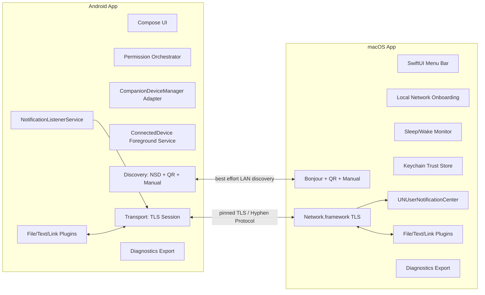
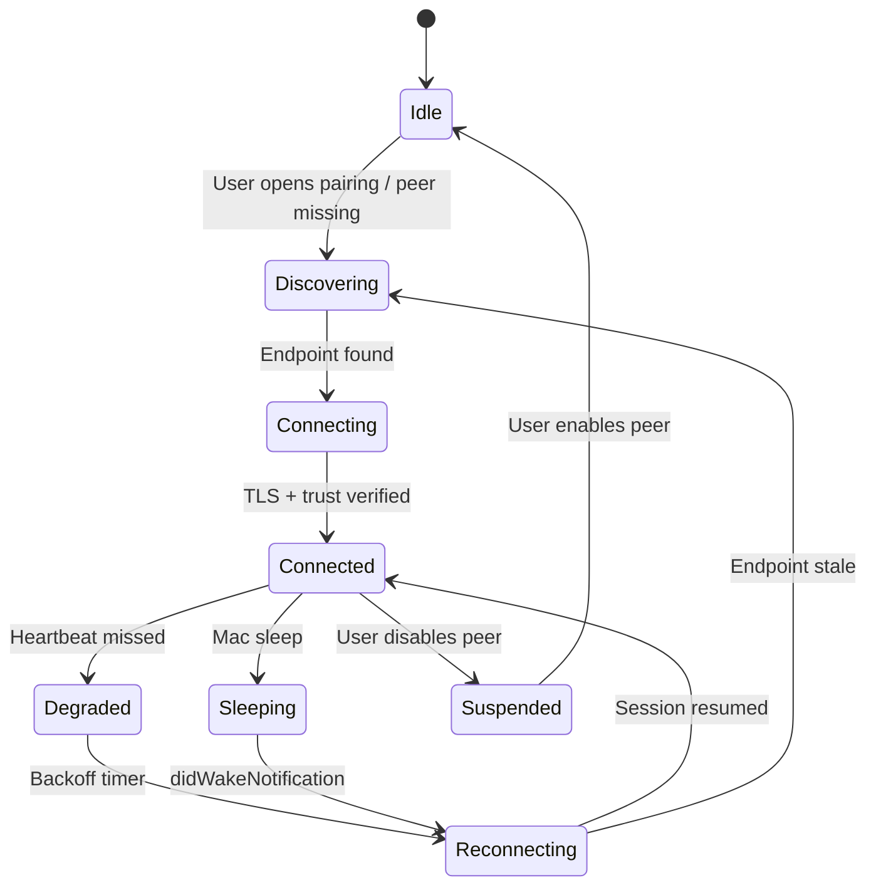
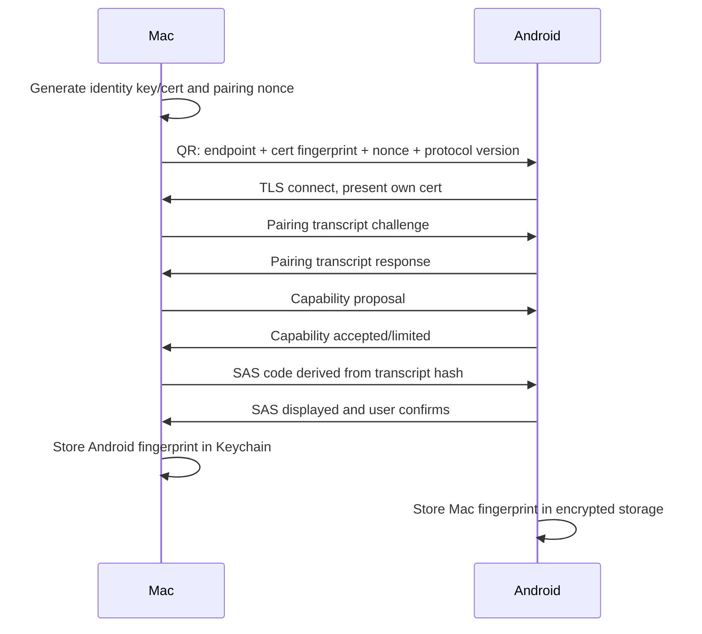

# Project Hyphen：macOS ↔ Android 本地优先 Companion Layer 计划 v0.3

**版本**：v0.3  
**日期**：2026-06-10  
**范围**：macOS ↔ Android，有线/无线互联互通中的第三个项目  
**定位**：开源、本地优先、可审计的 Android for Mac companion layer，而不是“Android AirDrop for Mac”单点工具。

---

## 0. v0.3 摘要

v0.3 是一次从“产品计划”向“可执行工程计划”的升级。v0.2 已经修正了 Quick Share ↔ AirDrop、NearDrop、scrcpy 官方来源、通知稳定 ID、Android 前台服务、CompanionDeviceManager、mDNS/MulticastLock、macOS 睡眠/App Nap、无遥测指标矛盾等问题；v0.3 进一步吸收 deep feasibility audit 的结论，把以下内容提升为 P0 架构约束：

1. **Android 16/17 本地网络权限路线**。Hyphen 不能再假设 LAN/mDNS/`.local`/`NsdManager` 永远是低摩擦隐式能力。Android 16 可用于提前测试受限本地网络行为；Android 17 对 target SDK 37+ 强制本地网络保护，`ACCESS_LOCAL_NETWORK` 需要作为显式运行时权限处理。发现和传输 onboarding 必须 permission-aware、fallback-rich、可自动测试。
2. **Companion Device API 版本分层**。CompanionDeviceManager 仍是正确方向，但 Android 16/API 36 之后的 presence model 已迁移到 `ObservingDevicePresenceRequest` 与 `DevicePresenceEvent`。Hyphen 不能把旧 callback 硬编码进核心，而要做 `CompanionPresenceAdapter` 抽象层。
3. **两条分发轨道**。GitHub/F-Droid 轨道优先透明、功能完整、可审计；Google Play 轨道优先政策最小化、权限解释、前台服务声明、Data safety 准确性。两个轨道可以能力不同，但协议兼容。
4. **发布工程前置**。Apple Developer ID/notarization、Google Play FGS declaration、Data safety、测试账户和关闭测试流程不是最后一周的包装任务，而是第 0 阶段就要开始。
5. **9 个月 v1 节奏**。v1 的可信窗口从 300 天以内调整为约 9 个月，即 2026-06 中旬启动，2027-03 左右进入 v1 window。前 60 天优先 burn down 平台风险，而不是堆功能。

---

## 1. 最终决策

**Conditional Go。** 继续推进，但必须接受以下边界：

- 护城河不是“文件传输”，而是**持久配对后的跨设备连续性**。
- v1 只承诺：配对、可靠重连、通知镜像与受控动作、文本/链接/文件双向流、隐私默认值、诊断导出、可验证协议。
- v1 不承诺：万能 Quick Reply、SMS/Call Log、云中继、目录同步、屏幕远控、AirDrop 协议重实现、后台自动剪贴板监听。
- 本地网络权限、Companion API 迁移、前台服务政策、macOS local network privacy 与睡眠重连是 P0，不是“后面再优化”。
- 如果 Google Play 对某些能力有审核摩擦，项目不能被 Play 轨道卡死；开源轨道与 Play 轨道应分层发布。

---

## 2. 产品定位

### 2.1 一句话

**Project Hyphen 是一个开源、本地优先、可审计的 Android for macOS companion layer，让 Mac 与 Android 手机在同一信任边界内持续互联：通知、动作、文本、链接、文件、状态与恢复。**

### 2.2 不再使用的叙事

不建议再使用这些定位：

- Android AirDrop for Mac
- Quick Share 替代品
- Android 版 Universal Control
- 开源 AirDroid
- Mac 上的 KDE Connect 复刻版

这些叙事会导致产品被拿去和 Quick Share、AirDrop、LocalSend、NearDrop、KDE Connect 逐项对比，而 Hyphen 的优势不在单项传输。

### 2.3 应使用的叙事

建议公开叙事：

- **Paired Android continuity for macOS**
- **Local-first Android companion for Mac**
- **Private, auditable, no-cloud device bridge**
- **Notification continuity + local transfer + reliable reconnect**

### 2.4 核心价值主张

| 价值 | 用户语言 | 工程含义 |
|---|---|---|
| 持久配对 | “我的 Mac 认识我的手机，不用每次重新找设备” | 信任存储、证书 pinning、remembered endpoints、CDM association |
| 通知连续性 | “手机消息能在 Mac 上看到、消除、部分回复” | `NotificationListenerService` + macOS `UNUserNotificationCenter` + action bridge |
| 本地优先 | “不经过云，不需要账号” | LAN TLS、QR/manual fallback、零遥测默认 |
| 可恢复 | “睡眠、换 Wi‑Fi、断线后自己回来” | reconnect state machine、wake observer、backoff、session resume |
| 可审计 | “我能看到它传了什么、为什么要权限” | 协议文档、权限说明、诊断包、开源 CI |

---

## 3. 市场与竞品格局 v0.3

### 3.1 Quick Share ↔ AirDrop 的影响

Quick Share 已经开始支持与 AirDrop 工作流互通，Android 端可以向 iPhone/iPad/macOS 发送文件，对方需要把 AirDrop 可见性设为 “Everyone for 10 Minutes”。这直接削弱“Android 向 Mac 发送文件”这一单点卖点。

但是它没有覆盖 Hyphen 的核心：

- 不是持久配对 companion。
- 不提供 Android 通知镜像与 Mac 端动作桥接。
- 不解决 Mac 睡眠/唤醒后的设备连续性。
- 不给用户可审计的开源协议栈。
- 不解决 Mac → Android 的稳定 companion workflow。
- 仍依赖用户临时打开 AirDrop/Quick Share 可见性。

**结论**：文件传输是 Hyphen 的基础能力，不是战略护城河。

### 3.2 竞品对比

| 项目 | 当前能力 | 对 Hyphen 的压力 | Hyphen 差异化 |
|---|---|---|---|
| Quick Share ↔ AirDrop | 官方跨生态文件/照片传输，部分设备支持 | 强烈压缩单次文件发送价值 | Hyphen 聚焦持久配对、通知、动作、重连、审计 |
| NearDrop | macOS 菜单栏接收 Nearby Share/Quick Share，Wi‑Fi LAN only | 与“Mac 菜单栏 + Android → Mac 文件接收”重叠 | Hyphen 不做单向文件接收，而做 companion layer |
| LocalSend | 跨平台、本地、无云文件/文本传输 | 文件传输体验强，用户基础大 | Hyphen 绑定 Android 权限能力和 Mac 原生连续性 |
| KDE Connect | 成熟的多平台设备互联，Android 能力丰富 | 功能广、社区成熟 | Hyphen 优先 macOS 原生体验、协议可审计、分发策略清晰 |
| AirDroid | 商业化多平台连接、远程访问 | 功能完整，品牌认知强 | Hyphen 本地优先、开源、默认无云 |
| scrcpy | Android 屏幕镜像/控制，非常成熟 | 如果做远控会被直接比较 | v1 不做远控；仅把 scrcpy 作为后期可选插件灵感，且只引用官方 GitHub |

---

## 4. 目标用户与 v1 Jobs To Be Done

### 4.1 目标用户

1. **Android 手机 + Mac 主力用户**：手机是 Android，工作电脑是 Mac。
2. **开源/隐私敏感用户**：不想把通知、文件、剪贴板经过商业云服务。
3. **开发者与技术用户**：愿意接受 QR 配对、权限解释、GitHub/F-Droid 安装。
4. **跨平台重度用户**：每天需要把链接、截图、文档、小文件、验证码通知在 Mac 和手机之间流转。
5. **不想使用重型套件的人**：不需要 AirDroid 那类全家桶，只想要一个可靠 companion。

### 4.2 v1 Jobs

| Job | 用户故事 | v1 验收 |
|---|---|---|
| J1 配对 | 我想把手机和 Mac 安全绑定，以后不重复确认 | 首次配对成功率 ≥ 90%，QR fallback ≥ 95% |
| J2 通知 | 我想在 Mac 上看到 Android 通知 | 通知中位延迟 < 2s，同一通知更新不刷屏 |
| J3 受控动作 | 我想从 Mac 关闭手机通知，部分 app 能直接回复 | Dismiss 稳定；Reply 仅对测试矩阵内 app 标注支持 |
| J4 文本/链接 | 我想把链接或文本从一端发到另一端 | 3 步内完成，失败可重试 |
| J5 文件 | 我想在同一 Wi‑Fi 下可靠传文件 | 1GB 文件可断点续传；失败原因可见 |
| J6 恢复 | 我合盖/切 Wi‑Fi 后不想重配 | Mac 唤醒后 30s 内恢复或显示明确状态 |
| J7 隐私 | 我想知道它有没有上传数据 | 默认无账号、无云中继、无遥测；诊断需 opt-in |

---

## 5. v1 范围与非目标

### 5.1 v1 必做

- macOS 菜单栏 app。
- Android companion app。
- QR 配对 + SAS 短码确认。
- 自签 TLS / mTLS + 公钥或证书 fingerprint pinning。
- Bonjour/mDNS 发现，但仅作为 best-effort accelerator。
- QR/manual IP/remembered endpoint fallback。
- Android Notification mirror/update/remove/dismiss。
- Quick Reply beta：仅对支持 `RemoteInput` 的通知动作开放，按 app 矩阵标注兼容性。
- 双向文本/链接发送。
- 双向文件发送，含断点续传、完整性校验、进度、取消。
- Mac 睡眠/唤醒、网络切换、Android 前后台/电池限制下的重连。
- 本地日志、可导出诊断包、无遥测默认。
- GitHub release；F-Droid 准备；Google Play policy-minimized track 评估。
- macOS notarized build 准备。

### 5.2 v1 明确不做

- 云账号、云中继、跨公网 NAT relay。
- SMS / Call Log 权限申请。
- 默认 SMS/Phone handler。
- 通话音频桥接。
- 屏幕镜像与远控。
- 自动后台剪贴板监听。
- 全量目录同步。
- AirDrop/AWDL 重实现。
- 私有 API、root、越狱、Accessibility hack。
- 将 KDE Connect GPL 代码搬进 MPL/Apache 项目。

---

## 6. 总体技术架构



### 6.1 架构原则

1. **协议核心小而稳定**：pairing、session、capability、envelope、ack、error、diagnostics 是 core。
2. **功能插件化**：notifications、files、text、clipboard、battery、future sms 都是 plugin。
3. **发现不是信任**：mDNS 只能告诉你“可能有设备”，信任来自 pinned key/cert 与 SAS。
4. **每个权限都有产品解释**：权限申请必须绑定用户可理解动作，不做 silent onboarding。
5. **每个 P0 风险都有 PoC**：Android local network、CDM presence、macOS local network、wake reconnect 必须先验证。

### 6.2 仓库结构建议

```text
hyphen/
  README.md
  LICENSE
  SECURITY.md
  CONTRIBUTING.md
  CODE_OF_CONDUCT.md
  docs/
    plan_v0_3_zh.md
    plan_v0_3_en.md
    roadmap_tracker_v0_3.md
    protocol/
      hyphen-protocol-v0.md
      threat-model.md
      pairing-transcript.md
    adr/
      0001-product-scope.md
      0002-transport-and-pairing.md
      0003-android-permission-model.md
      0004-distribution-tracks.md
  apps/
    android/
      app/
      core/
      feature-notifications/
      feature-transfer/
      feature-diagnostics/
    macos/
      Hyphen.xcodeproj
      HyphenApp/
      HyphenCore/
      HyphenNotifications/
      HyphenTransfer/
  protocol/
    schema/
    test-vectors/
    conformance/
  scripts/
    check.sh
    format.sh
    test-protocol.sh
  ci/
  packaging/
    macos/
    android-play/
    android-fdroid/
```

---

## 7. Android 设计 v0.3

### 7.1 最低与目标版本

| 项 | v1 建议 |
|---|---|
| minSdk | 26，原因是 CompanionDeviceManager 从 Android 8.0 可用 |
| targetSdk 初期 | 36，如果团队 2026 年启动开发 |
| targetSdk 前瞻 | 37 兼容工作必须在 v0.3 阶段开始，尤其是 `ACCESS_LOCAL_NETWORK` |
| 分发 | GitHub APK/AAB、F-Droid metadata 准备、Play policy-minimized build |

### 7.2 Android 模块

| 模块 | 职责 |
|---|---|
| `app` | Compose UI、导航、权限 onboarding |
| `core-protocol` | Envelope、capability、error code、test vectors |
| `core-transport` | TLS session、reconnect、backoff、ack、chunk IO |
| `core-discovery` | NSD/mDNS、MulticastLock、QR/manual endpoint、remembered endpoint |
| `core-companion` | CDM association、presence adapter、API 26–35 与 36+ 分层 |
| `feature-notifications` | NotificationListenerService、RemoteInput、dismiss、privacy filters |
| `feature-transfer` | SAF/MediaStore、file manifest、resumable chunks |
| `feature-diagnostics` | 本地日志、诊断导出、兼容性报告 |

### 7.3 Android Local Network Permission 策略

这是 v0.3 最大新增约束。

#### 设计要求

- 所有 LAN 操作经过 `LocalNetworkAccessController`。
- 发现、连接、`.local` resolve、incoming TCP listener、UDP multicast/broadcast 都视为需要本地网络权限的能力。
- Android 16 上启用限制模式进行 CI/manual test。
- Android 17 target SDK 37+ 时实现 `ACCESS_LOCAL_NETWORK` runtime permission flow。
- 权限被拒绝时，不崩溃、不空白；进入 QR/manual endpoint 模式。
- onboarding 文案要解释：Hyphen 只在本地网络寻找你已配对的 Mac，不扫描互联网，不上传拓扑。

#### 降级路径

| 情况 | 产品行为 |
|---|---|
| LAN permission granted | mDNS/NSD + remembered endpoint + manual fallback |
| LAN permission denied | 显示 QR/manual IP 连接说明；保留已配对设备但显示“无法自动发现” |
| 企业 Wi‑Fi/AP isolation | 尝试 remembered endpoint；失败后建议热点/USB/同一子网排查 |
| Android 版本不支持新权限 | 使用现有网络模型，但仍通过同一 controller 记录能力 |

### 7.4 CompanionDeviceManager 策略

#### 目标

把 CDM 从“可选增强”提升为 Android 端长期连接的核心系统集成点。

#### 设计

```kotlin
interface CompanionPresenceAdapter {
    suspend fun associate(request: HyphenAssociationRequest): AssociationResult
    fun observePresence(peerId: PeerId): Flow<PresenceEvent>
    suspend fun disassociate(peerId: PeerId)
}

class LegacyPresenceAdapter : CompanionPresenceAdapter // API 26-35
class Api36PresenceAdapter : CompanionPresenceAdapter // API 36+ ObservingDevicePresenceRequest
```

#### 要求

- 初始 pairing 可以结合 QR 与 CDM，但不能依赖 CDM 自动完成网络连接。
- presence event 只作为“可以尝试恢复连接”的信号，不作为安全信任来源。
- 所有 peer trust 仍由 Hyphen trust store 决定。
- API 36+ 使用 `ObservingDevicePresenceRequest` / `DevicePresenceEvent`。
- API 26–35 使用旧 association 能力和保守后台策略。

### 7.5 Foreground Service 策略

| 场景 | FGS 类型 | 策略 |
|---|---|---|
| 持久 companion 连接 | `connectedDevice` | 主路径；通知必须用户可感知，可关闭自动连接 |
| 用户主动大文件传输 | `dataSync` | 只在有限窗口使用；实现 timeout handling |
| 消息连续性实验 | `remoteMessaging` | v1 不作为核心；未来短信轨道再评估 |
| 定期维护 | 无 | 用 WorkManager/JobScheduler，不用 FGS 常驻 |

### 7.6 mDNS / NSD / MulticastLock

- `NsdManager` 是 best-effort，不是唯一入口。
- 自带 MulticastLock 管理器，仅在 discovery window 获取；默认非 reference-counted 或严格平衡 acquire/release。
- 每次 discovery 限时，例如 15–30 秒。
- Wi‑Fi 切换、屏幕关闭、省电模式、OEM ROM 都要测试。
- 记录 discovery failure reason，但默认只本地保存。
- 如果 NSD 在某些 ROM 上不稳定，允许引入纯 Kotlin mDNS 实现，但必须评估体积、维护、权限影响。

### 7.7 通知插件

#### 稳定 ID

使用 `StatusBarNotification.getKey()` 作为通知主键。不要把 `postTime` 混入主键，因为消息类 app 会不断更新同一通知，`postTime` 改变会导致 Mac 端刷屏。

#### 事件模型

| Android 事件 | Hyphen 事件 | macOS 行为 |
|---|---|---|
| posted new key | `notification.posted` | 显示新通知 |
| posted same key | `notification.updated` | 更新已有通知内容 |
| removed key | `notification.removed` | 移除/关闭对应 Mac 通知 |
| user dismiss on Mac | `notification.dismiss.request` | Android 调 `cancelNotification(key)`，失败则返回 error |
| reply action | `notification.reply.request` | Android 使用 `RemoteInput`，仅限兼容动作 |

#### 隐私模式

- 默认显示 app 名、标题、正文摘要。
- 可对指定 app 隐藏正文。
- 可设置“只显示通知存在，不显示内容”。
- 不保存历史通知数据库；只保留会话内映射。
- 诊断导出默认 redaction。

---

## 8. macOS 设计 v0.3

### 8.1 支持范围

| 项 | v1 建议 |
|---|---|
| 官方支持 | macOS 15.1+，因为 local network privacy 早期 bug 在 15.1 后更稳定 |
| Best effort | macOS 14.7+，功能可跑但不作为主要支持承诺 |
| 架构 | Apple Silicon 优先，Intel best effort |
| 分发 | GitHub DMG/ZIP + Developer ID notarization；Homebrew Cask 后续 |

### 8.2 macOS 模块

| 模块 | 职责 |
|---|---|
| `HyphenApp` | SwiftUI menu bar app、设置、onboarding |
| `HyphenCore` | 协议、session、trust store、capability |
| `HyphenDiscovery` | Bonjour/NWBrowser、QR code、manual endpoint |
| `HyphenTransport` | Network.framework TLS、connection lifecycle |
| `HyphenNotifications` | UNUserNotificationCenter、action mapping |
| `HyphenTransfer` | 文件选择、保存、断点续传、校验 |
| `HyphenPower` | sleep/wake/network change reconnect |
| `HyphenDiagnostics` | OSLog、redaction、diagnostic export |

### 8.3 Local Network Privacy

- 首次启动不立即触发本地网络 prompt；先解释原因，再让用户点击“查找手机”。
- Bonjour register/browse/resolve 都通过一个 onboarding step 触发。
- 权限被拒绝时仍可使用 QR/manual IP。
- 设置页展示“本地网络权限状态”和修复路径。
- 文档要给出 macOS 15+ 的权限重置/排查方法。

### 8.4 睡眠、唤醒与 App Nap

#### 状态机



#### 规则

- 监听 `NSWorkspace.didWakeNotification`。
- wake 后 1s、5s、15s、30s 尝试恢复。
- 传输中断后保存 transfer checkpoint。
- 只在用户主动传输或关键阶段使用 `ProcessInfo.beginActivity`，不阻止系统正常睡眠。
- App Nap 不靠“强行禁用”解决，而靠明确 activity scope 和重连逻辑解决。

### 8.5 macOS 通知映射

- 每个 Android `sbnKey` 映射到一个 macOS notification identifier。
- 更新同一 key 时替换/刷新内容，不创建新通知。
- Dismiss action 需要返回 Android 确认；若失败，Mac 显示温和错误。
- Reply action 只在 Android payload 明确给出 remote input capability 时显示。
- 支持 privacy mode：隐藏内容、隐藏 app、仅显示“Android 通知”。

---

## 9. 协议设计 v0.3

### 9.1 传输层

- v1 使用 LAN TCP + TLS 1.3。
- 双端生成自签证书，首次配对时 pin fingerprint。
- 证书/公钥变更需要重新确认。
- 连接恢复需要 session resume token，但 token 不可跨 peer 使用。
- 不使用云中继。

### 9.2 Pairing



### 9.3 Envelope

v1 使用 JSON line 或 length-prefixed JSON，便于调试；未来可以迁移 CBOR/Protobuf，但 v1 先追求可审计。

```json
{
  "protocol": "hyphen/0.3",
  "messageId": "01JZ...",
  "sessionId": "s_...",
  "type": "notification.updated",
  "capability": "notifications.v1",
  "seq": 42,
  "ackOf": null,
  "sentAtUnixMs": 1781020800000,
  "requiresAck": true,
  "payload": {},
  "trace": {
    "localOnly": true,
    "spanId": "..."
  }
}
```

### 9.4 Capability 协商

```json
{
  "type": "hello",
  "payload": {
    "device": {
      "kind": "android",
      "appVersion": "0.1.0",
      "osVersion": "Android 16",
      "deviceName": "Pixel"
    },
    "capabilities": {
      "notifications.v1": { "reply": "beta", "dismiss": true },
      "transfer.v1": { "resume": true, "maxChunkBytes": 1048576 },
      "text.v1": { "direction": "bidirectional" },
      "diagnostics.v1": { "redactedExport": true }
    }
  }
}
```

### 9.5 文件传输

- 先发 manifest，再传 chunk。
- v1 校验使用 SHA-256，避免额外依赖；BLAKE3 可作为 P2。
- 断点续传按 `fileId + chunkIndex + chunkHash`。
- 默认接收路径可配置。
- Android 使用 SAF/MediaStore；macOS 使用用户选择目录或 Downloads。
- 不做后台目录同步。

---

## 10. 权限、政策与分发

### 10.1 Android 权限分层

| 权限/能力 | v1 轨道 | 说明 |
|---|---|---|
| Notification Listener | GitHub/F-Droid/Play | 核心能力，用户显式开启 |
| Local Network | Android 17+ 必须处理 | 用于 LAN discovery/transport |
| Foreground Service connectedDevice | GitHub/F-Droid/Play | 需要清晰用户可感知通知 |
| Foreground Service dataSync | 有限使用 | 仅大文件用户主动传输 |
| SMS/Call Log | v1 不申请 | 避免 Play 高风险权限 |
| Accessibility | 不申请 | 避免隐私与审核风险 |
| Clipboard background | 不做 | Android 10+ 限制，且隐私风险高 |

### 10.2 分发轨道

| 轨道 | 目标 | 特点 |
|---|---|---|
| GitHub Releases | 早期社区、透明构建、技术用户 | 最快发布；包含完整开源功能，但仍不碰 SMS/Call Log v1 |
| F-Droid | 开源用户、可复现构建 | 需要 metadata、无专有依赖审查、构建可复现准备 |
| Google Play | 普通用户与可发现性 | 功能更保守；强权限解释；FGS declaration；Data safety 严格匹配 |
| macOS GitHub notarized build | Mac 用户直接下载 | Developer ID、notarization、Sparkle/Homebrew 后续 |

### 10.3 发布工程前置清单

- Apple Developer Program 账户确认。
- Developer ID Application 证书。
- Notarization 脚本与 CI secret 设计。
- Google Play developer account 类型确认。
- Play Data safety 草案。
- FGS declaration 草案。
- Privacy policy 草案。
- F-Droid metadata 初稿。
- Release signing key 存储策略。
- SBOM 与 dependency license audit。

---

## 11. 隐私、安全与遥测

### 11.1 默认策略

- 默认无账号。
- 默认无云。
- 默认无遥测。
- 默认不保存通知历史。
- 默认不扫描联系人、短信、通话记录。
- 默认不上传 crash report。
- 默认本地日志 redaction。

### 11.2 Opt-in beta diagnostics

只有用户显式开启 beta diagnostics 时，才允许收集：

- 匿名设备类别、OS 版本、app 版本。
- 配对阶段失败码。
- 连接重试次数。
- 通知延迟分布。
- crash stack，且默认移除通知正文、文件名、IP 地址最后一段。

必须提供：

- 一键关闭。
- 一键导出本地诊断。
- 一键删除本地诊断。
- 隐私政策中逐项说明。

### 11.3 威胁模型摘要

| 威胁 | 防护 |
|---|---|
| 同网段设备冒充 Mac/手机 | SAS + pinned cert/fingerprint |
| mDNS spoofing | 发现不等于信任；TLS pin 才是信任 |
| 中间人攻击 | TLS 1.3 + transcript SAS |
| 通知内容泄露 | privacy mode、redaction、无历史数据库 |
| 丢失设备继续连接 | peer revoke、trust reset、association removal |
| 诊断泄露敏感数据 | 默认本地、opt-in、redaction、用户可查看再发送 |
| 恶意贡献引入 GPL 污染 | clean-room policy、license audit、DCO/CLA 选择 |

---

## 12. Open Source 治理

### 12.1 命名

继续使用 **Project Hyphen** 作为 working name。避免 `Droid*`，因为 “Droid” 有商标风险。正式名称需做商标检索。

### 12.2 许可证

推荐路线：

- 协议规范、schema、test vectors：Apache-2.0。
- App 代码：MPL-2.0 或 Apache-2.0。
- 文档：CC-BY-4.0。

如果选择 MPL/Apache 路线，则必须 clean-room：不能复制 KDE Connect GPL 代码片段；只能借鉴公开协议/产品思想并重新实现。

### 12.3 安全流程

- `SECURITY.md` 中提供私下报告路径。
- 所有 crypto/pairing 代码必须有 test vectors。
- release 前跑 dependency audit。
- 公开 threat model。
- 重要协议变更必须 ADR。

---

## 13. Roadmap v0.3 总览

| 阶段 | 时间窗 | 目标 | Gate |
|---|---|---|---|
| M0 Scope & Ops | 2026-06-15 → 2026-07-05 | 范围冻结、仓库、发布/政策草案 | docs + repo + CI skeleton |
| M1 Platform Risk PoC | 2026-06-22 → 2026-07-20 | Android LAN/CDM、macOS LNP/wake 验证 | 四个 P0 PoC 均有可复现实验 |
| M2 Core Pairing/Transport | 2026-07-21 → 2026-09-01 | trust store、TLS session、fallback discovery | 两端可安全配对、断线恢复 |
| M3 Notification + Transfer MVP | 2026-08-04 → 2026-09-15 | 通知镜像、dismiss、文本/链接/文件 | 内测可日用 |
| M4 Private Beta | 2026-09-22 → 2026-11-17 | 兼容性矩阵、诊断、稳定性 | 20–50 名技术用户 |
| M5 Public Beta | 2026-11-24 → 2027-01-19 | 文档、notarization、F-Droid/Play track | 公测下载体验闭环 |
| M6 v1 Stabilization | 2027-01-26 → 2027-03-09 | crash-free、reconnect、transfer recovery | v1.0 tag |

---

## 14. 30/60/90 天执行重点

### 30 天

- 完成 ADR 0001–0004。
- 建仓库与 CI skeleton。
- macOS Bonjour + local network permission PoC。
- Android NSD + MulticastLock + Android 16 restricted LAN PoC。
- CDM association + API 36 presence model spike。
- QR pairing transcript prototype。
- 初版 threat model 与 protocol schema。

### 60 天

- 两端可运行 app skeleton。
- pinned TLS session 建立。
- remembered endpoint + manual endpoint fallback。
- Android connectedDevice FGS skeleton。
- Mac sleep/wake reconnect prototype。
- Notification mirror posted/updated/removed MVP。
- 本地 redacted diagnostics export。

### 90 天

- 通知 dismiss。
- Quick Reply beta app matrix。
- 文本/链接双向发送。
- 文件 manifest + chunk + resume。
- Beta onboarding 文案。
- notarization pipeline dry run。
- Play/F-Droid release checklist dry run。

---

## 15. Gate 与 Cut Rules

### Gate A：LAN/Discovery survivability

通过条件：

- mDNS 成功时能自动发现。
- mDNS 失败时 QR/manual 在 95% 手工测试中成功。
- Android 16 restricted LAN 模式下行为可解释。
- Android 17 `ACCESS_LOCAL_NETWORK` 设计有 mock/test path。

失败处理：

- 不追求隐式发现；把 QR/manual 做成主体验。

### Gate B：Notification thesis

通过条件：

- 10 个常见 app 通知 mirror/update/remove 正常。
- 同一 key 更新不会刷屏。
- dismiss 成功率可测。
- privacy mode 无正文泄漏。

失败处理：

- v1 只发 mirror，不发 reply；reply 留到 v1.1。

### Gate C：Distribution feasibility

通过条件：

- macOS notarization dry run 成功。
- Play Data safety/FGS declaration 草案明确。
- F-Droid metadata 无阻断依赖。

失败处理：

- 先 GitHub release；Play 延后，不影响开源 beta。

### Gate D：Reliability

通过条件：

- Mac wake 后 30 秒内恢复或明确错误。
- 1GB 文件中断后 resume 成功。
- crash-free beta sessions ≥ 99%。

失败处理：

- 缩小 v1 功能面，保 pairing/notifications/transfers 基础稳定。

---

## 16. 测试策略

### 16.1 自动化

- Protocol schema tests。
- Pairing transcript test vectors。
- TLS pinning negative tests。
- File chunk resume tests。
- Notification key dedupe tests。
- Android permission controller unit tests。
- macOS reconnect state machine tests。

### 16.2 手工矩阵

| 维度 | 必测 |
|---|---|
| Android | Pixel Android 14/15/16，Android 17 preview；Samsung One UI；Xiaomi/HyperOS；OnePlus/Oppo |
| macOS | macOS 15.1+ Apple Silicon；macOS 15.5；macOS 16 beta；Intel best effort |
| 网络 | 家庭 Wi‑Fi、Mesh、手机热点、企业 Wi‑Fi、AP isolation、IPv6-only、公共 Wi‑Fi |
| 场景 | 首次配对、拒绝权限、睡眠唤醒、切换 Wi‑Fi、大文件中断、通知风暴、低电量模式 |

---

## 17. KPI 与指标

默认无遥测，因此指标分两类。

### 17.1 默认社区代理指标

- GitHub issue 类型与复现质量。
- Release 下载量。
- 兼容性矩阵 PR 数。
- Discord/Discussions 中的失败场景分类。
- 手动提交的诊断包数量。

### 17.2 Opt-in beta 指标

- 首次配对成功率。
- QR/manual fallback 成功率。
- 通知中位延迟。
- duplicate notification rate。
- wake reconnect median time。
- transfer resume success rate。
- crash-free sessions。

---

## 18. 资源与预算模型

用户尚未给出预算上限、地区、薪酬口径，因此只能建模。

| 情境 | 团队 | 时间 | 粗略预算 |
|---|---|---:|---:|
| Community PoC | 1 名 lead + part-time review | 2–3 个月 | US$45k–90k |
| Lean v1 | Android engineer + macOS engineer + 0.5 QA/release + 0.25 docs/product | 9 个月 | US$360k–430k |
| Hardened v1 | Lean v1 + 外部安全/兼容性预算 | 9–12 个月 | US$430k–600k |

硬成本较低：Apple Developer Program、Google Play 注册、域名、少量设备与 CI 资源。真正成本是平台兼容性、测试矩阵、发布流程和长期维护。

---

## 19. v1 发布标准

v1.0 必须满足：

- GitHub release 可安装。
- macOS build 已签名与 notarized。
- Android build 可从 GitHub 安装；F-Droid/Play 至少一个轨道有明确状态。
- 首次配对有 QR + SAS。
- 通知 mirror/update/remove/dismiss 稳定。
- 文本/链接/文件双向流可用。
- 1GB 文件断点续传可用。
- Mac wake/network change 可恢复。
- 默认无遥测。
- 协议文档、threat model、diagnostics docs 已公开。
- 已知风险与 unsupported cases 明确写入 README。

---

## 20. 下一步

1. 把 `roadmap_tracker_v0_3.md` 放入仓库 `docs/`。
2. 创建 `CLAUDE.md`，写明工程约束、测试命令、禁止事项。
3. 运行 Claude Code loop，先做 M0/M1，不要直接进入 UI polish。
4. 每完成一个任务更新 roadmap 状态与 ADR。
5. 每 2 周重开 Gate review。

---

## 21. v0.3 结论

Project Hyphen 仍然值得做，但它的正确形态是：

> **不是文件传输工具，而是 Mac 与 Android 之间的本地信任层。**

在 Quick Share ↔ AirDrop 正式互通、LocalSend/NearDrop 已经覆盖传输场景、KDE Connect 已经证明广义设备互联可行的前提下，Hyphen 的机会在于：macOS 原生体验、Android companion 权限能力、隐私默认、可审计协议、可靠重连、分发策略清晰。

v0.3 的关键变化是把平台政策和未来权限变化前置，而不是等到 beta 才发现产品无法稳定运行。只要团队接受 scope discipline，先 burn down Android LAN/CDM/macOS wake/发布工程这些 P0 风险，再逐步扩大功能，Hyphen 有机会成为一个真正可用、可信、适合开源社区参与的 Android for Mac companion layer。

## 22. 参考资料与资料完整性说明

本计划基于 v0.2 文档、后续 deep feasibility audit，以及 2026-06-10 可核验的一手资料。外部资料建议在每次公开发布前重新核验。

- Android Local Network Permission: https://developer.android.com/privacy-and-security/local-network-permission
- Android Companion Device Pairing: https://developer.android.com/develop/connectivity/bluetooth/companion-device-pairing
- Android Foreground Service timeouts: https://developer.android.com/develop/background-work/services/fgs/timeout
- Android `StatusBarNotification`: https://developer.android.com/reference/android/service/notification/StatusBarNotification
- Android `WifiManager.MulticastLock`: https://developer.android.com/reference/android/net/wifi/WifiManager.MulticastLock
- Apple TN3179, Local Network Privacy: https://developer.apple.com/documentation/technotes/tn3179-understanding-local-network-privacy
- Android Quick Share with iPhone: https://www.android.com/quick-share/with-iphone/
- NearDrop: https://github.com/grishka/NearDrop
- LocalSend: https://localsend.org/ and https://github.com/localsend/localsend
- scrcpy official repository only: https://github.com/Genymobile/scrcpy
- Claude Code scheduled tasks and `/loop`: https://code.claude.com/docs/en/scheduled-tasks
- Claude Code CLI reference: https://code.claude.com/docs/en/cli-reference
