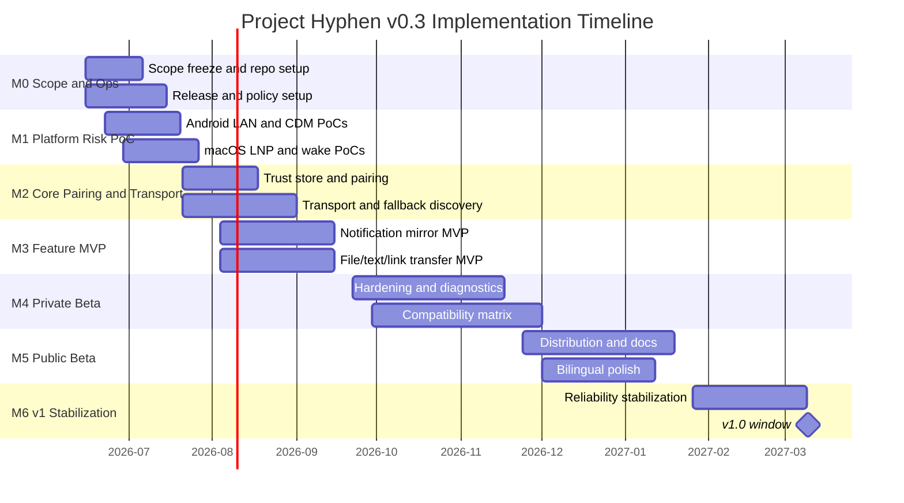

# Project Hyphen Roadmap Tracker v0.3

**Date**: 2026-06-10  
**Recommended repo path**: `docs/project_hyphen_roadmap_tracker_v0_3.md`  
**Purpose**: This is the source-of-truth implementation tracker for Project Hyphen v0.3. It is designed for humans, GitHub issues, and Claude Code loops.

---

## 0. How to use this tracker

### Status legend

| Status | Meaning |
|---|---|
| `[ ]` | Not started |
| `[~]` | In progress |
| `[?]` | Blocked; reason required |
| `[R]` | Ready for review |
| `[x]` | Done; acceptance criteria met, tests run, docs/ADR updated |

### Priority legend

| Priority | Meaning |
|---|---|
| P0 | Blocks Alpha or a major feasibility gate |
| P1 | Required before Private/Public Beta |
| P2 | Important but can slip after v1 |
| P3 | Optional / community nice-to-have |

### Definition of Done

A task is done only when all apply:

- Implementation is merged or committed locally.
- Relevant unit/integration/manual tests have run.
- Failure modes are handled, not just the happy path.
- Docs, ADRs, or protocol schemas are updated if behavior changed.
- This roadmap row is updated with status, notes, and commit hash if available.
- No secrets, credentials, or personal data were introduced.

### Claude Code operating rule

When this file is used by an agent, the agent should always:

1. Choose the next unchecked P0 task with no unmet dependency.
2. If no P0 remains, choose the next P1 task.
3. Implement the smallest coherent slice.
4. Run the narrowest relevant tests first, then broader checks.
5. Update this file.
6. Commit with a concise message if tests pass.
7. Stop or mark `[?]` if blocked by missing credentials, signing accounts, physical devices, or policy access.

---

## 1. Milestone timeline



---

## 2. Decision gates

| Gate | Target | Status | Pass criteria | If failed |
|---|---:|---|---|---|
| G-A LAN/discovery survivability | 2026-07-20 | `[ ]` | mDNS works when available; QR/manual succeeds when mDNS fails; Android restricted LAN behavior understood | Make QR/manual the primary pairing UX |
| G-B Companion API viability | 2026-07-20 | `[ ]` | API 26–35 and API 36+ adapters compile and have PoC behavior | Use conservative background model and reduce always-connected promise |
| G-C macOS wake recovery | 2026-07-27 | `[ ]` | Wake triggers reconnect state machine; failure surfaced within 30s | Delay Beta; focus on reliability before features |
| G-D Notification thesis | 2026-09-15 | `[ ]` | 10-app matrix passes mirror/update/remove; duplicate rate acceptable | Remove Quick Reply from v1; keep mirror/dismiss |
| G-E Distribution feasibility | 2026-11-24 | `[ ]` | notarization dry run, Play/F-Droid package plan, privacy docs | Ship GitHub first; defer Play |
| G-F v1 Reliability | 2027-03-01 | `[ ]` | crash-free beta sessions ≥99%; 1GB resume works; wake reconnect works | Cut P1/P2 breadth |

---

## 3. Workstream M0 — Scope, repository, and release operations

| ID | Status | Priority | Area | Task | Dependencies | Acceptance criteria | Verification |
|---|---|---|---|---|---|---|---|
| HYP-M0-001 | `[x]` | P0 | Product | Freeze v1 scope and non-goals in `docs/adr/0001-product-scope.md` | none | ADR lists v1 must-have, non-goals, cut rules | Review ADR |
| HYP-M0-002 | `[x]` | P0 | Repo | Initialize monorepo layout | none | `apps/android`, `apps/macos`, `protocol`, `docs`, `scripts` exist | `tree -L 3` |
| HYP-M0-003 | `[x]` | P0 | Repo | Add `README.md`, `CONTRIBUTING.md`, `SECURITY.md`, `CODE_OF_CONDUCT.md` | HYP-M0-002 | Basic open-source governance present | Manual review |
| HYP-M0-004 | `[x]` | P0 | Agent | Add `CLAUDE.md` with repo rules, test commands, forbidden actions | HYP-M0-002 | Claude Code can orient from repo root | `claude -p "summarize repo rules"` |
| HYP-M0-005 | `[x]` | P0 | CI | Create `scripts/check.sh` placeholder that runs available checks | HYP-M0-002 | Script exits 0 and explains missing platform checks | `./scripts/check.sh` |
| HYP-M0-006 | `[x]` | P0 | CI | Add GitHub Actions skeleton for docs/protocol checks | HYP-M0-005 | CI runs markdown/schema checks | GitHub Actions local/dry run |
| HYP-M0-007 | `[x]` | P0 | Protocol | Create `docs/protocol/hyphen-protocol-v0.md` | HYP-M0-001 | Contains envelope, pairing, capability, errors | Manual review |
| HYP-M0-008 | `[x]` | P0 | Security | Create `docs/protocol/threat-model.md` | HYP-M0-007 | Covers LAN spoofing, MITM, notification privacy, diagnostics | Manual review |
| HYP-M0-009 | `[x]` | P0 | Policy | Draft `docs/adr/0003-android-permission-model.md` | HYP-M0-001 | Covers Local Network, FGS, notification listener, no SMS v1 | Manual review |
| HYP-M0-010 | `[x]` | P0 | Distribution | Draft `docs/adr/0004-distribution-tracks.md` | HYP-M0-001 | GitHub/F-Droid/Play/macOS tracks separated | Manual review |
| HYP-M0-011 | `[ ]` | P1 | Distribution | Create `packaging/macos/notarization-notes.md` | HYP-M0-010 | Developer ID/notary requirements listed | Manual review |
| HYP-M0-012 | `[ ]` | P1 | Distribution | Create `packaging/android-play/play-policy-notes.md` | HYP-M0-010 | FGS/Data safety/closed testing notes listed | Manual review |
| HYP-M0-013 | `[ ]` | P1 | Distribution | Create `packaging/android-fdroid/metadata-notes.md` | HYP-M0-010 | F-Droid metadata and reproducibility considerations listed | Manual review |
| HYP-M0-014 | `[ ]` | P1 | Devices | Create `docs/compatibility-matrix.md` | none | Blank matrix for Android/macOS/network cases | Manual review |
| HYP-M0-015 | `[ ]` | P1 | License | Add license decision note | HYP-M0-003 | MPL/Apache clean-room rules stated | Manual review |

---

## 4. Workstream M1 — Platform risk PoCs

| ID | Status | Priority | Area | Task | Dependencies | Acceptance criteria | Verification |
|---|---|---|---|---|---|---|---|
| HYP-M1-001 | `[x]` | P0 | Android LAN | Create Android sample app skeleton | HYP-M0-002 | Builds on local machine/CI where Android available | `./gradlew assembleDebug` |
| HYP-M1-002 | `[x]` | P0 | Android LAN | Implement `LocalNetworkAccessController` abstraction | HYP-M1-001 | API exposes granted/denied/unknown and rationale state | Unit tests |
| HYP-M1-003 | `[x]` | P0 | Android LAN | Add Android 16 restricted LAN test plan | HYP-M1-002 | Steps documented with expected results | Manual test log |
| HYP-M1-004 | `[?]` | P0 | Android LAN | Implement NSD/mDNS discovery PoC | HYP-M1-001 | Can discover Mac test service on same LAN | Manual test |
| HYP-M1-005 | `[x]` | P0 | Android LAN | Implement scoped MulticastLock manager | HYP-M1-004 | Lock acquired only during discovery window and always released | Unit/log test |
| HYP-M1-006 | `[?]` | P0 | Android LAN | Implement QR/manual endpoint fallback PoC | HYP-M1-002 | Connects when mDNS disabled | Manual test |
| HYP-M1-007 | `[?]` | P0 | Android CDM | Implement CDM association PoC | HYP-M1-001 | User can create/disassociate association | Manual test |
| HYP-M1-008 | `[ ]` | P0 | Android CDM | Implement `CompanionPresenceAdapter` interface | HYP-M1-007 | Legacy and API36+ stubs compile | Unit tests |
| HYP-M1-009 | `[ ]` | P0 | Android CDM | Spike API 36 `ObservingDevicePresenceRequest` path | HYP-M1-008 | Behavior recorded in ADR/test log | Manual test or compile-gated code |
| HYP-M1-010 | `[ ]` | P0 | macOS LNP | Create macOS menu-bar sample app skeleton | HYP-M0-002 | App launches and shows menu-bar item | `xcodebuild build` |
| HYP-M1-011 | `[ ]` | P0 | macOS LNP | Implement Bonjour advertise/browse PoC | HYP-M1-010 | Mac advertises `_hyphen._tcp.local` | Manual test |
| HYP-M1-012 | `[ ]` | P0 | macOS LNP | Add Local Network Privacy onboarding copy | HYP-M1-011 | Prompt is triggered only after user action | Manual test |
| HYP-M1-013 | `[ ]` | P0 | macOS Wake | Implement wake/sleep observer PoC | HYP-M1-010 | Logs sleep/wake and starts reconnect attempt | Manual test |
| HYP-M1-014 | `[ ]` | P0 | macOS Wake | Implement reconnect state machine prototype | HYP-M1-013 | 1s/5s/15s/30s retry schedule exists | Unit tests |
| HYP-M1-015 | `[ ]` | P0 | Gate | Write M1 findings report | HYP-M1-001..014 | Go/cut decisions documented | Gate review |

---

## 5. Workstream M2 — Protocol, trust store, and transport

| ID | Status | Priority | Area | Task | Dependencies | Acceptance criteria | Verification |
|---|---|---|---|---|---|---|---|
| HYP-M2-001 | `[ ]` | P0 | Protocol | Define envelope schema | HYP-M0-007 | JSON schema checked into `protocol/schema` | Schema test |
| HYP-M2-002 | `[ ]` | P0 | Protocol | Define capability negotiation schema | HYP-M2-001 | Includes notifications, transfer, text, diagnostics | Schema test |
| HYP-M2-003 | `[ ]` | P0 | Protocol | Define error-code taxonomy | HYP-M2-001 | Permission, transport, trust, plugin errors covered | Unit test |
| HYP-M2-004 | `[ ]` | P0 | Security | Create pairing transcript and SAS test vectors | HYP-M0-008 | Deterministic vectors for both platforms | `scripts/test-protocol.sh` |
| HYP-M2-005 | `[ ]` | P0 | macOS Trust | Implement Keychain peer trust store | HYP-M1-010 | Add/get/remove peer fingerprint | Unit tests |
| HYP-M2-006 | `[ ]` | P0 | Android Trust | Implement encrypted peer trust store | HYP-M1-001 | Add/get/remove peer fingerprint | Unit tests |
| HYP-M2-007 | `[ ]` | P0 | Transport | Implement macOS TLS listener/client skeleton | HYP-M2-005 | Self-signed cert and pinned peer verification | Integration test |
| HYP-M2-008 | `[ ]` | P0 | Transport | Implement Android TLS client/server skeleton | HYP-M2-006 | Self-signed cert and pinned peer verification | Integration test |
| HYP-M2-009 | `[ ]` | P0 | Pairing | Implement QR payload generation on macOS | HYP-M2-004,HYP-M2-007 | QR contains endpoint, fingerprint, nonce, protocol | Unit/manual test |
| HYP-M2-010 | `[ ]` | P0 | Pairing | Implement QR scan/parse on Android | HYP-M2-009 | Invalid payload rejected safely | Unit/manual test |
| HYP-M2-011 | `[ ]` | P0 | Pairing | Implement SAS confirmation UI both sides | HYP-M2-009,HYP-M2-010 | User confirms matching code before trust is stored | Manual test |
| HYP-M2-012 | `[ ]` | P0 | Transport | Implement heartbeat and ack | HYP-M2-007,HYP-M2-008 | Missed heartbeat transitions to degraded | Unit/integration test |
| HYP-M2-013 | `[ ]` | P0 | Transport | Implement session reconnect and backoff | HYP-M2-012 | Reconnect after simulated drop | Integration test |
| HYP-M2-014 | `[ ]` | P1 | Diagnostics | Add protocol-level trace IDs local only | HYP-M2-001 | Trace IDs are not transmitted in diagnostics unless opted-in | Unit test |
| HYP-M2-015 | `[ ]` | P1 | Docs | Update protocol docs with implementation decisions | HYP-M2-001..014 | Docs match code behavior | Manual review |

---

## 6. Workstream M3 — Notifications, text/link, and file transfer MVP

| ID | Status | Priority | Area | Task | Dependencies | Acceptance criteria | Verification |
|---|---|---|---|---|---|---|---|
| HYP-M3-001 | `[ ]` | P0 | Notifications | Implement Android NotificationListenerService scaffold | HYP-M2-013 | Permission onboarding and service lifecycle work | Manual test |
| HYP-M3-002 | `[ ]` | P0 | Notifications | Normalize notification payload using `sbn.getKey()` | HYP-M3-001 | `postTime` not used in primary key | Unit test |
| HYP-M3-003 | `[ ]` | P0 | Notifications | Implement posted/updated/removed events | HYP-M3-002 | Same key updates existing record | Integration test |
| HYP-M3-004 | `[ ]` | P0 | macOS Notifications | Show/update/remove macOS notifications | HYP-M3-003 | One Android key maps to one macOS ID | Manual test |
| HYP-M3-005 | `[ ]` | P0 | Notifications | Implement privacy filters | HYP-M3-004 | Hidden-body mode leaks no body text | Unit/manual test |
| HYP-M3-006 | `[ ]` | P0 | Notifications | Implement Mac-side dismiss request | HYP-M3-004 | Android cancels notification or returns explicit error | Manual test |
| HYP-M3-007 | `[ ]` | P1 | Notifications | Implement RemoteInput quick-reply beta | HYP-M3-006 | Works on at least 3 tested app families | Compatibility matrix |
| HYP-M3-008 | `[ ]` | P0 | Text/Link | Implement Android → macOS text/link send | HYP-M2-013 | Text/link appears on Mac with user confirmation | Manual test |
| HYP-M3-009 | `[ ]` | P0 | Text/Link | Implement macOS → Android text/link send | HYP-M2-013 | Android receives and can copy/open | Manual test |
| HYP-M3-010 | `[ ]` | P0 | Transfer | Define file manifest schema | HYP-M2-001 | filename, size, mime, sha256, chunks | Schema test |
| HYP-M3-011 | `[ ]` | P0 | Transfer | Implement chunk sender/receiver | HYP-M3-010 | Small file transfers both directions | Integration test |
| HYP-M3-012 | `[ ]` | P0 | Transfer | Implement resume checkpoints | HYP-M3-011 | Interrupted transfer resumes | Integration test |
| HYP-M3-013 | `[ ]` | P0 | Transfer | Implement SHA-256 verification | HYP-M3-011 | Corrupted chunk/file rejected | Unit test |
| HYP-M3-014 | `[ ]` | P1 | Transfer | Implement progress/cancel UI | HYP-M3-011 | User sees progress and can cancel | Manual test |
| HYP-M3-015 | `[ ]` | P1 | Transfer | Implement 1GB transfer test | HYP-M3-012,HYP-M3-013 | 1GB transfer resumes after interruption | Manual test log |

---

## 7. Workstream M4 — Diagnostics, beta hardening, and compatibility

| ID | Status | Priority | Area | Task | Dependencies | Acceptance criteria | Verification |
|---|---|---|---|---|---|---|---|
| HYP-M4-001 | `[ ]` | P0 | Diagnostics | Implement local structured logs | HYP-M2-013 | Logs include failure codes without sensitive payload | Unit/manual test |
| HYP-M4-002 | `[ ]` | P0 | Diagnostics | Implement redacted diagnostics export on Android | HYP-M4-001 | User can preview/export/delete | Manual test |
| HYP-M4-003 | `[ ]` | P0 | Diagnostics | Implement redacted diagnostics export on macOS | HYP-M4-001 | User can preview/export/delete | Manual test |
| HYP-M4-004 | `[ ]` | P1 | Diagnostics | Implement opt-in beta diagnostics toggle | HYP-M4-002,HYP-M4-003 | Off by default; clear copy; disable works | Manual test |
| HYP-M4-005 | `[ ]` | P0 | Compatibility | Fill Android device matrix with first 5 devices | HYP-M3-001..015 | Results recorded with OS/OEM/network | Manual matrix |
| HYP-M4-006 | `[ ]` | P0 | Compatibility | Fill macOS matrix with 3 OS/device combos | HYP-M3-001..015 | Results recorded | Manual matrix |
| HYP-M4-007 | `[ ]` | P0 | Reliability | Test sleep/wake reconnect across 20 cycles | HYP-M2-013,HYP-M1-014 | Median reconnect <30s or clear error | Test log |
| HYP-M4-008 | `[ ]` | P0 | Reliability | Notification storm test | HYP-M3-004 | No duplicate flood; UI remains responsive | Manual/automated test |
| HYP-M4-009 | `[ ]` | P1 | UX | Improve onboarding copy for permissions | HYP-M4-005 | Users understand why each permission is requested | Review/beta feedback |
| HYP-M4-010 | `[ ]` | P1 | UX | Add peer management screen | HYP-M2-006 | Revoke/reset peer works | Manual test |
| HYP-M4-011 | `[ ]` | P1 | Beta | Prepare private beta release notes | HYP-M4-001..010 | Known issues and unsupported cases listed | Manual review |
| HYP-M4-012 | `[ ]` | P1 | Beta | Recruit 20–50 technical beta users | HYP-M4-011 | Feedback channel and bug template ready | Manual |

---

## 8. Workstream M5 — Distribution and public beta

| ID | Status | Priority | Area | Task | Dependencies | Acceptance criteria | Verification |
|---|---|---|---|---|---|---|---|
| HYP-M5-001 | `[ ]` | P0 | macOS Dist | Implement macOS signing script | HYP-M1-010 | Local signing dry run documented | Script/manual |
| HYP-M5-002 | `[ ]` | P0 | macOS Dist | Implement notarization dry run | HYP-M5-001 | Notarization succeeds or blocker documented | Script/manual |
| HYP-M5-003 | `[ ]` | P1 | macOS Dist | Create DMG/ZIP packaging script | HYP-M5-002 | Install path tested | Manual test |
| HYP-M5-004 | `[ ]` | P0 | Android Dist | Implement reproducible-ish Android release build | HYP-M1-001 | APK/AAB signed with release key process documented | Build script |
| HYP-M5-005 | `[ ]` | P0 | Android Play | Draft Play Data safety statement | HYP-M0-012,HYP-M4-004 | Matches actual data behavior | Manual review |
| HYP-M5-006 | `[ ]` | P0 | Android Play | Draft FGS declaration | HYP-M0-012,HYP-M3-015 | connectedDevice/dataSync usage justified | Manual review |
| HYP-M5-007 | `[ ]` | P1 | F-Droid | Draft F-Droid metadata | HYP-M0-013,HYP-M5-004 | Metadata validates locally where possible | Manual/tooling |
| HYP-M5-008 | `[ ]` | P1 | Docs | Write bilingual installation docs | HYP-M5-003,HYP-M5-004 | macOS/Android install paths clear | Manual review |
| HYP-M5-009 | `[ ]` | P1 | Docs | Write troubleshooting guide | HYP-M4-005..008 | Covers LAN permission, mDNS, wake, OEM background | Manual review |
| HYP-M5-010 | `[ ]` | P1 | Public Beta | Publish public beta checklist | HYP-M5-001..009 | Release can be reproduced by maintainer | Dry run |

---

## 9. Workstream M6 — v1 stabilization

| ID | Status | Priority | Area | Task | Dependencies | Acceptance criteria | Verification |
|---|---|---|---|---|---|---|---|
| HYP-M6-001 | `[ ]` | P0 | Reliability | Fix top 10 beta crash/failure categories | HYP-M4-012 | All top issues closed or documented | Issue review |
| HYP-M6-002 | `[ ]` | P0 | Reliability | Achieve ≥99% crash-free beta sessions where measurable | HYP-M4-004 | Opt-in diagnostics or manual logs support claim | Metrics review |
| HYP-M6-003 | `[ ]` | P0 | Reliability | Finalize wake/network reconnect behavior | HYP-M4-007 | Median <30s or explicit degraded state | Test log |
| HYP-M6-004 | `[ ]` | P0 | Transfer | Finalize 1GB resume behavior | HYP-M3-015 | Passes on at least 3 Android/macOS/network combos | Test log |
| HYP-M6-005 | `[ ]` | P0 | Notifications | Finalize notification duplicate prevention | HYP-M4-008 | Duplicate notification rate acceptable | Test log |
| HYP-M6-006 | `[ ]` | P1 | Docs | Freeze protocol v0 docs | HYP-M2-015 | Docs match release behavior | Manual review |
| HYP-M6-007 | `[ ]` | P1 | Security | Run final threat-model review | HYP-M6-006 | New risks captured | Review notes |
| HYP-M6-008 | `[ ]` | P1 | License | Run dependency/license audit | HYP-M5-004 | No blocking dependency/license issue | Audit report |
| HYP-M6-009 | `[ ]` | P0 | Release | Create v1.0 release candidate | HYP-M6-001..008 | RC artifacts published privately | Release checklist |
| HYP-M6-010 | `[ ]` | P0 | Release | Tag v1.0 | HYP-M6-009 | Git tag, release notes, checksums, docs | GitHub release |

---

## 10. Compatibility matrix template

| Date | Tester | Android device | Android version | OEM skin | Mac model | macOS version | Network | Scenario | Result | Notes/Issue |
|---|---|---|---|---|---|---|---|---|---|---|
| YYYY-MM-DD | TBD | Pixel | Android 16 | AOSP/Pixel | M-series Mac | 15.1+ | Home Wi‑Fi | Pairing | TBD |  |
| YYYY-MM-DD | TBD | Samsung | Android 15/16 | One UI | M-series Mac | 15.5 | Mesh | Notification mirror | TBD |  |
| YYYY-MM-DD | TBD | Xiaomi | Android 15/16 | HyperOS | M-series Mac | 15.5 | AP isolation | QR/manual fallback | TBD |  |
| YYYY-MM-DD | TBD | OnePlus/Oppo | Android 15/16 | OxygenOS/ColorOS | Intel Mac | 15.1+ | Hotspot | Transfer resume | TBD |  |

---

## 11. Manual test logs

### Pairing test log

```text
Date:
Tester:
Android device/version:
macOS device/version:
Network:
Path tested: mDNS / QR / manual IP / remembered endpoint
Steps:
Observed result:
Expected result:
Pass/Fail:
Issue link:
```

### Notification test log

```text
Date:
App tested:
Android notification key behavior:
Posted/updated/removed:
Dismiss:
Reply:
Privacy mode:
Duplicate behavior:
Pass/Fail:
Issue link:
```

### Transfer test log

```text
Date:
Direction: Android→Mac / Mac→Android
File size:
Network:
Interrupted at:
Resume behavior:
Hash verification:
Pass/Fail:
Issue link:
```

### Wake/reconnect test log

```text
Date:
Mac model/macOS:
Android model/version:
Connected before sleep: yes/no
Sleep duration:
Wake reconnect time:
Fallback path used:
Pass/Fail:
Issue link:
```

---

## 12. Backlog after v1

| ID | Status | Priority | Area | Task | Notes |
|---|---|---|---|---|---|
| HYP-P2-001 | `[ ]` | P2 | Clipboard | Manual clipboard send/receive shortcuts | Not background auto-sync |
| HYP-P2-002 | `[ ]` | P2 | Battery | Phone battery/status in menu bar | Low risk |
| HYP-P2-003 | `[ ]` | P2 | USB | ADB-assisted fallback transport | Requires careful UX and docs |
| HYP-P2-004 | `[ ]` | P2 | Finder | Finder share extension | Useful but not core |
| HYP-P2-005 | `[ ]` | P2 | Sparkle | macOS auto-update | Needs signing/notarization maturity |
| HYP-P2-006 | `[ ]` | P2 | Homebrew | Homebrew Cask | After notarized public beta |
| HYP-P2-007 | `[ ]` | P2 | Protocol | CBOR/Protobuf transport encoding | Only if JSON overhead becomes issue |
| HYP-P2-008 | `[ ]` | P3 | SMS | SMS continuity research track | Separate policy review; not v1 |
| HYP-P2-009 | `[ ]` | P3 | Calls | Call notification/control research | No audio bridge by default |
| HYP-P2-010 | `[ ]` | P3 | Remote Control | scrcpy integration research | Cite only official GitHub; optional plugin |

---

## 13. Claude Code `/loop` prompt

Use this prompt inside Claude Code from the repository root after this file is placed at `docs/project_hyphen_roadmap_tracker_v0_3.md`.

```text
/loop 10m Read docs/project_hyphen_roadmap_tracker_v0_3.md and CLAUDE.md. Continue implementing Project Hyphen by selecting the next unchecked P0 task with no unmet dependency; if no P0 task is available, select the next unchecked P1 task. Implement the smallest coherent slice only. Do not expand v1 scope beyond the roadmap. Prefer platform-risk burn-down before UI polish. For every task: inspect current code first, make minimal edits, add or update tests where practical, run the relevant checks, update the roadmap row status and notes, add or update ADR/protocol docs when behavior changes, and create a git commit if tests pass. If blocked by missing credentials, physical devices, signing accounts, Play/F-Droid access, or unavailable OS versions, mark the task `[?]` with the exact blocker and move to the next unblocked task. Never introduce cloud relay, telemetry by default, SMS/Call Log permissions, Accessibility hacks, copied GPL code, secrets, or destructive commands. Stop when all P0/P1 tasks are done or when every remaining P0/P1 task is blocked.
```

### Optional headless one-shot command

For a single non-interactive pass instead of a scheduled loop:

```bash
claude -p "Read docs/project_hyphen_roadmap_tracker_v0_3.md and CLAUDE.md. Implement the next unchecked unblocked P0 task, or P1 if no P0 is available. Run relevant tests, update roadmap/docs, and commit if green. Do not expand v1 scope."
```

---

## 14. Current progress summary

| Area | Done | In progress | Blocked | Remaining |
|---|---:|---:|---:|---:|
| M0 Scope/Ops | 10 | 0 | 0 | 5 |
| M1 Platform PoCs | 4 | 0 | 3 | 8 |
| M2 Core Transport | 0 | 0 | 0 | 15 |
| M3 Feature MVP | 0 | 0 | 0 | 15 |
| M4 Beta Hardening | 0 | 0 | 0 | 12 |
| M5 Distribution | 0 | 0 | 0 | 10 |
| M6 Stabilization | 0 | 0 | 0 | 10 |

Update this summary after each milestone review.

### Progress log

- 2026-06-10 — HYP-M0-001 `[x]` — Created `docs/adr/0001-product-scope.md` from plan v0.3 §1/§5/§15: v1 must-have list, explicit non-goals, gate cut rules, and a scope-change rule (new superseding ADR required). Verified by manual review; no automated checks exist yet (HYP-M0-005 pending).
- 2026-06-10 — HYP-M0-002 `[x]` — Initialized monorepo layout per plan §6.2: `apps/android`, `apps/macos`, `protocol/{schema,test-vectors,conformance}`, `scripts`, `ci`, `packaging/{macos,android-play,android-fdroid}`, `docs/protocol` with `.gitkeep` placeholders. Verified via `find` directory listing (`tree` not installed on this machine).
- 2026-06-10 — HYP-M0-003 `[x]` — Added `README.md` (pre-alpha status, scope table from ADR-0001, layout, doc links), `CONTRIBUTING.md` (scope discipline, clean-room rule, no high-risk surface, commit style, pending license/DCO note), `SECURITY.md` (private disclosure route via GitHub private reporting, scope notes), `CODE_OF_CONDUCT.md` (adapted from Contributor Covenant 2.1 with attribution). LICENSE intentionally deferred to HYP-M0-015. Verified: all relative links resolve.
- 2026-06-10 — HYP-M0-004 `[x]` — Added root `CLAUDE.md`: source-of-truth order, agent task-selection rule, check/test command table (with honest "planned" status), forbidden actions (cloud relay, default telemetry, SMS/Call Log, Accessibility, GPL copying, secrets, destructive commands, unlicensed deps), and core conventions (sbn key identity, discovery≠trust). Verified by structural review; `claude -p` smoke test skipped inside the autonomous loop to avoid a nested interactive session — runnable manually anytime.
- 2026-06-10 — HYP-M0-005 `[x]` — Added executable `scripts/check.sh`: real markdown relative-link check and secret-pattern scan run today; Android/macOS/protocol checks print `SKIP` with the exact pending task ID (HYP-M1-001/HYP-M1-010/HYP-M2-001) and auto-activate once those projects exist. Verified: `./scripts/check.sh` exits 0 with links OK, secrets OK, 3 explained SKIPs. CLAUDE.md command table updated to match.
- 2026-06-10 — HYP-M0-006 `[x]` — Added `.github/workflows/checks.yml`: single least-privilege job (`permissions: contents: read`) running `./scripts/check.sh` on push/PR. Workflows must live in `.github/workflows/` (GitHub requirement); `ci/` stays reserved for helper configs. Verified locally: YAML parses (ruby), `bash -n` clean, job body runs green. Caveat: hosted run pends first push to GitHub — push is user-initiated by repo rule, not a task blocker.
- 2026-06-10 — HYP-M0-007 `[x]` — Created `docs/protocol/hyphen-protocol-v0.md` covering all four required areas: envelope (field table + semantics), pairing (QR URI format, transcript, SAS = SHA-256 transcript hash mod 10^6, both-sides confirmation), capability negotiation (hello/intersection/forward-compat rules), error taxonomy (protocol/transport/trust/permission/plugin codes). v0 decisions made explicit: length-prefixed JSON framing with 4 MiB cap, SPKI pinning (not cert pinning), base64 chunks in-envelope, heartbeat 10s/2-miss degraded, resume tokens single-use/10min. Open questions listed for M2 ADRs. `./scripts/check.sh` green.
- 2026-06-10 — HYP-M0-008 `[x]` — Created `docs/protocol/threat-model.md`: assets, six-adversary model (A1 passive LAN…A6 diagnostics recipient), threat/mitigation tables for discovery+pairing (mDNS spoofing, QR/manual MITM, downgrade, replay), notification privacy (transit, shared Mac, no history DB, log redaction), trust lifecycle (lost-device revocation), diagnostics (default redaction, localOnly traces), availability (frame cap; hostile-LAN DoS accepted). Six derived test hooks mapped to roadmap IDs; residual risks listed explicitly. `./scripts/check.sh` green.
- 2026-06-10 — HYP-M0-009 `[x]` — Drafted `docs/adr/0003-android-permission-model.md`: minSdk 26 / targetSdk 36 / SDK 37 prep; controller-mediated deny-tolerant local network (denied = supported QR/manual mode, never a crash); FGS table (connectedDevice resident + dataSync user-initiated only, remoteMessaging excluded); action-triggered notification-listener onboarding; frozen exclusions (SMS/Call Log, Accessibility, clipboard, location — location explicitly rejected even if it would help NSD); expected v1 manifest permission table. Uncertain platform claims marked ⚠ with the M1 PoC task that validates each. ADR-0002 number reserved for M2 transport/pairing decisions. `./scripts/check.sh` green.
- 2026-06-10 — HYP-M0-010 `[x]` — Drafted `docs/adr/0004-distribution-tracks.md`: four tracks (GitHub / F-Droid / Play / macOS-notarized) with goals and first-release targets; five track invariants (protocol compat, ADR-0003 permission ceiling, no dark divergence, one version, no telemetry anywhere); GitHub-first sequencing with Gate E cut rule; signing/integrity plan; external account gates (Apple Developer, Play account, F-Droid queue) explicitly separated from local prep so they block only `[?]`-marked release tasks. **All 10 M0 P0 tasks now done — next loop iterations enter M1 platform-risk PoCs.** `./scripts/check.sh` green.
- 2026-06-10 — HYP-M1-001 `[x]` — Android app skeleton at `apps/android`: Gradle 8.14.3 (wrapper bootstrapped from locally cached dist), AGP 8.13.0, Kotlin 2.3.21, single `:app` module, minSdk 26 / compileSdk+targetSdk 36 (ADR-0003), `allowBackup=false` (trust-store material never enters backups), plain-Activity zero-androidx skeleton — Compose deliberately deferred to the first UI-bearing PoC task. `local.properties` gitignored. Verified: `./gradlew assembleDebug test` BUILD SUCCESSFUL (APK 872KB, smoke unit test green); `./scripts/check.sh` Android hook now runs Gradle tests and passes.
- 2026-06-10 — HYP-M1-002 `[x]` — `dev.hyphen.android.lan.LocalNetworkAccessController` in `:app`: pure-Kotlin logic behind `LanPermissionProbe`/`PermissionRequestTracker` interfaces (JVM-testable, no Robolectric). Exposes `LanAccessStatus(state ∈ GRANTED/DENIED/UNKNOWN, shouldShowRationale, platformGated)`; models the Android subtlety that granted=false+rationale=false means UNKNOWN before first request but permanent DENIED after (persisted asked-bit). `availableCapabilities()` enforces the ADR-0003 deny-tolerant invariant: QR_MANUAL_PAIRING in every state; MDNS_DISCOVERY/LAN_CONNECT only when GRANTED. SDK 37 (`ACCESS_LOCAL_NETWORK`) threshold as named constant; pre-37 reports GRANTED+platformGated=false. Verified: 8 unit tests, 0 failures (test-results XML checked). Real Context-backed probe lands with the discovery PoC (HYP-M1-004).
- 2026-06-10 — HYP-M1-003 `[x]` — `docs/test-plans/android-16-restricted-lan.md`: 8 test cases with steps + expected results, each tagged with the task that activates it (TC-1..6 pend M1-004/005/006 features; TC-7 runnable now; TC-8 blocked on Android 17 preview image). Encodes the key distinction: A16 restricted mode is behavioral blocking invisible to the permission API (controller correctly says GRANTED/platformGated=false) vs SDK 37 real permission — both degradation paths must pass. Compat-flag adb commands included with verify-on-device caveat. Gate A pass criteria + execution log template. Plan-only by design: execution needs a physical/emulated A16 device and pending PoCs — documented, not a task blocker.
- 2026-06-10 — HYP-M1-004 `[?]` — **Implementation complete, on-LAN verify blocked.** `dev.hyphen.android.discovery`: `DiscoveryManager` (time-boxed 20s window per plan §7.6, serialized resolves — NsdManager rejects concurrent ones, duplicate suppression, lost-service re-resolve, local failure log, lock acquired only inside window and released exactly once incl. start-failure path) behind `NsdBackend`/`Scheduler`/`DiscoveryLock` interfaces; `AndroidNsdBackend` wraps NsdManager (resolveService deprecation suppressed for PoC, revisit at M2 module split); MainActivity debug UI runs one window per tap. Verified: 10 JVM unit tests green, `assembleDebug` green. **Blocker**: acceptance needs a physical Android device on the same LAN as an advertising Mac (HYP-M1-011) — emulator NAT drops mDNS multicast. `DiscoveryLock` hook ready for HYP-M1-005's scoped MulticastLock manager.
- 2026-06-10 — HYP-M1-005 `[x]` — `ScopedMulticastLock` + `AndroidMulticastLockHandle` (WifiManager, `setReferenceCounted(false)`, tag `hyphen-discovery`): idempotent both directions — double-release is swallowed because the platform lock throws RuntimeException on over-release; transitions reported to a local log hook. Wired into MainActivity's discovery window; `CHANGE_WIFI_MULTICAST_STATE` added to manifest per ADR-0003 §6 table. Verified by the row's own criterion (unit/log test): 6 tests incl. two integration tests proving the lock is held exactly from window start to timeout (once) and released on the start-failure path. 25 unit tests + `assembleDebug` green.
- 2026-06-10 — HYP-M1-006 `[?]` — **Implementation complete, on-device verify blocked.** `dev.hyphen.android.pairing`: `EndpointParser` (strict `hyphen://pair` QR parsing per protocol §5.1 — required v/ep/fp/n, base64url length validation 32B fp/16B nonce, duplicate-key & oversize rejection, version gate, safe sealed-result rejection; manual `host:port` path; IPv6 literals deliberately rejected pending M2) + `EndpointConnectProbe` (plain-TCP reachability, 5s timeout, no data sent — TLS is M2). MainActivity gained the manual-endpoint entry + probe debug path; `INTERNET` permission added per ADR-0003 §6. Verified: 14 new JVM tests incl. real localhost ServerSocket connect; 39 total green; `assembleDebug` green. **Blocker**: "connects when mDNS disabled" device-level test needs a physical Android device + listening peer (pairs with the HYP-M1-004 device session).
- 2026-06-10 — HYP-M1-007 `[?]` — **Implementation complete, on-device verify blocked.** `dev.hyphen.android.companion`: `AssociationController` (SDK-gated event API) + `CdmAssociationBackend` (self-managed `AssociationRequest`, API 33+; approval IntentSender wrapped as launchable event; `disassociate(id)`; association listing). **Design decision recorded in ADR-0003**: v1 uses `REQUEST_COMPANION_SELF_MANAGED` on API 33+ (Hyphen owns the LAN-TLS link; CDM records the relationship); API 26–32 ships QR-only without CDM — BT-filter legacy association stays an open device-spike question. Manifest: permission + optional `companion_device_setup` feature. MainActivity debug buttons (associate / list+disassociate). Verified: 8 controller unit tests, 47 total green, `assembleDebug` green. **Blocker**: create/disassociate acceptance requires the CDM system dialog on a physical API 33+ device.
