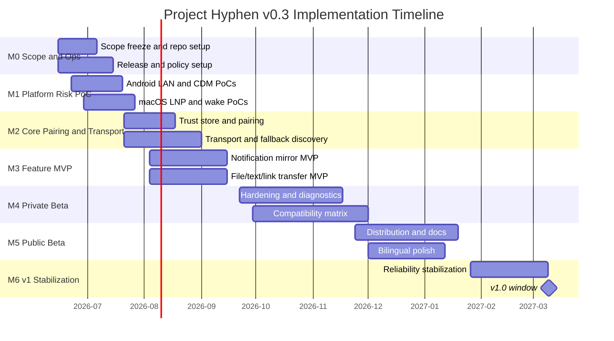

# Project Hyphen Roadmap Tracker v0.3

**Date**: 2026-06-10  
**Recommended repo path**: `docs/project_hyphen_roadmap_tracker_v0_3.md`  
**Purpose**: This is the source-of-truth implementation tracker for Project Hyphen v0.3. It is designed for humans, GitHub issues, and Claude Code loops.

---

## 0. How to use this tracker

### Status legend

| Status | Meaning |
|---|---|
| `[ ]` | Not started |
| `[~]` | In progress |
| `[?]` | Blocked; reason required |
| `[R]` | Ready for review |
| `[x]` | Done; acceptance criteria met, tests run, docs/ADR updated |

### Priority legend

| Priority | Meaning |
|---|---|
| P0 | Blocks Alpha or a major feasibility gate |
| P1 | Required before Private/Public Beta |
| P2 | Important but can slip after v1 |
| P3 | Optional / community nice-to-have |

### Definition of Done

A task is done only when all apply:

- Implementation is merged or committed locally.
- Relevant unit/integration/manual tests have run.
- Failure modes are handled, not just the happy path.
- Docs, ADRs, or protocol schemas are updated if behavior changed.
- This roadmap row is updated with status, notes, and commit hash if available.
- No secrets, credentials, or personal data were introduced.

### Claude Code operating rule

When this file is used by an agent, the agent should always:

1. Choose the next unchecked P0 task with no unmet dependency.
2. If no P0 remains, choose the next P1 task.
3. Implement the smallest coherent slice.
4. Run the narrowest relevant tests first, then broader checks.
5. Update this file.
6. Commit with a concise message if tests pass.
7. Stop or mark `[?]` if blocked by missing credentials, signing accounts, physical devices, or policy access.

---

## 1. Milestone timeline



---

## 2. Decision gates

| Gate | Target | Status | Pass criteria | If failed |
|---|---:|---|---|---|
| G-A LAN/discovery survivability | 2026-07-20 | `[~]` | mDNS works when available; QR/manual succeeds when mDNS fails; Android restricted LAN behavior understood | Make QR/manual the primary pairing UX |
| G-B Companion API viability | 2026-07-20 | `[x]` | API 26–35 and API 36+ adapters compile and have PoC behavior | Use conservative background model and reduce always-connected promise |
| G-C macOS wake recovery | 2026-07-27 | `[~]` | Wake triggers reconnect state machine; failure surfaced within 30s | Delay Beta; focus on reliability before features |
| G-D Notification thesis | 2026-09-15 | `[ ]` | 10-app matrix passes mirror/update/remove; duplicate rate acceptable | Remove Quick Reply from v1; keep mirror/dismiss |
| G-E Distribution feasibility | 2026-11-24 | `[ ]` | notarization dry run, Play/F-Droid package plan, privacy docs | Ship GitHub first; defer Play |
| G-F v1 Reliability | 2027-03-01 | `[ ]` | crash-free beta sessions ≥99%; 1GB resume works; wake reconnect works | Cut P1/P2 breadth |

---

## 3. Workstream M0 — Scope, repository, and release operations

| ID | Status | Priority | Area | Task | Dependencies | Acceptance criteria | Verification |
|---|---|---|---|---|---|---|---|
| HYP-M0-001 | `[x]` | P0 | Product | Freeze v1 scope and non-goals in `docs/adr/0001-product-scope.md` | none | ADR lists v1 must-have, non-goals, cut rules | Review ADR |
| HYP-M0-002 | `[x]` | P0 | Repo | Initialize monorepo layout | none | `apps/android`, `apps/macos`, `protocol`, `docs`, `scripts` exist | `tree -L 3` |
| HYP-M0-003 | `[x]` | P0 | Repo | Add `README.md`, `CONTRIBUTING.md`, `SECURITY.md`, `CODE_OF_CONDUCT.md` | HYP-M0-002 | Basic open-source governance present | Manual review |
| HYP-M0-004 | `[x]` | P0 | Agent | Add `CLAUDE.md` with repo rules, test commands, forbidden actions | HYP-M0-002 | Claude Code can orient from repo root | `claude -p "summarize repo rules"` |
| HYP-M0-005 | `[x]` | P0 | CI | Create `scripts/check.sh` placeholder that runs available checks | HYP-M0-002 | Script exits 0 and explains missing platform checks | `./scripts/check.sh` |
| HYP-M0-006 | `[x]` | P0 | CI | Add GitHub Actions skeleton for docs/protocol checks | HYP-M0-005 | CI runs markdown/schema checks | GitHub Actions local/dry run |
| HYP-M0-007 | `[x]` | P0 | Protocol | Create `docs/protocol/hyphen-protocol-v0.md` | HYP-M0-001 | Contains envelope, pairing, capability, errors | Manual review |
| HYP-M0-008 | `[x]` | P0 | Security | Create `docs/protocol/threat-model.md` | HYP-M0-007 | Covers LAN spoofing, MITM, notification privacy, diagnostics | Manual review |
| HYP-M0-009 | `[x]` | P0 | Policy | Draft `docs/adr/0003-android-permission-model.md` | HYP-M0-001 | Covers Local Network, FGS, notification listener, no SMS v1 | Manual review |
| HYP-M0-010 | `[x]` | P0 | Distribution | Draft `docs/adr/0004-distribution-tracks.md` | HYP-M0-001 | GitHub/F-Droid/Play/macOS tracks separated | Manual review |
| HYP-M0-011 | `[x]` | P1 | Distribution | Create `packaging/macos/notarization-notes.md` | HYP-M0-010 | Developer ID/notary requirements listed | Manual review |
| HYP-M0-012 | `[x]` | P1 | Distribution | Create `packaging/android-play/play-policy-notes.md` | HYP-M0-010 | FGS/Data safety/closed testing notes listed | Manual review |
| HYP-M0-013 | `[x]` | P1 | Distribution | Create `packaging/android-fdroid/metadata-notes.md` | HYP-M0-010 | F-Droid metadata and reproducibility considerations listed | Manual review |
| HYP-M0-014 | `[x]` | P1 | Devices | Create `docs/compatibility-matrix.md` | none | Blank matrix for Android/macOS/network cases | Manual review |
| HYP-M0-015 | `[x]` | P1 | License | Add license decision note | HYP-M0-003 | MPL/Apache clean-room rules stated | Manual review |

---

## 4. Workstream M1 — Platform risk PoCs

| ID | Status | Priority | Area | Task | Dependencies | Acceptance criteria | Verification |
|---|---|---|---|---|---|---|---|
| HYP-M1-001 | `[x]` | P0 | Android LAN | Create Android sample app skeleton | HYP-M0-002 | Builds on local machine/CI where Android available | `./gradlew assembleDebug` |
| HYP-M1-002 | `[x]` | P0 | Android LAN | Implement `LocalNetworkAccessController` abstraction | HYP-M1-001 | API exposes granted/denied/unknown and rationale state | Unit tests |
| HYP-M1-003 | `[x]` | P0 | Android LAN | Add Android 16 restricted LAN test plan | HYP-M1-002 | Steps documented with expected results | Manual test log |
| HYP-M1-004 | `[?]` | P0 | Android LAN | Implement NSD/mDNS discovery PoC | HYP-M1-001 | Can discover Mac test service on same LAN | Manual test |
| HYP-M1-005 | `[x]` | P0 | Android LAN | Implement scoped MulticastLock manager | HYP-M1-004 | Lock acquired only during discovery window and always released | Unit/log test |
| HYP-M1-006 | `[?]` | P0 | Android LAN | Implement QR/manual endpoint fallback PoC | HYP-M1-002 | Connects when mDNS disabled | Manual test |
| HYP-M1-007 | `[?]` | P0 | Android CDM | Implement CDM association PoC | HYP-M1-001 | User can create/disassociate association | Manual test |
| HYP-M1-008 | `[x]` | P0 | Android CDM | Implement `CompanionPresenceAdapter` interface | HYP-M1-007 | Legacy and API36+ stubs compile | Unit tests |
| HYP-M1-009 | `[x]` | P0 | Android CDM | Spike API 36 `ObservingDevicePresenceRequest` path | HYP-M1-008 | Behavior recorded in ADR/test log | Manual test or compile-gated code |
| HYP-M1-010 | `[x]` | P0 | macOS LNP | Create macOS menu-bar sample app skeleton | HYP-M0-002 | App launches and shows menu-bar item | `xcodebuild build` |
| HYP-M1-011 | `[x]` | P0 | macOS LNP | Implement Bonjour advertise/browse PoC | HYP-M1-010 | Mac advertises `_hyphen._tcp.local` | Manual test |
| HYP-M1-012 | `[x]` | P0 | macOS LNP | Add Local Network Privacy onboarding copy | HYP-M1-011 | Prompt is triggered only after user action | Manual test |
| HYP-M1-013 | `[x]` | P0 | macOS Wake | Implement wake/sleep observer PoC | HYP-M1-010 | Logs sleep/wake and starts reconnect attempt | Manual test |
| HYP-M1-014 | `[x]` | P0 | macOS Wake | Implement reconnect state machine prototype | HYP-M1-013 | 1s/5s/15s/30s retry schedule exists | Unit tests |
| HYP-M1-015 | `[x]` | P0 | Gate | Write M1 findings report | HYP-M1-001..014 | Go/cut decisions documented | Gate review |

---

## 5. Workstream M2 — Protocol, trust store, and transport

| ID | Status | Priority | Area | Task | Dependencies | Acceptance criteria | Verification |
|---|---|---|---|---|---|---|---|
| HYP-M2-001 | `[x]` | P0 | Protocol | Define envelope schema | HYP-M0-007 | JSON schema checked into `protocol/schema` | Schema test |
| HYP-M2-002 | `[x]` | P0 | Protocol | Define capability negotiation schema | HYP-M2-001 | Includes notifications, transfer, text, diagnostics | Schema test |
| HYP-M2-003 | `[x]` | P0 | Protocol | Define error-code taxonomy | HYP-M2-001 | Permission, transport, trust, plugin errors covered | Unit test |
| HYP-M2-004 | `[x]` | P0 | Security | Create pairing transcript and SAS test vectors | HYP-M0-008 | Deterministic vectors for both platforms | `scripts/test-protocol.sh` |
| HYP-M2-005 | `[x]` | P0 | macOS Trust | Implement Keychain peer trust store | HYP-M1-010 | Add/get/remove peer fingerprint | Unit tests |
| HYP-M2-006 | `[x]` | P0 | Android Trust | Implement encrypted peer trust store | HYP-M1-001 | Add/get/remove peer fingerprint | Unit tests |
| HYP-M2-007 | `[x]` | P0 | Transport | Implement macOS TLS listener/client skeleton | HYP-M2-005 | Self-signed cert and pinned peer verification | Integration test |
| HYP-M2-008 | `[x]` | P0 | Transport | Implement Android TLS client/server skeleton | HYP-M2-006 | Self-signed cert and pinned peer verification | Integration test |
| HYP-M2-009 | `[x]` | P0 | Pairing | Implement QR payload generation on macOS | HYP-M2-004,HYP-M2-007 | QR contains endpoint, fingerprint, nonce, protocol | Unit/manual test |
| HYP-M2-010 | `[x]` | P0 | Pairing | Implement QR scan/parse on Android | HYP-M2-009 | Invalid payload rejected safely | Unit/manual test |
| HYP-M2-011 | `[x]` | P0 | Pairing | Implement SAS confirmation UI both sides | HYP-M2-009,HYP-M2-010 | User confirms matching code before trust is stored; live two-device SAS drill remains manual residue | Unit/manual test |
| HYP-M2-012 | `[x]` | P0 | Transport | Implement heartbeat and ack | HYP-M2-007,HYP-M2-008 | Missed heartbeat transitions to degraded | Unit/integration test |
| HYP-M2-013 | `[x]` | P0 | Transport | Implement session reconnect and backoff | HYP-M2-012 | Reconnect after simulated drop | Integration test |
| HYP-M2-014 | `[x]` | P1 | Diagnostics | Add protocol-level trace IDs local only | HYP-M2-001 | Trace IDs are not transmitted in diagnostics unless opted-in | Unit test |
| HYP-M2-015 | `[x]` | P1 | Docs | Update protocol docs with implementation decisions | HYP-M2-001..014 | Docs match code behavior | Manual review |

---

## 6. Workstream M3 — Notifications, text/link, and file transfer MVP

| ID | Status | Priority | Area | Task | Dependencies | Acceptance criteria | Verification |
|---|---|---|---|---|---|---|---|
| HYP-M3-001 | `[?]` | P0 | Notifications | Implement Android NotificationListenerService scaffold | HYP-M2-013 | Permission onboarding and service lifecycle work | Manual test |
| HYP-M3-002 | `[x]` | P0 | Notifications | Normalize notification payload using `sbn.getKey()` | HYP-M3-001 | `postTime` not used in primary key | Unit test |
| HYP-M3-003 | `[x]` | P0 | Notifications | Implement posted/updated/removed events | HYP-M3-002 | Same key updates existing record | Integration test |
| HYP-M3-004 | `[?]` | P0 | macOS Notifications | Show/update/remove macOS notifications | HYP-M3-003 | One Android key maps to one macOS ID | Manual test |
| HYP-M3-005 | `[?]` | P0 | Notifications | Implement privacy filters | HYP-M3-004 | Hidden-body mode leaks no body text | Unit/manual test |
| HYP-M3-006 | `[?]` | P0 | Notifications | Implement Mac-side dismiss request | HYP-M3-004 | Android cancels notification or returns explicit error | Manual test |
| HYP-M3-007 | `[?]` | P1 | Notifications | Implement RemoteInput quick-reply beta | HYP-M3-006 | Works on at least 3 tested app families | Compatibility matrix |
| HYP-M3-008 | `[?]` | P0 | Text/Link | Implement Android → macOS text/link send | HYP-M2-013 | Text/link appears on Mac with user confirmation | Manual test |
| HYP-M3-009 | `[?]` | P0 | Text/Link | Implement macOS → Android text/link send | HYP-M2-013 | Android receives and can copy/open | Manual test |
| HYP-M3-010 | `[x]` | P0 | Transfer | Define file manifest schema | HYP-M2-001 | filename, size, mime, sha256, chunks | Schema test |
| HYP-M3-011 | `[x]` | P0 | Transfer | Implement chunk sender/receiver | HYP-M3-010 | Streamed temp-file transfers reconstruct small/empty files and reject bad chunks | Unit/integration test |
| HYP-M3-012 | `[x]` | P0 | Transfer | Implement resume checkpoints | HYP-M3-011 | Wire `resume.request/info` resumes from sender registry + receiver checkpoint | Unit + ProtocolSession loopback |
| HYP-M3-013 | `[x]` | P0 | Transfer | Implement SHA-256 verification | HYP-M3-011 | Corrupted chunk/file rejected | Unit test |
| HYP-M3-014 | `[?]` | P1 | Transfer | Implement progress/cancel UI | HYP-M3-011 | User sees progress and can cancel | Manual test |
| HYP-M3-015 | `[?]` | P1 | Transfer | Implement 1GB transfer test | HYP-M3-012,HYP-M3-013 | Core supports streaming large files; real paired-device 1GB interruption/resume run still blocked | Manual test log |

---

## 7. Workstream M4 — Diagnostics, beta hardening, and compatibility

| ID | Status | Priority | Area | Task | Dependencies | Acceptance criteria | Verification |
|---|---|---|---|---|---|---|---|
| HYP-M4-001 | `[x]` | P0 | Diagnostics | Implement local structured logs | HYP-M2-013 | Logs include failure codes without sensitive payload | Unit/manual test |
| HYP-M4-002 | `[?]` | P0 | Diagnostics | Implement redacted diagnostics export on Android | HYP-M4-001 | User can preview/export/delete | Manual test |
| HYP-M4-003 | `[x]` | P0 | Diagnostics | Implement redacted diagnostics export on macOS | HYP-M4-001 | User can preview/export/delete | Manual test |
| HYP-M4-004 | `[?]` | P1 | Diagnostics | Implement opt-in beta diagnostics toggle | HYP-M4-002,HYP-M4-003 | Off by default; clear copy; disable works | Manual test |
| HYP-M4-005 | `[?]` | P0 | Compatibility | Fill Android device matrix with first 5 devices | HYP-M3-001..015 | Results recorded with OS/OEM/network | Manual matrix |
| HYP-M4-006 | `[?]` | P0 | Compatibility | Fill macOS matrix with 3 OS/device combos | HYP-M3-001..015 | Results recorded | Manual matrix |
| HYP-M4-007 | `[?]` | P0 | Reliability | Test sleep/wake reconnect across 20 cycles | HYP-M2-013,HYP-M1-014 | Median reconnect <30s or clear error | Test log |
| HYP-M4-008 | `[x]` | P0 | Reliability | Notification storm test | HYP-M3-004 | Automated duplicate-prevention invariant passes; G-D 10-app/live Notification Center matrix not yet passed | Automated invariant + manual residue |
| HYP-M4-009 | `[?]` | P1 | UX | Improve onboarding copy for permissions | HYP-M4-005 | Copy review/update complete; user-comprehension validation blocked by missing device matrix/beta feedback | Review/beta feedback |
| HYP-M4-010 | `[?]` | P1 | UX | Add peer management screen | HYP-M2-006 | Revoke/reset peer works | Manual test |
| HYP-M4-011 | `[x]` | P1 | Beta | Prepare private beta release notes | HYP-M4-001..010 | Draft notes list known issues, blockers, unsupported cases, and feedback fields | Manual review |
| HYP-M4-012 | `[?]` | P1 | Beta | Recruit 20–50 technical beta users | HYP-M4-011 | Recruiting plan and bug template ready; actual cohort/channel blocked by external maintainer action | Manual |

---

## 8. Workstream M5 — Distribution and public beta

| ID | Status | Priority | Area | Task | Dependencies | Acceptance criteria | Verification |
|---|---|---|---|---|---|---|---|
| HYP-M5-001 | `[x]` | P0 | macOS Dist | Implement macOS signing script | HYP-M1-010 | Local signing dry run documented | Script/manual |
| HYP-M5-002 | `[?]` | P0 | macOS Dist | Implement notarization dry run | HYP-M5-001 | Notarization succeeds or blocker documented | Script/manual |
| HYP-M5-003 | `[x]` | P1 | macOS Dist | Create DMG/ZIP packaging script | HYP-M5-002 | Install path tested | Manual test |
| HYP-M5-004 | `[?]` | P0 | Android Dist | Implement reproducible-ish Android release build | HYP-M1-001 | APK/AAB signed with release key process documented | Build script |
| HYP-M5-005 | `[x]` | P0 | Android Play | Draft Play Data safety statement | HYP-M0-012,HYP-M4-004 | Matches actual data behavior | Manual review |
| HYP-M5-006 | `[x]` | P0 | Android Play | Draft FGS declaration | HYP-M0-012,HYP-M3-015 | connectedDevice/dataSync usage justified | Manual review |
| HYP-M5-007 | `[x]` | P1 | F-Droid | Draft F-Droid metadata | HYP-M0-013,HYP-M5-004 | Metadata validates locally where possible | Manual/tooling |
| HYP-M5-008 | `[x]` | P1 | Docs | Write bilingual installation docs | HYP-M5-003,HYP-M5-004 | macOS/Android install paths clear | Manual review |
| HYP-M5-009 | `[x]` | P1 | Docs | Write troubleshooting guide | HYP-M4-005..008 | Covers LAN permission, mDNS, wake, OEM background | Manual review |
| HYP-M5-010 | `[?]` | P1 | Public Beta | Publish public beta checklist | HYP-M5-001..009 | Checklist drafted; public beta reproduction blocked by external signing/notary/channel gates | Dry run |

---

## 9. Workstream M6 — v1 stabilization

| ID | Status | Priority | Area | Task | Dependencies | Acceptance criteria | Verification |
|---|---|---|---|---|---|---|---|
| HYP-M6-001 | `[?]` | P0 | Reliability | Fix top 10 beta crash/failure categories | HYP-M4-012 | Blocked: no beta issue/failure corpus exists to rank or fix top categories | Issue review |
| HYP-M6-002 | `[?]` | P0 | Reliability | Achieve ≥99% crash-free beta sessions where measurable | HYP-M4-004 | Opt-in diagnostics or manual logs support claim | Metrics review |
| HYP-M6-003 | `[?]` | P0 | Reliability | Finalize wake/network reconnect behavior | HYP-M4-007 | Median <30s or explicit degraded state | Test log |
| HYP-M6-004 | `[?]` | P0 | Transfer | Finalize 1GB resume behavior | HYP-M3-015 | Core supports streaming 1GiB-class files; 3 real Android/macOS/network combos still blocked | Test log |
| HYP-M6-005 | `[x]` | P0 | Notifications | Finalize notification duplicate prevention | HYP-M4-008 | Automated duplicate-prevention invariant acceptable; G-D 10-app/live matrix still open | Test log |
| HYP-M6-006 | `[x]` | P1 | Docs | Freeze protocol v0 docs | HYP-M2-015 | Docs match release behavior | Manual review |
| HYP-M6-007 | `[x]` | P1 | Security | Run final threat-model review | HYP-M6-006 | New risks captured | Review notes |
| HYP-M6-008 | `[?]` | P1 | License | Run dependency/license audit | HYP-M5-004 | Audit complete; public-release license gate blocked by missing formal root license files/map/notice policy | Audit report |
| HYP-M6-009 | `[?]` | P0 | Release | Create v1.0 release candidate | HYP-M6-001..008 | Blocked: prerequisite reliability/beta/license gates prevent RC artifacts | Release checklist |
| HYP-M6-010 | `[?]` | P0 | Release | Tag v1.0 | HYP-M6-009 | Blocked: HYP-M6-009 RC not created; no tag/checksums/release created | GitHub release |

---

## 10. Compatibility matrix template

| Date | Tester | Android device | Android version | OEM skin | Mac model | macOS version | Network | Scenario | Result | Notes/Issue |
|---|---|---|---|---|---|---|---|---|---|---|
| YYYY-MM-DD | TBD | Pixel | Android 16 | AOSP/Pixel | M-series Mac | 15.1+ | Home Wi‑Fi | Pairing | TBD |  |
| YYYY-MM-DD | TBD | Samsung | Android 15/16 | One UI | M-series Mac | 15.5 | Mesh | Notification mirror | TBD |  |
| YYYY-MM-DD | TBD | Xiaomi | Android 15/16 | HyperOS | M-series Mac | 15.5 | AP isolation | QR/manual fallback | TBD |  |
| YYYY-MM-DD | TBD | OnePlus/Oppo | Android 15/16 | OxygenOS/ColorOS | Intel Mac | 15.1+ | Hotspot | Transfer resume | TBD |  |

---

## 11. Manual test logs

### Pairing test log

```text
Date:
Tester:
Android device/version:
macOS device/version:
Network:
Path tested: mDNS / QR / manual IP / remembered endpoint
Steps:
Observed result:
Expected result:
Pass/Fail:
Issue link:
```

### Notification test log

```text
Date:
App tested:
Android notification key behavior:
Posted/updated/removed:
Dismiss:
Reply:
Privacy mode:
Duplicate behavior:
Pass/Fail:
Issue link:
```

### Transfer test log

```text
Date:
Direction: Android→Mac / Mac→Android
File size:
Network:
Interrupted at:
Resume behavior:
Hash verification:
Pass/Fail:
Issue link:
```

### Wake/reconnect test log

```text
Date:
Mac model/macOS:
Android model/version:
Connected before sleep: yes/no
Sleep duration:
Wake reconnect time:
Fallback path used:
Pass/Fail:
Issue link:
```

---

## 12. Backlog after v1

| ID | Status | Priority | Area | Task | Notes |
|---|---|---|---|---|---|
| HYP-P2-001 | `[ ]` | P2 | Clipboard | Manual clipboard send/receive shortcuts | Not background auto-sync |
| HYP-P2-002 | `[ ]` | P2 | Battery | Phone battery/status in menu bar | Low risk |
| HYP-P2-003 | `[ ]` | P2 | USB | ADB-assisted fallback transport | Requires careful UX and docs |
| HYP-P2-004 | `[ ]` | P2 | Finder | Finder share extension | Useful but not core |
| HYP-P2-005 | `[ ]` | P2 | Sparkle | macOS auto-update | Needs signing/notarization maturity |
| HYP-P2-006 | `[ ]` | P2 | Homebrew | Homebrew Cask | After notarized public beta |
| HYP-P2-007 | `[ ]` | P2 | Protocol | CBOR/Protobuf transport encoding | Only if JSON overhead becomes issue |
| HYP-P2-008 | `[ ]` | P3 | SMS | SMS continuity research track | Separate policy review; not v1 |
| HYP-P2-009 | `[ ]` | P3 | Calls | Call notification/control research | No audio bridge by default |
| HYP-P2-010 | `[ ]` | P3 | Remote Control | scrcpy integration research | Cite only official GitHub; optional plugin |

---

## 13. Claude Code `/loop` prompt

Use this prompt inside Claude Code from the repository root after this file is placed at `docs/project_hyphen_roadmap_tracker_v0_3.md`.

```text
/loop 10m Read docs/project_hyphen_roadmap_tracker_v0_3.md and CLAUDE.md. Continue implementing Project Hyphen by selecting the next unchecked P0 task with no unmet dependency; if no P0 task is available, select the next unchecked P1 task. Implement the smallest coherent slice only. Do not expand v1 scope beyond the roadmap. Prefer platform-risk burn-down before UI polish. For every task: inspect current code first, make minimal edits, add or update tests where practical, run the relevant checks, update the roadmap row status and notes, add or update ADR/protocol docs when behavior changes, and create a git commit if tests pass. If blocked by missing credentials, physical devices, signing accounts, Play/F-Droid access, or unavailable OS versions, mark the task `[?]` with the exact blocker and move to the next unblocked task. Never introduce cloud relay, telemetry by default, SMS/Call Log permissions, Accessibility hacks, copied GPL code, secrets, or destructive commands. Stop when all P0/P1 tasks are done or when every remaining P0/P1 task is blocked.
```

### Optional headless one-shot command

For a single non-interactive pass instead of a scheduled loop:

```bash
claude -p "Read docs/project_hyphen_roadmap_tracker_v0_3.md and CLAUDE.md. Implement the next unchecked unblocked P0 task, or P1 if no P0 is available. Run relevant tests, update roadmap/docs, and commit if green. Do not expand v1 scope."
```

---

## 14. Current progress summary

| Area | Done | In progress | Blocked | Remaining |
|---|---:|---:|---:|---:|
| M0 Scope/Ops | 15 | 0 | 0 | 0 |
| M1 Platform PoCs | 12 | 0 | 3 | 0 |
| M2 Core Transport | 15 | 0 | 0 | 0 |
| M3 Feature MVP | 6 | 0 | 9 | 0 |
| M4 Beta Hardening | 4 | 0 | 8 | 0 |
| M5 Distribution | 7 | 0 | 3 | 0 |
| M6 Stabilization | 3 | 0 | 7 | 0 |

Update this summary after each milestone review.

### Progress log

- 2026-06-10 — HYP-M0-001 `[x]` — Created `docs/adr/0001-product-scope.md` from plan v0.3 §1/§5/§15: v1 must-have list, explicit non-goals, gate cut rules, and a scope-change rule (new superseding ADR required). Verified by manual review; no automated checks exist yet (HYP-M0-005 pending).
- 2026-06-10 — HYP-M0-002 `[x]` — Initialized monorepo layout per plan §6.2: `apps/android`, `apps/macos`, `protocol/{schema,test-vectors,conformance}`, `scripts`, `ci`, `packaging/{macos,android-play,android-fdroid}`, `docs/protocol` with `.gitkeep` placeholders. Verified via `find` directory listing (`tree` not installed on this machine).
- 2026-06-10 — HYP-M0-003 `[x]` — Added `README.md` (pre-alpha status, scope table from ADR-0001, layout, doc links), `CONTRIBUTING.md` (scope discipline, clean-room rule, no high-risk surface, commit style, pending license/DCO note), `SECURITY.md` (private disclosure route via GitHub private reporting, scope notes), `CODE_OF_CONDUCT.md` (adapted from Contributor Covenant 2.1 with attribution). LICENSE intentionally deferred to HYP-M0-015. Verified: all relative links resolve.
- 2026-06-10 — HYP-M0-004 `[x]` — Added root `CLAUDE.md`: source-of-truth order, agent task-selection rule, check/test command table (with honest "planned" status), forbidden actions (cloud relay, default telemetry, SMS/Call Log, Accessibility, GPL copying, secrets, destructive commands, unlicensed deps), and core conventions (sbn key identity, discovery≠trust). Verified by structural review; `claude -p` smoke test skipped inside the autonomous loop to avoid a nested interactive session — runnable manually anytime.
- 2026-06-10 — HYP-M0-005 `[x]` — Added executable `scripts/check.sh`: real markdown relative-link check and secret-pattern scan run today; Android/macOS/protocol checks print `SKIP` with the exact pending task ID (HYP-M1-001/HYP-M1-010/HYP-M2-001) and auto-activate once those projects exist. Verified: `./scripts/check.sh` exits 0 with links OK, secrets OK, 3 explained SKIPs. CLAUDE.md command table updated to match.
- 2026-06-10 — HYP-M0-006 `[x]` — Added `.github/workflows/checks.yml`: single least-privilege job (`permissions: contents: read`) running `./scripts/check.sh` on push/PR. Workflows must live in `.github/workflows/` (GitHub requirement); `ci/` stays reserved for helper configs. Verified locally: YAML parses (ruby), `bash -n` clean, job body runs green. Caveat: hosted run pends first push to GitHub — push is user-initiated by repo rule, not a task blocker.
- 2026-06-10 — HYP-M0-007 `[x]` — Created `docs/protocol/hyphen-protocol-v0.md` covering all four required areas: envelope (field table + semantics), pairing (QR URI format, transcript, SAS = SHA-256 transcript hash mod 10^6, both-sides confirmation), capability negotiation (hello/intersection/forward-compat rules), error taxonomy (protocol/transport/trust/permission/plugin codes). v0 decisions made explicit: length-prefixed JSON framing with 4 MiB cap, SPKI pinning (not cert pinning), base64 chunks in-envelope, heartbeat 10s/2-miss degraded, resume tokens single-use/10min. Open questions listed for M2 ADRs. `./scripts/check.sh` green.
- 2026-06-10 — HYP-M0-008 `[x]` — Created `docs/protocol/threat-model.md`: assets, six-adversary model (A1 passive LAN…A6 diagnostics recipient), threat/mitigation tables for discovery+pairing (mDNS spoofing, QR/manual MITM, downgrade, replay), notification privacy (transit, shared Mac, no history DB, log redaction), trust lifecycle (lost-device revocation), diagnostics (default redaction, localOnly traces), availability (frame cap; hostile-LAN DoS accepted). Six derived test hooks mapped to roadmap IDs; residual risks listed explicitly. `./scripts/check.sh` green.
- 2026-06-10 — HYP-M0-009 `[x]` — Drafted `docs/adr/0003-android-permission-model.md`: minSdk 26 / targetSdk 36 / SDK 37 prep; controller-mediated deny-tolerant local network (denied = supported QR/manual mode, never a crash); FGS table (connectedDevice resident + dataSync user-initiated only, remoteMessaging excluded); action-triggered notification-listener onboarding; frozen exclusions (SMS/Call Log, Accessibility, clipboard, location — location explicitly rejected even if it would help NSD); expected v1 manifest permission table. Uncertain platform claims marked ⚠ with the M1 PoC task that validates each. ADR-0002 number reserved for M2 transport/pairing decisions. `./scripts/check.sh` green.
- 2026-06-10 — HYP-M0-010 `[x]` — Drafted `docs/adr/0004-distribution-tracks.md`: four tracks (GitHub / F-Droid / Play / macOS-notarized) with goals and first-release targets; five track invariants (protocol compat, ADR-0003 permission ceiling, no dark divergence, one version, no telemetry anywhere); GitHub-first sequencing with Gate E cut rule; signing/integrity plan; external account gates (Apple Developer, Play account, F-Droid queue) explicitly separated from local prep so they block only `[?]`-marked release tasks. **All 10 M0 P0 tasks now done — next loop iterations enter M1 platform-risk PoCs.** `./scripts/check.sh` green.
- 2026-06-10 — HYP-M1-001 `[x]` — Android app skeleton at `apps/android`: Gradle 8.14.3 (wrapper bootstrapped from locally cached dist), AGP 8.13.0, Kotlin 2.3.21, single `:app` module, minSdk 26 / compileSdk+targetSdk 36 (ADR-0003), `allowBackup=false` (trust-store material never enters backups), plain-Activity zero-androidx skeleton — Compose deliberately deferred to the first UI-bearing PoC task. `local.properties` gitignored. Verified: `./gradlew assembleDebug test` BUILD SUCCESSFUL (APK 872KB, smoke unit test green); `./scripts/check.sh` Android hook now runs Gradle tests and passes.
- 2026-06-10 — HYP-M1-002 `[x]` — `dev.hyphen.android.lan.LocalNetworkAccessController` in `:app`: pure-Kotlin logic behind `LanPermissionProbe`/`PermissionRequestTracker` interfaces (JVM-testable, no Robolectric). Exposes `LanAccessStatus(state ∈ GRANTED/DENIED/UNKNOWN, shouldShowRationale, platformGated)`; models the Android subtlety that granted=false+rationale=false means UNKNOWN before first request but permanent DENIED after (persisted asked-bit). `availableCapabilities()` enforces the ADR-0003 deny-tolerant invariant: QR_MANUAL_PAIRING in every state; MDNS_DISCOVERY/LAN_CONNECT only when GRANTED. SDK 37 (`ACCESS_LOCAL_NETWORK`) threshold as named constant; pre-37 reports GRANTED+platformGated=false. Verified: 8 unit tests, 0 failures (test-results XML checked). Real Context-backed probe lands with the discovery PoC (HYP-M1-004).
- 2026-06-10 — HYP-M1-003 `[x]` — `docs/test-plans/android-16-restricted-lan.md`: 8 test cases with steps + expected results, each tagged with the task that activates it (TC-1..6 pend M1-004/005/006 features; TC-7 runnable now; TC-8 blocked on Android 17 preview image). Encodes the key distinction: A16 restricted mode is behavioral blocking invisible to the permission API (controller correctly says GRANTED/platformGated=false) vs SDK 37 real permission — both degradation paths must pass. Compat-flag adb commands included with verify-on-device caveat. Gate A pass criteria + execution log template. Plan-only by design: execution needs a physical/emulated A16 device and pending PoCs — documented, not a task blocker.
- 2026-06-10 — HYP-M1-004 `[?]` — **Implementation complete, on-LAN verify blocked.** `dev.hyphen.android.discovery`: `DiscoveryManager` (time-boxed 20s window per plan §7.6, serialized resolves — NsdManager rejects concurrent ones, duplicate suppression, lost-service re-resolve, local failure log, lock acquired only inside window and released exactly once incl. start-failure path) behind `NsdBackend`/`Scheduler`/`DiscoveryLock` interfaces; `AndroidNsdBackend` wraps NsdManager (resolveService deprecation suppressed for PoC, revisit at M2 module split); MainActivity debug UI runs one window per tap. Verified: 10 JVM unit tests green, `assembleDebug` green. **Blocker**: acceptance needs a physical Android device on the same LAN as an advertising Mac (HYP-M1-011) — emulator NAT drops mDNS multicast. `DiscoveryLock` hook ready for HYP-M1-005's scoped MulticastLock manager.
- 2026-06-10 — HYP-M1-005 `[x]` — `ScopedMulticastLock` + `AndroidMulticastLockHandle` (WifiManager, `setReferenceCounted(false)`, tag `hyphen-discovery`): idempotent both directions — double-release is swallowed because the platform lock throws RuntimeException on over-release; transitions reported to a local log hook. Wired into MainActivity's discovery window; `CHANGE_WIFI_MULTICAST_STATE` added to manifest per ADR-0003 §6 table. Verified by the row's own criterion (unit/log test): 6 tests incl. two integration tests proving the lock is held exactly from window start to timeout (once) and released on the start-failure path. 25 unit tests + `assembleDebug` green.
- 2026-06-10 — HYP-M1-006 `[?]` — **Implementation complete, on-device verify blocked.** `dev.hyphen.android.pairing`: `EndpointParser` (strict `hyphen://pair` QR parsing per protocol §5.1 — required v/ep/fp/n, base64url length validation 32B fp/16B nonce, duplicate-key & oversize rejection, version gate, safe sealed-result rejection; manual `host:port` path; IPv6 literals deliberately rejected pending M2) + `EndpointConnectProbe` (plain-TCP reachability, 5s timeout, no data sent — TLS is M2). MainActivity gained the manual-endpoint entry + probe debug path; `INTERNET` permission added per ADR-0003 §6. Verified: 14 new JVM tests incl. real localhost ServerSocket connect; 39 total green; `assembleDebug` green. **Blocker**: "connects when mDNS disabled" device-level test needs a physical Android device + listening peer (pairs with the HYP-M1-004 device session).
- 2026-06-10 — HYP-M1-007 `[?]` — **Implementation complete, on-device verify blocked.** `dev.hyphen.android.companion`: `AssociationController` (SDK-gated event API) + `CdmAssociationBackend` (self-managed `AssociationRequest`, API 33+; approval IntentSender wrapped as launchable event; `disassociate(id)`; association listing). **Design decision recorded in ADR-0003**: v1 uses `REQUEST_COMPANION_SELF_MANAGED` on API 33+ (Hyphen owns the LAN-TLS link; CDM records the relationship); API 26–32 ships QR-only without CDM — BT-filter legacy association stays an open device-spike question. Manifest: permission + optional `companion_device_setup` feature. MainActivity debug buttons (associate / list+disassociate). Verified: 8 controller unit tests, 47 total green, `assembleDebug` green. **Blocker**: create/disassociate acceptance requires the CDM system dialog on a physical API 33+ device.
- 2026-06-10 — HYP-M1-008 `[x]` — `CompanionPresenceAdapter` layering per plan §7.4: `PeerId`/`HyphenAssociationRequest`/`PresenceAssociationResult`/`PresenceEvent` types; `CdmBackedPresenceAdapter` base (CDM association delegation + peerId→associationId bookkeeping); `LegacyPresenceAdapter` (26–35: no-op presence, reconnect-on-use per conservative background model; association works 33+); `Api36PresenceAdapter` (consumes `PresenceSource` — real `ObservingDevicePresenceRequest` feed lands in M1-009; dedupes consecutive duplicate events so radio flapping can't cause reconnect storms); `CompanionPresenceAdapterFactory.forSdk` boundary at 36. **Deliberate divergence**: plan sketches suspend/Flow; shipped callback-based because kotlinx-coroutines isn't a sanctioned dependency yet — same shape, migration noted for M2 module split. Verified: 8 unit tests (factory boundary, gating, bookkeeping, dedupe, per-peer isolation, idempotent cancel); 55 total green.
- 2026-06-10 — HYP-M1-009 `[x]` — API 36 presence spike via the row's compile-gated path: `HyphenCompanionDeviceService` (system-bound, `BIND_COMPANION_DEVICE_SERVICE`-guarded, translates `DevicePresenceEvent` via pure `presenceEventToAppeared()` mapper tested against platform constants; pre-36 deprecated callbacks explicit no-ops); `DevicePresenceBridge` (associationId↔PeerId seam from system service to adapters, unknown ids ignored) + `BridgePresenceSource` feeding `Api36PresenceAdapter`; `Api36PresenceObservation` start/stop per association. **Key recorded behavior** (`docs/spikes/api36-device-presence.md`): self-managed presence is app-driven — Hyphen must call `notifyDeviceAppeared/Disappeared` when the LAN-TLS session changes (M2 wiring); the reward is system service binding while present (resilience without hiding the FGS transparency surface). 5 on-device questions tabled for the device session. Verified: API-36 surface compiles against SDK 36; 5 new tests incl. end-to-end bridge→adapter dedupe; 60 total green.
- 2026-06-10 — HYP-M1-010 `[x]` — macOS skeleton at `apps/macos`: SwiftPM package (no .xcodeproj — auditable, CI-friendly), targets `HyphenApp` (AppKit menu-bar executable, `.accessory` activation policy so no Dock icon, status item + quit menu) and `HyphenCore` (shared constants; `bonjourServiceType` test-pinned to `_hyphen._tcp` matching Android and protocol v0) + `HyphenCoreTests`. Swift tools 5.9 (language mode 5) on the Swift 6.3 toolchain; platforms floor macOS 14 per plan §8.1 support range. Verified: `swift build` + `swift test` (2 XCTests pass), **`xcodebuild -scheme Hyphen build` SUCCEEDED** (row's literal verification), launch smoke: binary ran 8s on the live desktop session — `applicationDidFinishLaunching` created the status item without crashing — and was killed cleanly with zero error output. Pixel-level menu-bar confirmation deferred to the first interactive session (needs screen-capture permission). `check.sh` macOS hook now active (runs `swift test`).
- 2026-06-10 — HYP-M1-011 `[x]` — `HyphenDiscovery` target: `BonjourAdvertiser` (NWListener + `NWListener.Service`, state machine idle/starting/advertising(port)/failed/stopped; incoming connections refused until M2 transport — discovery grants nothing) and `BonjourBrowser` (NWBrowser, full current name-set callback). Menu bar gained a Start/Stop advertising toggle + live state line — advertising starts only on user action (LNP rule from plan §8.3, formalized next in M1-012). **Acceptance verified with real mDNS on this machine**: loopback XCTest advertises `_hyphen._tcp` and browses it back in 0.96s (equivalent to `dns-sd -B _hyphen._tcp local.`), port-bind asserted; stop-state test too. 4 macOS tests green; cross-device browse from the Android phone pairs with the M1-004 device session.
- 2026-06-10 — HYP-M1-012 `[x]` — Explain-first LNP onboarding: `LocalNetworkOnboardingGate` (AppKit-free, in HyphenDiscovery) wraps every local-network-touching action — already-explained runs straight through; otherwise the explanation presents and only "Continue" persists the flag and runs the action; declining persists nothing so the explanation returns next attempt. `LocalNetworkCopy` carries the dialog text (paired-devices-only, direct connections, no internet scanning, QR/manual fallback, System Settings recovery path); canonical copy + denial/repair state table + 5-step on-device verification script in `docs/copy/macos-local-network-onboarding.md`. Advertising toggle in the app now routes through the gate via NSAlert. Verified: 4 gate unit tests (immediate-when-explained, accept-persists, decline-persists-nothing, copy-promise regression guard); 8 macOS tests green; `check.sh` green. OS-prompt timing observation steps documented for the manual session.
- 2026-06-10 — HYP-M1-013 `[x]` — `HyphenPower` target: `SleepWakeObserver` over an injected `NotificationCenter` (production: `NSWorkspace.shared.notificationCenter`; tests post the real `NSWorkspace.willSleep/didWake` names) with ordered local event log, idempotent start/stop, and a `ReconnectTrigger` seam fired exactly once per wake — HYP-M1-014's state machine plugs in there. App wires a `LoggingReconnectTrigger` (NSLog + menu state line "Woke — reconnect pending"). Verified: 5 unit tests; one test initially failed because an unretained observer was deallocated under its weak handlers — fixed with `withExtendedLifetime`, a real API hazard now documented in the test. 13 macOS tests green; `check.sh` green. Hardware sleep cycles deliberately not run autonomously (would sleep the user's machine); they're M4-007's dedicated 20-cycle test.
- 2026-06-10 — HYP-M1-014 `[x]` — `ReconnectStateMachine` in HyphenPower (conforms to `ReconnectTrigger`, replacing the M1-013 placeholder in the app): states idle/connecting/connected/waitingRetry(attempt,delay)/sleeping/suspended; `backoffSchedule == [1,5,15,30]` as a named constant (the row's acceptance literal), capping repeated failures at 30s; success and wake both reset to a fresh schedule (wake's first recovery attempt at 1s per plan §8.4); sleep cancels pending retries and late-fired cancelled timers are ignored; suspend blocks all events until resume; lost-while-waiting never stacks timers. `RetryScheduler` seam + `DispatchRetryScheduler` for production; `startConnect` callback is where M2 transport (HYP-M2-007) plugs in. Verified: 9 unit tests incl. exact delay-sequence walk [1,5,15,30,30,30]; 22 macOS tests green.
- 2026-06-10 — HYP-M1-015 `[x]` — **M1 closed.** `docs/reports/m1-findings.md`: conditional GO to M2; gate table updated — G-B `[x]` PASS (written criteria met 40 days early), G-A/G-C `[~]` conditional pass with residuals named; 11 durable findings (UNKNOWN-vs-permanent-denial, A16 invisibility to permission API, NsdManager serialization, emulator-NAT hardware requirement, app-driven self-managed presence, SwiftPM-only viability, injected-center testability + ARC hazard, schedule semantics, cross-platform service-type pinning, withheld deps); 6 decisions queued for ADR-0002; consolidated ~2h single-sitting device checklist that flips M1-004/006/007 and runs all pending test plans. M1 final: 12 done, 3 device-blocked, 0 open.
- 2026-06-10 — HYP-M2-001 `[x]` — `protocol/schema/envelope.schema.json` (JSON Schema 2020-12, strict `additionalProperties:false` by design for v0 — loosening is a deliberate pre-v1 decision): ULID messageId/ackOf patterns, `hyphen/0.x` protocol gate, nullable sessionId (`null` only in hello), namespaced type pattern, `feature.vN` capability pattern, `seq ≥ 1`, trace requires `localOnly`. 11 test vectors under `protocol/test-vectors/envelope/` (3 valid incl. hello/ack/notification.updated; 8 invalid each rejected for its precise reason — verified in output). `scripts/test-protocol.sh` + dependency-free `validate_protocol_fixtures.py` (implements exactly the schema subset used; unsupported constraint keywords raise loudly; runs stdlib-only on macOS and ubuntu CI). `check.sh` [5/5] now delegates to it; CLAUDE.md command table updated — all five check rows now real.
- 2026-06-10 — HYP-M2-002 `[x]` — `protocol/schema/capability.schema.json` for the hello payload: all four required capability families (notifications.v1 reply off/beta/on + dismiss; transfer.v1 resume + maxChunkBytes 1KiB–2MiB — **new normative cap so base64-inflated chunks fit the 4MiB frame, protocol doc §6 updated to match**; text.v1 direction enum; diagnostics.v1 redactedExport). Encodes protocol §6 forward-compat precisely: top level + device strict, capability option objects permissive (optional-field additions non-breaking), unknown capability keys validate (proven by `unknown-capability-ignored.json`) while `propertyNames` still enforces feature.vN naming (misnamed `Notifications.V1` rejected). Validator extended with `propertyNames`/`maximum`. 11 new vectors (4 valid, 7 invalid); 22 total fixtures green.
- 2026-06-10 — HYP-M2-003 `[x]` — Error taxonomy made normative: `protocol/schema/error.schema.json` (required code/message/regarding/retryable, strict, message ≤256 chars) whose `code` enum IS the v0 registry — 24 codes across protocol/transport/trust/permission/plugin exactly matching doc §8; `scripts/lint_error_registry.py` machine-checks the acceptance criterion (all 5 categories populated, kebab-case format, no duplicates) and runs inside `test-protocol.sh`. 9 new vectors incl. boundary case (257-char message rejected at the 256 cap) and a `stackTrace` smuggling rejection. Validator gained `maxLength`. Doc §8 now points at the schema as the registry of record. 31 fixtures + registry lint green.
- 2026-06-10 — HYP-M2-004 `[x]` — `protocol/test-vectors/pairing/sas-vectors.json`: 5 deterministic cases pinning every implementation-relevant property — basic, realistic fingerprints, **version-binding** (same inputs, `hyphen/0.4` → different SAS = downgrade detection), **role-swap** (fps exchanged → different SAS = field order binds roles), and two **leading-zero SAS** cases (`091874`, `071295`) pinning the zero-pad rule; plus 1 tamper case the verifier must flag (self-test that mismatches are actually detected). `scripts/verify_pairing_vectors.py` recomputes everything from first principles (stdlib SHA-256) and additionally requires the set to contain a leading-zero case; wired into `test-protocol.sh`. Protocol doc §5.3 now specifies exact encodings (ASCII label, 16/32-byte raw fields, UTF-8 version last, injectivity argument). Platform-neutral by design — Kotlin (M2-010/011) and Swift (M2-009/011) implementations must reproduce all cases. All green.
- 2026-06-10 — HYP-M2-005 `[x]` — `PeerTrustStore` protocol + `KeychainTrustStore` in HyphenCore: generic-password items (service `dev.hyphen.peers`, account = fingerprint hex, value = JSON `TrustedPeer`), upsert semantics, **`kSecAttrSynchronizable:false` — trust never rides iCloud Keychain**; 32-byte fingerprint validation on every operation; `removeAll()` for trust reset. Platform finding fixed mid-task: macOS rejects `kSecReturnData`+`kSecMatchLimitAll` for generic passwords (errSecParam −50) — `allPeers()` lists attributes then fetches per item. v0 uses the login keychain (works unsigned); data-protection-keychain migration queued for the signed app (ADR-0002/M5). Verified: 7 unit tests against the real keychain under UUID-isolated throwaway services with teardown; 29 macOS tests green.
- 2026-06-10 — HYP-M2-006 `[x]` — Android `dev.hyphen.android.trust`: `PeerTrustStore` interface mirroring the macOS M2-005 API (upsert add / get / remove / allPeers / removeAll, 32-byte fingerprint validated on every op) + `EncryptedFilePeerTrustStore` — versioned line format (`hyphen-trust-v0`; hex fp + epoch ms + base64 name) sealed by `AesGcmTrustCipher` (AES-256-GCM, provider-generated random IV, `ivLen‖iv‖ct+tag`), atomic persist via NIO `ATOMIC_MOVE`, file under `filesDir/trust/` with `allowBackup=false` already set (M1-001). **Tamper/wrong-key reads throw `CorruptStore`, never silently-empty** — a wiped trust store must surface in UI, not auto-heal. Production master key is non-exportable in the Android Keystore (`AndroidTrustStores`, alias `dev.hyphen.trust.v0`, no user-auth binding so background reconnects can read); androidx EncryptedSharedPreferences rejected (new **and deprecated** dependency — zero-deps rule holds, same platform primitive used directly). Cipher code is identical under JVM software keys and Keystore keys (Keystore demands provider-chosen IVs — never pass one when encrypting). Verified: 17 new JVM tests (13 store: roundtrip, upsert, persistence across instances, encrypted-at-rest byte scan, tamper→Corrupt, wrong-key→Corrupt, length validation, removeAll; 4 cipher: roundtrip, IV uniqueness, tamper, truncation) — 77 Android tests green, `assembleDebug` compiles Keystore wiring, `check.sh` green. On-device residue: Keystore key create/reuse on hardware → M2 device checklist.
- 2026-06-10 — HYP-M2-007 `[x]` — `HyphenTransport` target: in-process identity minting + mutual-TLS skeleton. `DER` (minimal X.690 encoder, OID encoding pinned by test) + `SelfSignedCertificate` (clean-room X.509 v3, P-256/ecdsa-with-SHA256, **no extensions on purpose** — the verify block replaces default chain evaluation, so SAN/EKU are dead weight in v0); `SPKI` is the single encoder both embedded in certs and hashed for the 32-byte pin — cert and pin can't disagree. `KeychainIdentityStore`: permanent P-256 key by label + cert DER in a generic-password item; **platform finding #1**: file-based keychain ignores caller `kSecAttrLabel` on `kSecClassCertificate` items (label derives from subject) → certs are un-addressable that way; `SecIdentityCreateWithCertificate` needs only the private key in-keychain (verified empirically), so the cert never enters the keychain at all. `SPKIPinVerifier` (lookup-callback shape ready for `PeerTrustStore`; reject on any extraction failure) + `TLSEndpointListener`/`TLSConnector` (TLS 1.3 floor, both directions authenticated, listener surfaces connections only post-handshake). **Platform finding #2**: Network.framework parks a client whose verify block rejected (or any failed handshake) in `.waiting` and retries forever — connector treats `.waiting` as terminal failure (one-shot; retries belong to the M1-014 reconnect machine, and a pin mismatch must surface, not spin). Verified: 8 new tests — real loopback mutual-TLS echo, client-rejects-wrong-server-pin, server-never-surfaces-unpinned-client (TLS 1.3 client-side early-success caveat documented in test), lookup-backed pins, minted-cert parse + fp stability, idempotent load, reset-rotates-key; 37 macOS tests + check.sh green. Framing/session → M2-012.
- 2026-06-10 — HYP-M2-008 `[x]` — Android `dev.hyphen.android.transport`: JSSE mutual TLS with SPKI pinning, twin of M2-007. `PinnedTrustManager` (replaces chain evaluation, no hostname verification — the pin IS the identity; reject on missing/unfingerprint-able chain) + `SingleIdentityKeyManager` (always presents the device identity; avoids `KeyStore.setKeyEntry`, which would reject non-extractable Keystore keys) + `TlsServer`/`TlsClient` (TLS 1.3 only, `needClientAuth`, sockets surface post-handshake only, accept loop survives rejected peers, client one-shot). On JCA `publicKey.encoded` IS the DER SPKI, so pin = SHA-256 over it — no custom SPKI encoder needed (cross-platform pin equality with macOS holds: both hash standard SPKI DER). `DerEncoder`+`SelfSignedCertificateMinter` (Kotlin twins of the Swift ones; JVM-test infrastructure — BouncyCastle stays out) since production uses **Android Keystore's own self-signed cert generation** (`AndroidKeystoreTlsIdentity`, non-exportable P-256 sign key, alias `dev.hyphen.tls-identity.v0`, no auth binding). **Recorded gap → protocol doc §9.5**: platform TLS 1.3 needs API 29+; on API 26–28 this fails loudly, never downgrades — minSdk-29 vs TLS-1.2-legacy is an ADR-0002 decision. Verified: 8 new JVM tests (loopback TLS 1.3 echo with protocol assert, wrong-server-pin throws, unpinned client never surfaces, accept-loop survival after rejection, trust-manager direct accept/reject paths, cert self-verify, OID bytes, pin=key-hash) — 85 Android tests, `assembleDebug` (Keystore wiring compiles), `check.sh` green. On-device residue: Keystore TLS handshake on hardware → M2 device checklist.
- 2026-06-10 — HYP-M2-009 `[x]` — `PairingQRPayload` + `PairingTranscript` + `QRCodeRenderer` in HyphenCore. Payload builds `hyphen://pair?v=0&ep=&fp=&n=[&dn=]` with **pinned encodings the Android parser must accept**: base64url WITHOUT padding (43/22 chars for fp/nonce — asserted), device name percent-encoded with RFC 3986 unreserved-only set — **never a raw `+`, which Java URLDecoder reads as a space**; host/length/port validation mirrors the Android parser (IPv6 still a shared M2 follow-up). `PairingNonce.random()` = 16 bytes `SecRandomCopyBytes`, fresh per session (replayed QR can't confirm). **Swift SAS implementation reproduces all 5 normative vectors byte-for-byte on first run** (incl. both leading-zero SAS cases; tamper case detected as mismatch; transcript layout label‖nonce‖macFp‖androidFp‖version pinned structurally). QR image via CoreImage `CIQRCodeGenerator` (no dependency), correction level M. App window wiring deferred to M2-011 (SAS confirm UI is where the pairing screen exists). Verified: 10 new unit tests; 47 macOS tests + `check.sh` green.
- 2026-06-11 — HYP-M2-010 `[x]` — Android QR parse hardened to the wire + Kotlin SAS conformance. `PairingTranscript` (Kotlin twin; ULong arithmetic so the uint64 top bit can't go negative) **reproduces all 5 normative vectors byte-for-byte** (leading-zero SAS included; tamper case detected; layout pinned structurally; vector JSON read with a flat-object extractor — org.json is a JVM-test stub and a JSON lib would be a new dep). `QrPayload` gained `decodedFingerprint()`/`decodedNonce()`; `QrScanCompatTest` proves the M1-006 parser accepts **exactly the macOS generator's encodings** (unpadded base64url incl. `-_` alphabet chars, 43/22-char fields, unreserved-only percent-encoded dn with space/`&`/`+`/CJK round-trip) and feeds the transcript directly; 8-case negative table re-pinned (acceptance: invalid payload rejected safely — all sealed rejections, no exceptions). Debug surface: pasted `hyphen://pair` payloads now take the QR parse path (the code a camera scan will feed). **Camera capture deliberately not in this slice**: zero-dep QR decoding doesn't exist on Android; scanner-library choice (ZXing-embedded vs ML Kit — license + dependency audit) queued for ADR-0002, live-scan manual test joins the M2 device checklist. Verified: 8 new JVM tests; 93 Android tests, `assembleDebug`, `check.sh` green.
- 2026-06-11 — HYP-M2-011 `[x]` — SAS confirmation both sides, built around the acceptance property as a tested invariant: `SasConfirmationGate` (Swift in HyphenCore + Kotlin twin in `pairing`) is the ONLY path to a trust-store write — displaying the SAS persists nothing, reject is sticky (a dead session can never become trusted), confirm is idempotent, reject-after-confirm can't silently undo trust. **Gate tests run against the real stores** (login keychain / encrypted file). Mac UI: "Pair New Device…" menu item behind the M1-012 explain-first LNP gate → pairing window (QR via M2-009 + endpoint line + live code label) backed by a provisional `TLSEndpointListener` — admits ONE unknown client, captures its SPKI fp from the verify block (protocol §2 provisional-until-SAS), NSAlert Trust/Reject; window close aborts. `LocalIPv4` (getifaddrs, prefers en*) supplies the QR endpoint. Android UI: pasted QR payload → provisional `TlsClient` pinned to the QR fp → AlertDialog Trust/Reject through the gate. Provisional sockets close after the decision; steady-state session + device-name exchange land with M2-012/013 (peer name on Mac is a placeholder until hello). Verified: 8 new gate tests (4 Swift + 4 Kotlin); 51 macOS + 97 Android tests, app launch smoke 6s clean, `assembleDebug`, `check.sh` all green. Manual residue → M2 device checklist: live two-device pair (scan, both codes match, confirm both sides, mismatch-reject drill).
- 2026-06-11 — HYP-M2-012 `[x]` — Wire layer + heartbeat/ack sessions on both platforms. New shared pieces, each a twin pair: **framing** (4-byte BE u32 + payload, 4 MiB cap → `transport/frame-too-large`; truncation is a hard error, never clean EOF; Swift `FrameReader` proven against 1-byte dribble feeds), **ULID** (Crockford base32, schema-pinned shape, time-prefix ordering tested), **envelope codec** exactly matching `envelope.schema.json` (unknown fields rejected, all patterns enforced, trace strict; Swift rejects boolean/float-typed numbers via CFBoolean/objCType checks), and on Android a **hand-rolled ~170-line strict JSON** (org.json is a JVM-test stub; a JSON lib = new dep) — duplicate keys rejected, depth-capped 64, raw control chars rejected, numbers kept as raw text so longs never round-trip through Double. `ProtocolSession` (both): heartbeat every interval (§4 10s default), receive-silence watchdog `HeartbeatMonitor` — **DEGRADED strictly after >2 intervals of silence (boundary pinned: exactly 2 intervals is not yet missed), any received envelope recovers** — auto-ack for `requiresAck`, `AckTracker` fires `protocol/ack-timeout` exactly once per id, per-sender seq from 1, malformed envelopes surfaced+skipped (connection stays open per §3). Protocol id single-sourced (`Envelope.PROTOCOL_ID` ← PairingTranscript; `HyphenCore.protocolVersion` ← HyphenTransport dep). Verified: 36 new tests — 22 Kotlin + 14 Swift, incl. **10 real mutual-TLS loopback integration tests** (5/side: heartbeats-keep-healthy, silent-peer→degraded→recovery-on-traffic, requiresAck delivered+acked, missing-ack→timeout with id match, hostile 5 MiB header → frame-too-large while accept loop survives). 65 macOS + 119 Android tests, `assembleDebug`, `check.sh` green. Hello/resume → M2-013.
- 2026-06-11 — HYP-M2-013 `[x]` — Hello handshake + resume + reconnect, both platforms; **acceptance test (reconnect after simulated drop) passes over real mutual-TLS loopback on both**: drop the server-side session → client auto-redials → presents the resume token → SAME sessionId, resumed=true, new token ≠ old. `SessionHandshake` twins: initiator hello (envelope sessionId null) ⇄ responder hello carrying the assigned sessionId — **id-equality IS the resume signal** (no schema change needed); payload validated strictly per capability.schema.json; capabilities `{}` until M3. **§9.1 RESOLVED in protocol doc**: resumeToken = random 32-byte base64url handle, responder-side in-memory, bound to session+peer-fp, **single-use (consumed even on failed redeem)**, 10-min TTL, `invalidatePeer()` revocation hook. `SessionReconnector`: macOS drives the M1-014 `ReconnectStateMachine` (HyphenTransport now deps HyphenPower; walk [1,5,15] verified against dead port); Android gets a lean reconnector (no sleep/suspend states — reconnect-on-use model), inline-scheduler test pins [1,5,15,30,30,30]-then-reset. **Platform hazard found by the failing test**: JSSE `SSLSocket.close()` from another thread blocks until a concurrent blocking `read()` times out — the FIN never left, so the peer never saw the drop; fixed by resetting handshake soTimeout to 0 and giving session reads a 2×degraded-threshold deadline (also defuses the latent 10s-soTimeout-vs-10s-heartbeat session killer). NWConnection side: handshake may over-read past hello → `FrameReader.remainder()` hand-off, session `start(replaying:)`. v0 notes for M2-015 doc sync: handshake hellos requiresAck=false (reply is the ack); seq restarts per connection (hello=1, session continues at 2). Verified: 8 new Kotlin tests (5 token store + 3 reconnect/backoff) + 7 new Swift tests (5 token store + 2 integration); 72 macOS + 127 Android tests, `assembleDebug`, `check.sh` all green.
- 2026-06-11 — HYP-M3-001 `[?]` — **Implementation complete, manual verification blocked.** Android notification listener scaffold landed: manifest-registered `HyphenNotificationListenerService`, exact-component notification-access status parsing, service lifecycle state tracking, and MainActivity buttons for status plus rationale-first settings onboarding. Scope deliberately stops before payload normalization/event forwarding (HYP-M3-002/003). Verification exposed and fixed an existing reconnect race: `ProtocolSession.stop()` could interleave with `start()` and terminate the scheduler before heartbeat registration; `start()`/`close()` are now synchronized and closed sessions no-op on start. Verified: baseline and post-change `./gradlew test assembleDebug` green; baseline and post-change `./scripts/check.sh` green. **Blocker**: `adb devices` lists no Android device/emulator, so the required manual settings/onListenerConnected binding test cannot run here.
- 2026-06-12 — HYP-M3-008 `[?]` — **Implementation complete, manual verification blocked.** Android now keeps the post-SAS socket alive as the first steady-state `ProtocolSession`, adds a debug text/link send control, validates `text` vs http(s) `url`, and sends the existing `text.send/text.v1` payload through the session with ack required. macOS now upgrades the accepted post-SAS connection into a session, routes incoming `text.send` envelopes through `HyphenText.TextLinkReceiver`, and presents an NSAlert confirmation before copying text to NSPasteboard or opening a link with NSWorkspace. Verified: `./gradlew test assembleDebug` green; `swift test` green. **Blocker**: `adb devices` lists no Android device/emulator, so the required paired Android-to-Mac manual send test cannot run here.
- 2026-06-12 — HYP-M3-009 `[?]` — **Implementation complete, manual verification blocked.** macOS now exposes a menu-bar "Send Text/Link to Android..." action that collects user input, classifies http(s) as `url` and everything else as `text`, and sends the shared `text.send/text.v1` payload through the active `ProtocolSession` with ack required. Android now has a `TextLinkReceiver`, routes incoming session envelopes to it, and presents an AlertDialog before copying received text to the clipboard or opening received links with ACTION_VIEW. Verified: `./gradlew test assembleDebug` green; `swift test` green. **Blocker**: `adb devices` lists no Android device/emulator, so the required paired Mac-to-Android manual receive/copy/open test cannot run here.
- 2026-06-12 — HYP-M3-010 `[x]` — Added normative `protocol/schema/transfer-manifest.schema.json` for `transfer.manifest` payloads: `fileId`, display-only `filename`, `sizeBytes`, normalized `mimeType`, whole-file lowercase-hex `sha256`, negotiated `chunkSizeBytes`, and `chunkCount`. Added 2 valid fixtures (small file, empty file) and 5 invalid fixtures (bad hash, oversized chunk, missing filename, path-like filename, smuggled destination path). Protocol doc §7.2 now defines the field rules and explicitly defers cross-field arithmetic (`chunkCount == ceil(sizeBytes / chunkSizeBytes)`) to HYP-M3-011 implementations. Verified: `./scripts/test-protocol.sh` green.
- 2026-06-12 — HYP-M3-011 `[x]` — Hardened cross-platform transfer chunk sender/receiver cores from whole-file memory assembly to streaming sources plus receiver temp-file storage. Android `TransferByteSource`/`FileTransferByteSource` and macOS `TransferByteSource`/`FileTransferByteSource` stream file bytes and SHA-256 calculation; receiver state writes chunks to temp files by `chunkIndex * chunkSizeBytes` and returns `TransferCompleted` as manifest + completed file path/URL + verified SHA-256. Tests cover manifest-first sending, small file reconstruction in both directions, empty-file completion, corrupted chunk-hash rejection before commit, whole-file hash rejection, and exact decoded-size rejection for non-final/final chunks. Protocol doc §7.4 now requires exact decoded chunk sizes. Verified: Android `TransferMessagesTest` green; macOS `TransferMessagesTests` green.
- 2026-06-12 — HYP-M3-012 `[x]` — Reworked transfer resume into an actual wire path. `TransferReceiver.handle(...)` now returns completed/resumeRequested/cancelled/ignored events; `transfer.resume.request` produces `TransferResumeInfo(fileId,nextChunkIndex)` from the receiver checkpoint or `0`; app dispatchers send `transfer.resume.info`; `TransferSender` keeps an outbound `fileId -> manifest + source` registry and resumes streaming from `nextChunkIndex` when info arrives. Checkpoints remain v0 in-memory while bytes are temp-file backed; durable restart resume remains post-v0 hardening. Verified: Android transfer resume unit path green; macOS `testProtocolSessionLoopbackResumesInterruptedTransfer` proves manifest+first chunk interruption, `resume.request/info`, sender-registry resume, and output hash through real `ProtocolSession`.
- 2026-06-12 — HYP-M3-013 `[x]` — SHA-256 verification is now explicitly pinned by tests on both platforms. Existing transfer receivers already verify per-chunk `chunkSha256`, assembled byte count, and whole-file manifest `sha256`; this slice added dedicated corrupted whole-file tests alongside the existing corrupted chunk-hash tests so both Android and macOS reject tampered transfer data. Verified: `./gradlew test assembleDebug` green; `swift test` green.
- 2026-06-12 — HYP-M4-001 `[x]` — Added local structured diagnostics logs on both platforms. Android `LocalStructuredLogStore` and macOS `HyphenDiagnostics` now keep bounded in-memory events with timestamp, level, taxonomy category, failure code, and tokenized metadata only; session callback adapters record `protocol/ack-timeout` and protocol/transport failure codes while deliberately omitting callback detail, payloads, notification text, URLs, file paths, and file contents. The debug apps wrap active `ProtocolSession` callbacks with these local stores; export/delete UI is deferred to HYP-M4-002/003. Verified: `./gradlew test assembleDebug` green; `swift test` green.
- 2026-06-12 — HYP-M4-002 `[?]` — **Implementation complete, manual verification blocked.** Android now has `RedactedDiagnosticsExporter`, producing a local JSON bundle (`hyphen-diagnostics-v0`) with platform, app version, SDK, event count, and redacted structured events only. MainActivity exposes explicit user actions to preview the JSON, share/export it via `ACTION_SEND`, and delete local diagnostics. Tests prove callback detail containing notification text, file paths, and URLs is not present in the export and deletion clears the next bundle. Verified: `./gradlew test assembleDebug` green. **Blocker**: `adb devices` lists no Android device/emulator, so the required preview/export/delete manual UI test cannot run here.
- 2026-06-12 — HYP-M4-003 `[x]` — Added macOS redacted diagnostics export. `HyphenDiagnostics.RedactedDiagnosticsExporter` now builds the same local `hyphen-diagnostics-v0` JSON bundle with app version, coarse macOS version, event count, and redacted structured events; AppDelegate and PairingController share one diagnostics store, and the menu bar app now exposes Preview Diagnostics, Export Diagnostics (user-selected JSON file via `NSSavePanel`), and Delete Diagnostics actions. Tests prove callback detail containing notification text, file paths, and URLs is absent from the bundle and deletion clears the next export. Verified: `swift test` green; `swift run HyphenApp` launch smoke clean.
- 2026-06-12 — HYP-M4-007 `[?]` — **Manual reliability test blocked.** The implementation prerequisites are present (`SleepWakeObserver`, `ReconnectStateMachine`, and session reconnect all have automated tests), and the Wake/reconnect test-log template already exists in this tracker. The acceptance criterion requires 20 real Mac sleep/wake cycles with observed reconnect timing; this was not run because autonomously sleeping the user's active Mac repeatedly is unsafe and needs explicit human scheduling/observation. **Blocker**: manual 20-cycle sleep/wake session not authorized/run.
- 2026-06-12 — HYP-M5-001 `[x]` — Added `packaging/macos/sign-local.sh` and `packaging/macos/README.md`. The script builds SwiftPM `HyphenApp` in release mode, signs the executable, and verifies it with `codesign --verify --strict`; default mode uses ad-hoc signing (`SIGN_IDENTITY=-`) so no Apple Developer account or repo secret is required, while an installed Developer ID identity can be supplied later via `SIGN_IDENTITY` to enable hardened runtime and timestamping. README documents the local dry-run scope and explicitly defers notarization credentials/submission to HYP-M5-002. Verified: `./packaging/macos/sign-local.sh` signed and verified the release binary.
- 2026-06-12 — HYP-M5-002 `[?]` — **Script implemented, notarization blocked by missing Apple signing identity.** Added `packaging/macos/notarize-dry-run.sh`, which checks for `xcrun notarytool`, requires an installed Developer ID Application identity via `SIGN_IDENTITY`, accepts either `NOTARY_PROFILE` or one-time `APPLE_ID`/`TEAM_ID`/`APP_SPECIFIC_PASSWORD`, signs via `sign-local.sh`, zips the signed SwiftPM executable, and submits with `notarytool --wait` when credentials exist. README documents both credential paths and says packaging/stapling policy belongs to HYP-M5-003. Verification run output: `notarize-dry-run: BLOCKED: set SIGN_IDENTITY to an installed Developer ID Application certificate`.
- 2026-06-12 — HYP-M5-004 `[?]` — **Build script implemented, Play-ready signing blocked by missing release/upload keystore.** Added `packaging/android-play/build-release.sh`, `packaging/android-play/README.md`, and env-driven Gradle release signing config. Gradle now fails closed if only some `HYPHEN_ANDROID_*` signing variables are present; when all are present, release APK signing uses the external keystore without storing secrets in the repo. The script builds `:app:assembleRelease` and `:app:bundleRelease`, copies artifacts to ignored `packaging/android-play/build/`, and writes SHA-256 sums. Verification produced `app-release-unsigned.apk`, `app-release.aab`, and `SHA256SUMS`; output also reported `build-release: BLOCKED: release signing key not configured; artifacts are not Play-ready`.
- 2026-06-12 — HYP-M0-011 `[x]` — Added `packaging/macos/notarization-notes.md` listing the required Apple Developer Program membership, Developer ID Application certificate, notarytool credential options, distributable container expectation, local signing/notarization commands, secret boundaries, and expected blocker modes. Manual review complete; no automated behavior changed.
- 2026-06-12 — HYP-M0-012 `[x]` — Added `packaging/android-play/play-policy-notes.md` listing the Play track boundary, expected `connectedDevice` and user-initiated `dataSync` foreground-service areas, Data safety draft inputs, closed-testing setup notes, and review risks around Notification Listener, foreground-service declarations, diagnostics exports, and ADR-0003 excluded features. Manual review complete; no automated behavior changed.
- 2026-06-12 — HYP-M0-013 `[x]` — Added `packaging/android-fdroid/metadata-notes.md` listing F-Droid track boundaries, candidate metadata fields, current app ID/version seeds, source/repo requirements, reproducibility considerations for pinned toolchains and signing-key strategy, and inclusion-review risks around licensing, dependencies, Notification Listener, foreground service, and future scanner/diagnostics dependencies. Manual review complete; no automated behavior changed.
- 2026-06-12 — HYP-M5-008 `[x]` — Added bilingual install docs at `docs/install/installation_en.md` and `docs/install/installation_zh.md`, covering the current macOS ZIP/DMG dry-run path, Android debug install path, Android release dry-run/signing boundary, disabled F-Droid status, first-run permission notes, and pre-alpha blockers. Root and packaging READMEs now link to the install docs. Manual review plus markdown link check via `./scripts/check.sh`.
- 2026-06-12 — HYP-M5-009 `[x]` — Added bilingual troubleshooting docs at `docs/troubleshooting_en.md` and `docs/troubleshooting_zh.md`, covering the required LAN permission, mDNS/Bonjour, wake/reconnect, and Android OEM background-restriction paths, plus pairing/trust, notifications, transfer, evidence capture, and when to mark matrix rows blocked. The guide explicitly references current pre-alpha evidence limits from `docs/compatibility-matrix.md` and the restricted-LAN/wake test plans. Manual review plus markdown link check via `./scripts/check.sh`.
- 2026-06-12 — HYP-M5-010 `[?]` — Added `docs/release/public-beta-checklist.md`, a maintainer checklist for reproducing the current local dry-run release path and stopping before public distribution when required gates are missing. Verified local dry-run surface: `./packaging/macos/package-local.sh` produced ZIP/DMG/checksums, `shasum -a 256 -c` passed, `hdiutil verify` passed, `./packaging/android-play/build-release.sh` produced unsigned APK/AAB/checksums with the expected signing-key blocker, Android checksums passed, F-Droid metadata parsed as YAML, and `./scripts/check.sh` passed. **Blocker**: a real public beta still requires Developer ID/notary credentials, Android release/upload signing key, Play/F-Droid channel access, and unresolved device/sleep-wake/beta-session evidence.
- 2026-06-12 — HYP-M0-014 `[x]` — Added `docs/compatibility-matrix.md` as a blank execution matrix with recording rules, Android/OEM coverage targets, macOS coverage targets, network cases, scenario rows, and a redacted evidence-log template. Rows are explicitly initialized as `not-run` or blocked where human sleep/wake scheduling is required, so future M4 compatibility work records observed evidence instead of inferred support. Manual review complete; no automated behavior changed.
- 2026-06-12 — HYP-M0-015 `[x]` — Added `docs/adr/0005-license-and-clean-room-policy.md`: app source code uses MPL-2.0, protocol specs/schemas/test vectors use Apache-2.0, documentation uses CC-BY-4.0, third-party files keep upstream notices, and clean-room rules forbid GPL/AGPL/proprietary code copying or close paraphrase. README and CONTRIBUTING now point to the ADR while noting that formal root license files, SPDX sweeps, and DCO/CLA terms remain release-readiness follow-ups. Manual review complete; no automated behavior changed. **All M0 tasks are now complete.**
- 2026-06-12 — HYP-M2-014 `[x]` — Added protocol-level local trace helpers on Android and macOS. Envelope trace validation now requires `localOnly: true` and ULID-shaped `spanId` values, with schema fixtures pinning rejection of non-local trace metadata. Structured diagnostic events can keep a validated local trace id, but Android and macOS redacted diagnostics exporters omit it by default and include it only when constructed with explicit trace inclusion. Protocol docs now state the local-only trace rules. Verified: `./gradlew test assembleDebug` green; `swift test` green; `./scripts/check.sh` green.
- 2026-06-12 — HYP-M2-015 `[x]` — Updated `docs/protocol/hyphen-protocol-v0.md` with the M2 implementation decisions: strict envelope/hello validation, trace `localOnly`/ULID rules, core-vs-plugin type handling, heartbeat/ack timeout behavior, in-memory single-use resume-token semantics, TLS 1.3 Android API 26-28 behavior, and default-redacted trace export rules. Deferred post-M2 protocol questions are now separated from resolved implementation behavior. Verified: `./scripts/check.sh` green.
- 2026-06-12 — HYP-M3-002 `[x]` — Added Android notification payload normalization for `notifications.v1`: `NormalizedNotificationPayload.fromStatusBarNotification(...)` extracts the stable `sbnKey` from `StatusBarNotification.getKey()` (Kotlin `sbn.key`), package/display fields, category, clearable, and ongoing state, while keeping `postTime` out of identity and JSON payloads. Protocol docs now define the notification payload fields and repeat the no-`postTime` identity rule. Verified: baseline `./gradlew test assembleDebug` green; post-change `./gradlew test assembleDebug` green; `./scripts/check.sh` green.
- 2026-06-12 — HYP-M3-003 `[x]` — Android notification listener callbacks now route posted/removed `StatusBarNotification` events into a session-bound `NotificationMirrorEventSender`. The sender emits acked `notification.posted`, `notification.updated`, and `notification.removed` envelopes under `notifications.v1`; the first seen `sbnKey` posts, repeated keys update the same record, and removals carry only `sbnKey` so stale macOS records can close even after service restarts. MainActivity binds the notification outbox only while a paired `ProtocolSession` is active. Verified: `./gradlew test assembleDebug` green; `./scripts/check.sh` green.
- 2026-06-12 — HYP-M3-004 `[?]` — **Implementation complete, manual verification blocked.** Added the macOS `HyphenNotifications` target and routed incoming `notification.posted`, `notification.updated`, and `notification.removed` envelopes through `NotificationMirrorReceiver`. Posted/updated events use `UserNotificationCenterPresenter` with a deterministic identifier `hyphen.notification.<sbnKey>`, so the same Android key maps to one macOS notification ID; removed events clear the matching pending/delivered notification. PairingController now handles notification envelopes before text/link envelopes. Verified: `swift test` green; `./scripts/check.sh` green. **Blocker**: required end-to-end manual notification-center test needs a paired Android device emitting real NotificationListener events plus macOS notification permission approval.
- 2026-06-12 — HYP-M3-005 `[?]` — **Implementation complete, manual verification blocked.** Added Android notification privacy filtering at the send boundary. `NotificationPrivacyMode.HIDE_BODY` strips the `text` field before `NotificationMirrorEventSender` emits `notification.posted`/`notification.updated`, so body text is absent from the `notifications.v1` payload before it reaches transport, macOS, or diagnostics-adjacent code. MainActivity includes a debug toggle between full and hidden-body modes while preserving active-key update behavior. Verified: `./gradlew test assembleDebug` green; `./scripts/check.sh` green. **Blocker**: manual hidden-body validation needs a paired Android device producing real notifications and a Mac notification-center check.
- 2026-06-12 — HYP-M3-006 `[?]` — **Implementation complete, manual verification blocked.** Added Mac-side `notification.dismiss.request` sending via `NotificationDismissSender` and `UserNotificationCenterPresenter` custom dismiss handling, plus Android `NotificationDismissRequestHandler` that calls the active `NotificationListenerService.cancelNotification(sbnKey)` seam and replies with `notification.dismiss.result`; macOS parses that result for status reporting. Results return `success: true` when cancel is accepted, `permission/notifications-denied` when listener access/canceller is unavailable, and `plugin/notification-key-not-found` when cancellation throws. Protocol docs now define dismiss request/result payloads. Verified: `./gradlew test assembleDebug` green; `swift test` green; `./scripts/check.sh` green. **Blocker**: manual acceptance needs a paired Android device, an active mirrored notification, and a macOS notification dismiss action.
- 2026-06-12 — HYP-M4-008 `[x]` — Added automated notification storm coverage on both sides of the mirror pipeline, scoped to duplicate-prevention invariants only. Android `NotificationMirrorEventSender` has a 1,000-event storm test proving only the first occurrence of each of 25 stable `sbnKey` values posts, repeats become updates, removals shrink active state, and every envelope stays acked under `notifications.v1`. macOS `NotificationMirrorReceiver` has a matching 1,000-event coalescing test proving repeated Android keys overwrite the same macOS notification identifier and removals keep delivered notifications bounded. **Manual residue:** this does not prove the G-D 10-app/live Notification Center matrix; that gate remains open. Verified: `./gradlew test assembleDebug` green; `swift test` green; `./scripts/check.sh` green.
- 2026-06-12 — HYP-M3-007 `[?]` — **Implementation complete, compatibility verification blocked.** Android now advertises `replyActions` only for notification actions that have RemoteInput plus a sendable PendingIntent, macOS maps those mirrored notifications to a text-input reply action, and the active session sends `notification.reply.request` / parses `notification.reply.result` under `notifications.v1`. Android handles reply requests through the active NotificationListenerService, sends RemoteInput results to the selected action, and returns explicit `permission/notifications-denied`, `plugin/notification-key-not-found`, or `plugin/reply-unavailable` errors. Protocol docs now define `replyActions` and reply request/result payloads. Verified: `./gradlew test assembleDebug` green; `swift test` green; `./scripts/check.sh` green. **Blocker**: acceptance requires a paired Android device with real RemoteInput notifications from at least 3 app families and a recorded compatibility matrix; no device/app matrix is available in this environment.
- 2026-06-12 — HYP-M3-014 `[?]` — **Implementation complete, manual verification blocked.** Transfer sender/receiver cores on Android and macOS now emit local `TransferProgress` updates, support `transfer.cancel` with `discard` semantics, and keep/drop receiver checkpoints according to the cancel payload. Android's debug activity logs receive progress/completion and exposes "Cancel active transfer"; macOS menu bar status shows receive progress/completion and exposes "Cancel Active Transfer" through the active session. Protocol docs now define `transfer.cancel` and state that progress is local UI state, not a v0 wire message. Verified: `./gradlew test assembleDebug` green; `swift test` green; `./scripts/check.sh` green. **Blocker**: manual acceptance requires a paired Android/macOS session with an active transfer to observe progress and cancel behavior; no paired device/session is available in this environment.
- 2026-06-12 — HYP-M3-015 `[?]` — **Test scaffold complete, manual execution blocked.** Added `scripts/create_large_transfer_fixture.py`, a standard-library deterministic fixture generator that writes a 1 GiB transfer file and `.sha256` sidecar by default, plus `docs/test-plans/hyp-m3-015-1gb-transfer-test.md` with preconditions, interruption/resume procedure, pass criteria, and a run-record table. Core transfer now supports streaming 1GiB-class sources without whole-file `ByteArray`/`Data` assembly, but acceptance still requires a paired Android/macOS session with real active 1GiB file transfer to interrupt, resume, hash-check, and log. Verified: fixture generator smoke run with `--size-bytes 4096`; transfer unit/loopback tests; `./scripts/check.sh` green. **Blocker**: real paired-device 1GiB run is unavailable in this environment.
- 2026-06-12 — HYP-M4-005 `[?]` — **Manual Android compatibility matrix blocked.** Checked attached Android targets with `/Users/haitianzhu/Library/Android/sdk/platform-tools/adb devices -l`; output listed no attached devices, so no Pixel/Samsung/Xiaomi/OnePlus/Oppo/OEM rows can be observed or recorded. Added an evidence-log entry in `docs/compatibility-matrix.md`. **Blocker**: at least five physical Android devices or authorized emulators covering the required OS/OEM/network cases are unavailable in this environment.
- 2026-06-12 — HYP-M4-006 `[?]` — **Manual macOS compatibility matrix blocked.** Current host reports macOS 26.5.1 build 25F80 via `sw_vers`, but this environment does not provide the three distinct macOS OS/device combinations required by the row, and the matrix scenarios also need a paired Android session for notification/text/transfer checks. Added an evidence-log entry in `docs/compatibility-matrix.md`. **Blocker**: two additional Mac OS/device combinations plus a paired Android device/session are unavailable here.
- 2026-06-12 — HYP-M4-004 `[?]` — **Implementation complete, Android manual verification blocked.** Android now exposes a default-off "Beta diagnostics" button backed by local `SharedPreferences`; enabling requires explicit copy that beta extras are local-only, user-exported, and still redacted, while clicking again disables trace-id inclusion immediately. macOS now exposes the same default-off opt-in as a menu item backed by `UserDefaults`; preview copy reflects whether trace IDs are included. Both platforms wire the existing `includeTraceIds` exporter flag to the opt-in state, so default previews/exports remain redacted. Verified: baseline `./gradlew :app:testDebugUnitTest --tests dev.hyphen.android.diagnostics.RedactedDiagnosticsExporterTest` and `swift test --filter StructuredLogTests` green; post-change `./gradlew :app:testDebugUnitTest --tests dev.hyphen.android.diagnostics.RedactedDiagnosticsExporterTest :app:assembleDebug`, `swift build`, and `swift test --filter StructuredLogTests` green. **Blocker**: Android manual preview/export/disable acceptance still needs an attached device or emulator; `adb devices -l` currently lists no Android targets.
- 2026-06-12 — HYP-M4-010 `[?]` — **Implementation complete, manual UI verification blocked.** Android now exposes a "Manage paired devices" debug button that lists local trusted peers, forgets a selected peer, resets all peers, and stops the current protocol session after any trust change. macOS now exposes "Manage Paired Devices..." in the menu bar app with the same selected-forget and reset-all behavior backed by `KeychainTrustStore`; active pairing/session state is ended after trust changes. Verified: baseline `./gradlew :app:testDebugUnitTest --tests dev.hyphen.android.trust.EncryptedFilePeerTrustStoreTest` and `swift test --filter KeychainTrustStoreTests` green; post-change `./gradlew :app:testDebugUnitTest --tests dev.hyphen.android.trust.EncryptedFilePeerTrustStoreTest :app:assembleDebug`, `swift build`, and `swift test --filter KeychainTrustStoreTests` green. **Blocker**: final revoke/reset acceptance requires manually pairing devices, exercising the Android and macOS UI controls, and confirming reconnect requires re-pairing; no attached Android target or paired session is available here.
- 2026-06-12 — HYP-M5-003 `[x]` — Added `packaging/macos/package-local.sh`, a local ZIP/DMG packaging dry run that builds and signs `HyphenApp`, stages a minimal menu-bar `Hyphen.app` bundle with `LSUIElement=true`, signs/verifies the bundle, writes `Hyphen-macOS-0.0.1.zip`, `Hyphen-macOS-0.0.1.dmg`, and `SHA256SUMS`, and keeps generated artifacts ignored under `packaging/macos/build/`. `packaging/macos/README.md` documents ad-hoc vs Developer ID packaging, expected artifacts, and the non-notarized dry-run boundary. Verified: `./packaging/macos/sign-local.sh` baseline green; `./packaging/macos/package-local.sh` green; `shasum -a 256 -c SHA256SUMS` green; `hdiutil verify packaging/macos/build/Hyphen-macOS-0.0.1.dmg` green; mounted DMG contained executable `Hyphen.app` and `codesign --verify --strict` passed before detach.
- 2026-06-12 — HYP-M5-005 `[x]` — Added `packaging/android-play/data-safety-draft.md`, a Play Console Data safety draft aligned with the current Android manifest, Gradle dependencies, local trust storage, notification/text/transfer surfaces, redacted diagnostics export, and default-off beta diagnostics toggle. The draft uses Google's current Data safety definitions to keep local-only/pinned-TLS peer traffic separate from optional user-triggered diagnostics export, recommends a conservative optional `App info and performance -> Diagnostics` declaration, and records non-uses (no account, cloud relay, telemetry by default, ads SDK, analytics SDK, crash SDK, SMS/Call Log/Accessibility/location/contacts). `packaging/android-play/README.md`, `play-policy-notes.md`, and `fgs-declaration-draft.md` now link to it. Manual review complete; no runtime behavior changed.
- 2026-06-12 — HYP-M5-006 `[x]` — Added `packaging/android-play/fgs-declaration-draft.md`, a Play Console foreground-service declaration draft for `connectedDevice` and `dataSync`. The draft ties each type to user-visible local companion behavior, explicit user triggers, stop conditions, notification copy, local-first data handling, non-use of `remoteMessaging`/SMS/Call Log/Accessibility/background clipboard/cloud sync, and release evidence still required before submission. `packaging/android-play/README.md` and `play-policy-notes.md` now link to it. Manual review complete; no runtime behavior changed.
- 2026-06-12 — HYP-M5-007 `[x]` — Added disabled F-Droid metadata draft `packaging/android-fdroid/metadata/dev.hyphen.android.yml` plus `packaging/android-fdroid/README.md`. The draft uses the current app id `dev.hyphen.android`, version `0.0.1` / code `1`, MPL-2.0 app-source license from ADR-0005, `Connectivity` category, Gradle build rooted at `apps/android`, full current commit hash, and explicit disabled notes for placeholder public URLs, release tag/signing policy, formal root license files, dependency audit, and unavailable fdroidserver lint. `metadata-notes.md` now links to the draft and records the local validation boundary. Verified: official F-Droid metadata reference re-checked; `ruby -e 'require "yaml"; ... YAML.load_file(...)'` green; `./gradlew :app:assembleRelease` green; `apps/android/app/build/outputs/apk/release/app-release-unsigned.apk` exists. `fdroid` CLI is not installed in this environment, so `fdroid lint` / `rewritemeta` remain external follow-up.
- 2026-06-12 — HYP-M6-005 `[x]` — Added `docs/test-plans/hyp-m6-005-notification-duplicate-prevention.md` as the duplicate-prevention automated-invariant log. It records the Android storm invariant (1,000 events across 25 keys -> 25 posted, 975 updated, 10 removed, active set bounded) and the macOS coalescing invariant (1,000 updates across 25 deterministic identifiers, latest update wins, removals leave 15 delivered identifiers). `[x]` is limited to those automated duplicate-prevention invariants; G-D's 10-app/live Notification Center matrix has not passed. Verified: `./gradlew :app:testDebugUnitTest --tests dev.hyphen.android.notifications.NotificationMirrorEventSenderTest` green; `swift test --filter NotificationMirrorReceiverTests/testNotificationStormCoalescesByAndroidKeyAndRemovalsStayBounded` green.
- 2026-06-12 — HYP-M6-002 `[?]` — **Crash-free beta-session metric blocked / not measurable.** Added `docs/test-plans/hyp-m6-002-crash-free-beta-sessions.md` defining the eventual crash-free-session denominator, numerator, allowed evidence sources, and minimum review packet. Repository search found no beta session logs, crash ledger, issue export, or user-submitted diagnostics corpus; HYP-M4-012 beta user recruitment is still unchecked; HYP-M4-011 beta release notes/feedback channel are still unchecked; and there is no crash-reporting SDK, analytics SDK, telemetry endpoint, account system, or cloud service. `adb devices -l` also lists no Android targets, so no paired-device beta session can be generated here. **Blocker**: collect real beta-session diagnostics or manual logs before claiming >=99% crash-free sessions.
- 2026-06-12 — HYP-M6-003 `[?]` — **Final wake/network reconnect behavior blocked.** Implementation prerequisites exist (`SleepWakeObserver`, `ReconnectStateMachine`, `SessionReconnectTests`, and HYP-M4-007's prior blocker note), but this finalization requires the same real 20-cycle Mac sleep/wake timing log and/or network-transition evidence. Autonomously sleeping the user's active Mac repeatedly is unsafe, and no scheduled manual reliability log is available in this environment. **Blocker**: human-run sleep/wake or network-transition session with observed reconnect timing is required.
- 2026-06-12 — HYP-M6-004 `[?]` — **Final 1 GiB resume behavior blocked.** Core transfer supports streaming 1GiB-class files and a real `ProtocolSession` loopback resume path, and HYP-M3-015 provides the deterministic fixture generator/manual run log. Finalization still requires successful observed 1GiB interruption/resume runs across at least three Android/macOS/network combinations. HYP-M4-005 currently has no attached Android devices, and HYP-M4-006 lacks the required additional macOS combinations plus a paired Android session. **Blocker**: three real paired-device/network test combinations are unavailable in this environment.
- 2026-06-12 — HYP-M6-006 `[x]` — Froze `docs/protocol/hyphen-protocol-v0.md` for the current pre-alpha v0 wire behavior and synced drift found during manual review: `hello` uses `requiresAck: false` with responder `hello` as the handshake acknowledgment, `seq` is per-sender/per-connection with `hello` consuming `seq: 1`, trace IDs are exported only behind the default-off beta diagnostics opt-in, notification identity stays `StatusBarNotification.getKey()`, transfer progress is local-only UI state, and remaining feature-bitmap/heartbeat/flow-control/persistent-checkpoint questions are explicitly post-v0. Updated schema descriptions in `protocol/schema/envelope.schema.json` and `protocol/schema/transfer-manifest.schema.json` without changing validation rules. Verification: `./scripts/test-protocol.sh` and `./scripts/check.sh`.
- 2026-06-12 — HYP-M6-007 `[x]` — Ran final local threat-model review against the frozen protocol docs, ADR-0001/0003, diagnostics behavior, and public beta checklist. Added `docs/reports/hyp-m6-007-threat-model-review.md` and updated `docs/protocol/threat-model.md` to capture new/updated risks: local dry-run artifacts mistaken for public beta artifacts, placeholder F-Droid metadata submission/mirroring, Play/F-Droid policy drift, beta diagnostics trace-ID correlation, broader physical-access action risk, and per-source listener rate limiting as an accepted post-v0 availability residual. Verification: manual review plus `./scripts/check.sh`.
- 2026-06-12 — HYP-M6-008 `[?]` — Ran dependency/license audit and added `docs/reports/hyp-m6-008-dependency-license-audit.md`. Evidence included Android release runtime dependency report (`kotlin-stdlib` + JetBrains annotations only), unit-test runtime report (JUnit/Hamcrest test-only), build-time plugin POM license checks, macOS SwiftPM inspection (no external packages), script/tooling manifest scan, and vendored binary scan (only `apps/android/gradle/wrapper/gradle-wrapper.jar`, SHA-256 recorded). No GPL/AGPL/proprietary runtime dependency was found. **Blocker**: public-release license readiness still needs canonical root license files for MPL-2.0/Apache-2.0/CC-BY-4.0, a top-level license map, NOTICE/SPDX/header policy, and DCO/CLA decision before HYP-M6-008 can claim no blocking license issue.
- 2026-06-12 — HYP-M4-009 `[?]` — **Copy pass complete, user-comprehension validation blocked.** Updated Android notification-listener onboarding copy to lead with the sensitive access ("titles, actions, and content"), paired-Mac/local-TLS destination, no cloud relay/history store, hidden-body fallback, SMS/Call Log exclusion, and Android Settings disable path. Added `docs/reports/hyp-m4-009-permission-onboarding-copy-review.md` inventorying the current permission/special-access surfaces and beta tester questions. **Blocker**: the row's acceptance requires review/beta feedback that users understand each permission; HYP-M4-005 has no attached Android device matrix and no beta feedback corpus exists yet.
- 2026-06-12 — HYP-M4-011 `[x]` — Added `docs/release/private-beta-release-notes.md` for technical private beta testers. The draft lists what to test, privacy/safety defaults, known blocked matrix and reliability areas, unsupported v1 surfaces, required feedback fields, and stop conditions. Manual review complete; no runtime behavior changed. HYP-M4-012 remains the external recruiting/channel task.
- 2026-06-12 — HYP-M4-012 `[?]` — Added `docs/release/private-beta-feedback.md` plus `.github/ISSUE_TEMPLATE/private_beta_bug.yml`. The local packet defines target cohorts, channel setup checklist, invitation copy, bug-report fields, safety checklist, and triage rules. **Blocker**: recruiting 20-50 technical beta users and configuring the actual private feedback channel require external maintainer action; no invited tester list, accepted cohort, or beta feedback corpus exists in this repo.
- 2026-06-12 — HYP-M6-001 `[?]` — Added `docs/reports/hyp-m6-001-beta-failure-category-review.md` after searching for beta issue exports, crash ledgers, session logs, diagnostics corpora, and feedback reports. The repo has intake templates and known blocker buckets but no real beta failure corpus, so no top-10 categories can be ranked or fixed. Updated the HYP-M6-002 metrics note to reflect that HYP-M4-011/HYP-M4-012 local prep now exists while recruitment and feedback remain external blockers.
- 2026-06-12 — HYP-M6-009 `[?]` — Added `docs/reports/hyp-m6-009-rc-readiness-review.md`. RC creation is blocked by HYP-M6-001/002/003/004/008 plus external release gates: no beta failure corpus, no crash-free denominator, no final wake/reconnect log, no 1GB multi-combo evidence, incomplete root license/map/notice policy, missing macOS Developer ID/notary credentials, missing Android release/upload keystore, and no Play/F-Droid/private beta channel evidence. No RC artifacts were created.
- 2026-06-12 — HYP-M6-010 `[?]` — Added `docs/reports/hyp-m6-010-v1-tag-readiness.md`. v1.0 tagging is blocked because HYP-M6-009 has no valid RC artifact set, no final checksums, unresolved reliability/beta evidence, external signing/channel blockers, and incomplete license release readiness. No git tag, GitHub release, or release checksums were created.
- 2026-06-12 — HYP-M2-012/HYP-M2-013/HYP-M2-015 hardening — Fixed protocol/transport drift found during adversarial review. macOS handshake now preserves coalesced post-hello frames for `ProtocolSession.start(replaying:)`; macOS `ProtocolSession` returns receive/send completion state changes to its serial queue; Android and macOS reconnectors close sockets/connections when stop races handshake/connect success. Hello payloads now advertise `notifications.v1`, `transfer.v1`, `text.v1`, and `diagnostics.v1`; responders return the intersection; `HandshakeResult` carries negotiated capabilities; app dispatchers return `plugin/unsupported-capability` and `protocol/unknown-type` error envelopes; transfer sender chunk size is capped by negotiated `transfer.v1.maxChunkBytes`. Verified: Android `SessionReconnectTest` + `TransferMessagesTest`; macOS `EnvelopeAndFrameTests`, `ProtocolSessionTests`, `SessionReconnectTests`, and `TransferMessagesTests`.
- 2026-06-13 — Transfer outbound-send hardening (behind HYP-M3-012/HYP-M3-015/HYP-M6-004) — Closed three gaps found by adversarial review of the F2 transfer path. (1) **Real outbound send entry, both apps.** `TransferSender.sendSource(...)` was only ever called from tests, so the outbound `registered` registry was always empty in a live session and a real `transfer.resume.info` threw "unknown outbound fileId". macOS adds a "Send File to Android…" menu item (`NSOpenPanel` → `FileTransferByteSource`); Android adds a "Send file to Mac" button (`ACTION_GET_CONTENT` → new framework-free `StreamTransferByteSource` over the content URI). Both feed the persistent `activeTransferSender`, and send progress is wired to the existing status/debug surface via `onProgress`. (2) **Android send window/ack parity.** Android `TransferSender` was a single synchronous all-chunks loop; it now mirrors the macOS bounded `outstandingWindow` (default 8) advanced by `handleAck`/`pumpChunks`, with mutating entry points `@Synchronized` (Android lacks macOS's main-queue serialization). Added `ProtocolSession.Listener.onAck` (dispatched only on a tracked ack), forwarded through the diagnostic + reconnector listener wrappers and into `MainActivity`. (3) Removed the dead `TransferByteSource.readChunk` default method on both platforms (zero call sites). Verified: macOS 122 tests + `swift build`; Android `TransferMessagesTest` (new window + multi-window ack-driven end-to-end + stream-source tests) + `assembleDebug`; `./scripts/check.sh` green. **Still `[?]`**: real paired-device 1 GiB interrupt/resume runs across the HYP-M6-004 matrix — this fix makes the path reachable on-device but provides no real-hardware transfer evidence.
